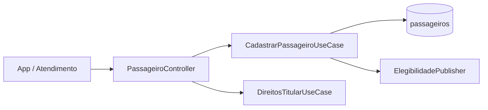
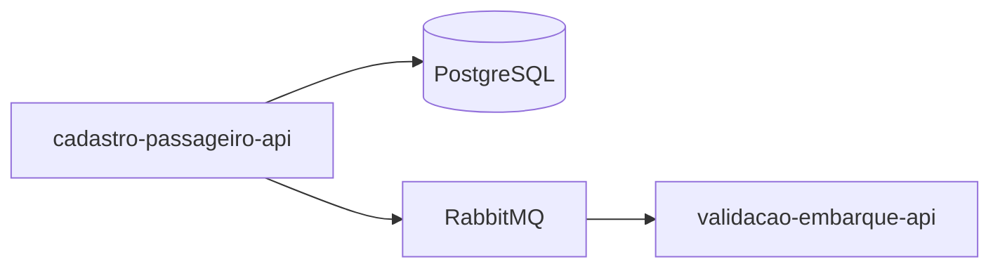
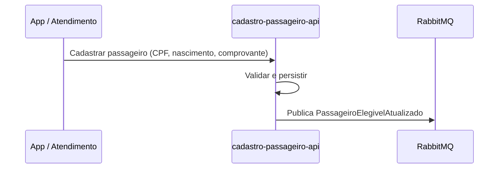

# Module - Cadastro de Passageiro API

## 1. Visão Geral

É dono dos dados pessoais do passageiro (CPF, data de nascimento, comprovante de matrícula) e publica sua elegibilidade a gratuidades e meia-tarifa estudantil.

## 2. Classificação

| Item | Valor |
|---|---|
| Tipo de Módulo | Microservice |
| Deployable Candidato | cadastro-passageiro-api |
| Bounded Context Relacionado | Cadastro |
| Subdomínio DDD | Generic Subdomain |
| Tier / Criticidade | Tier 2 |
| Status | Confirmado |

## 3. Objetivo

Cadastrar o passageiro com CPF, data de nascimento e comprovante de matrícula para viabilizar gratuidades e meia-tarifa estudantil (OBJ-04, FR-06).

## 4. Responsabilidades

- Cadastrar passageiro (FR-06).
- Expor GET /v1/passageiros/{id}.
- Publicar PassageiroElegivelAtualizado quando a elegibilidade mudar.
- Atender direitos do titular de dados pessoais (LGPD) em até 15 dias (NFR-03).

## 5. Fora de Escopo

- Cálculo de tarifa em si (pertence a tarifacao-lib).
- Validação de embarque (pertence a validacao-embarque-api).

## 6. Capacidades Atendidas

| Código | Capability | Descrição |
|---|---|---|
| CAP-05 | Cadastro | Cadastrar passageiro com CPF, data de nascimento e comprovante de matrícula |

## 7. Bounded Context e Linguagem Ubíqua

| Termo | Definição |
|---|---|
| Passageiro | Titular de dados pessoais cadastrado na solução |
| Gratuidade | Isenção de tarifa aplicável a passageiros elegíveis |
| Comprovante | Documento que comprova matrícula estudantil |

## 8. Componentes Internos Candidatos

| Componente | Tipo | Responsabilidade |
|---|---|---|
| PassageiroController | API Controller | Expor GET /v1/passageiros/{id} e cadastro |
| CadastrarPassageiroUseCase | Use Case | Validar e persistir dados do passageiro |
| ElegibilidadePublisher | Publisher | Publicar PassageiroElegivelAtualizado |
| DireitosTitularUseCase | Use Case | Atender acesso/correção/exclusão em até 15 dias (NFR-03) |

## 9. APIs Principais

| Método | Endpoint | Finalidade | Consumidores |
|---|---|---|---|
| GET | /v1/passageiros/{id} | Consultar dados do passageiro (FR-06) | tarifacao-lib (via validacao-embarque-api), app |

## 10. Eventos Publicados

| Evento | Quando é publicado | Consumidores |
|---|---|---|
| PassageiroElegivelAtualizado | Alteração de elegibilidade (gratuidade/meia-tarifa) | validacao-embarque-api |

## 11. Eventos Consumidos

```text
Este módulo não consome eventos diretamente.
```

## 12. Dados Próprios

| Entidade/Tabela/Collection | Tipo | Banco/Persistência | Observações |
|---|---|---|---|
| passageiros | Tabela | PostgreSQL | Campos sensíveis: cpf, data_nascimento, comprovante_matricula_url (dados pessoais, LGPD) |

## 13. Integrações

| Sistema/Módulo | Tipo de Integração | Direção | Observações |
|---|---|---|---|
| validacao-embarque-api | Evento (RabbitMQ) | Saída | Publica PassageiroElegivelAtualizado |

## 14. Dependências

### 14.1 Dependências de Domínio

- Bounded context Cadastro (próprio).

### 14.2 Dependências Técnicas

- PostgreSQL, RabbitMQ.
- Armazenamento seguro do comprovante de matrícula (URL — provedor não especificado, Ponto a Validar).

### 14.3 Dependências Operacionais

- Processo de atendimento a direitos do titular (LGPD) em até 15 dias.
- Política de retenção de 5 anos após o último uso do cartão (NFR-03).

## 15. Requisitos Não Funcionais Relevantes

| Categoria | Requisito / Observação |
|---|---|
| Performance | Não especificado — Ponto a Validar |
| Segurança | Controle de acesso a dados pessoais |
| Disponibilidade | 99,5% (NFR-05) |
| Observabilidade | Auditoria de acesso a PII |
| Compliance | LGPD (NFR-03) |
| Resiliência | Não especificado |
| Privacidade | CPF, nascimento e comprovante são dados pessoais; retenção de 5 anos após último uso do cartão |
| Auditabilidade | Acesso e alteração de PII devem ser auditáveis |

## 16. Compliance Aplicável

| Compliance / Norma / Lei | Aplicável? | Motivo | Impacto no Módulo |
|---|---|---|---|
| PCI DSS | Não | Não processa dados de cartão | — |
| LGPD / GDPR / Privacidade | Sim | Trata CPF, data de nascimento e comprovante de matrícula (NFR-03) | Módulo dono de PII; ver compliance-lgpd.md |
| SOX / Auditoria Financeira | Não | Não movimenta valores financeiros diretamente | — |

## 17. Observabilidade

| Item | Recomendação Inicial |
|---|---|
| Logs | Logs estruturados com correlation_id; mascarar CPF em logs |
| Métricas | Volume de cadastros e atualizações de elegibilidade |
| Traces | Trace do fluxo de cadastro e de atendimento a direitos do titular |
| Alertas | SLA de 15 dias para direitos do titular em risco |
| Health Checks | Readiness dependente de PostgreSQL |
| Auditoria | Todo acesso e alteração de PII deve ser auditável (NFR-03) |

## 18. Diagramas do Módulo

### 18.1 Diagrama de Componentes Internos



### 18.2 Diagrama de Dependências



### 18.3 Diagrama de Fluxo Principal



## 19. Riscos

| Código | Risco | Impacto | Mitigação |
|---|---|---|---|
| RISK-MOD-01 | Provedor de armazenamento do comprovante de matrícula não definido | Risco de exposição de documento pessoal | Definir provedor com controle de acesso e criptografia adequados |

## 20. Pontos a Validar

| Código | Ponto | Impacto | Recomendação |
|---|---|---|---|
| VAL-MOD-01 | Provedor de armazenamento do comprovante de matrícula | Segurança e conformidade LGPD | Definir com arquitetura/segurança |
| VAL-MOD-02 | Fluxo detalhado de atendimento a direitos do titular (acesso, correção, exclusão) | SLA de 15 dias (NFR-03) | Detalhar em design técnico |

## 21. Backlog Inicial Sugerido

| Tipo | Item | Descrição |
|---|---|---|
| Epic | Cadastro de Passageiro | Implementar cadastro e consulta |
| Story Técnica | Direitos do titular (LGPD) | Implementar fluxo de acesso/correção/exclusão em até 15 dias |
| Task | Endpoint GET /v1/passageiros/{id} | Implementar contrato REST conforme FRD |

## 22. Referências

| Documento | Seção |
|---|---|
| DDD Segmentation | Solution Module Map |
| Context Map | Cadastro → Tarifação, Customer/Supplier |
| NFRD | NFR-03, NFR-05 |
| FRD | FR-06 |
