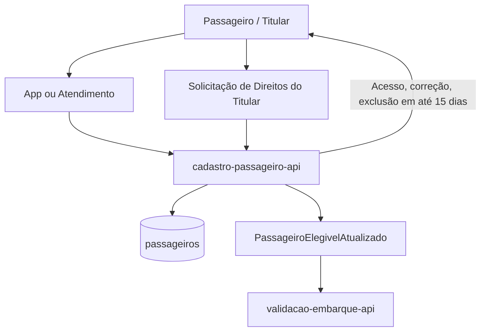

# LGPD / PII Compliance Flow

## 1. Objetivo

Descrever o fluxo de dados pessoais do passageiro e as regras de tratamento de PII na solução Tarifa Viva (NFR-03).

## 2. Dados Pessoais Identificados

| Dado | Categoria | Módulo Dono | Finalidade | Retenção |
|---|---|---|---|---|
| CPF | Pessoal | cadastro-passageiro-api | Identificação para gratuidade/meia-tarifa | 5 anos após o último uso do cartão |
| Data de nascimento | Pessoal | cadastro-passageiro-api | Elegibilidade a gratuidade | 5 anos após o último uso do cartão |
| Comprovante de matrícula | Sensível | cadastro-passageiro-api | Comprovação de meia-tarifa estudantil | 5 anos após o último uso do cartão |

## 3. Diagrama de Fluxo PII

## 4. Regras LGPD / PII

| Regra | Descrição |
|---|---|
| Minimização | Coletar apenas CPF, nascimento e comprovante necessários à finalidade (FR-06) |
| Finalidade | Dados usados exclusivamente para elegibilidade a gratuidade/meia-tarifa |
| Controle de acesso | Acesso a passageiros restrito por papel |
| Mascaramento | Logs de cadastro-passageiro-api não devem expor CPF em texto claro |
| Retenção | 5 anos após o último uso do cartão (NFR-03) |
| Auditoria | Acesso e alteração de PII devem ser auditáveis (NFR-03) |
| Direitos do titular | Atendidos em até 15 dias (NFR-03) |

## 5. Pontos a Validar

| Código | Ponto | Impacto |
|---|---|---|
| VAL-PII-01 | Se o evento PassageiroElegivelAtualizado carrega apenas flag de elegibilidade ou também dado pessoal | Define o escopo LGPD de validacao-embarque-api |
| VAL-PII-02 | Provedor de armazenamento do comprovante de matrícula não definido | Impacta controles de segurança e conformidade LGPD |
