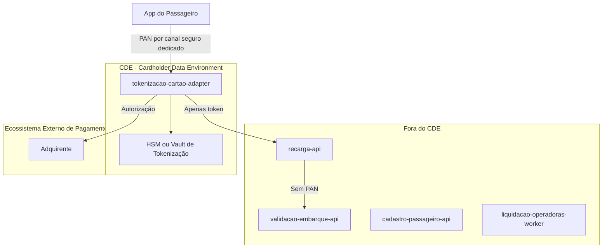

# PCI DSS Compliance Flow

## 1. Objetivo

Descrever o fluxo de dados de cartão da recarga e delimitar o CDE - Cardholder Data Environment na solução Tarifa Viva (NFR-02).

## 2. Escopo PCI

| Módulo | Dentro do CDE? | Motivo |
|---|---|---|
| tokenizacao-cartao-adapter | Sim | Único módulo que recebe PAN do app e o envia à adquirente |
| recarga-api | Não | Recebe apenas token e resultado de autorização, nunca PAN |
| validacao-embarque-api | Não | Não trata dados de cartão de pagamento (cartão transporte é identificador lógico) |
| tarifacao-lib | Não | Não trata dados de cartão |
| liquidacao-operadoras-worker | Não | Não trata dados de cartão |
| cadastro-passageiro-api | Não | Não trata dados de cartão |

## 3. Diagrama CDE

## 4. Regras PCI

| Regra | Descrição |
|---|---|
| Dados sensíveis não devem sair do CDE | PAN não pode ser propagado para recarga-api ou qualquer outro módulo |
| Tokenização obrigatória | recarga-api e demais módulos recebem apenas token |
| Acesso restrito | Somente tokenizacao-cartao-adapter acessa o vault/HSM |
| Auditoria obrigatória | Todo acesso ao CDE deve gerar evento auditável |
| Logs sem PAN | Logs de todos os módulos não devem conter PAN, CVV ou track data (NFR-02) |

## 5. Pontos a Validar

| Código | Ponto | Impacto |
|---|---|---|
| VAL-PCI-01 | Canal seguro pelo qual o app envia o PAN ao tokenizacao-cartao-adapter não está documentado no FRD | Define a arquitetura real do ponto de entrada do CDE |
| VAL-PCI-02 | Fornecedor de HSM/vault de tokenização não identificado nos artefatos aprovados | Impacta o escopo de certificação PCI DSS 4.0.1 |
