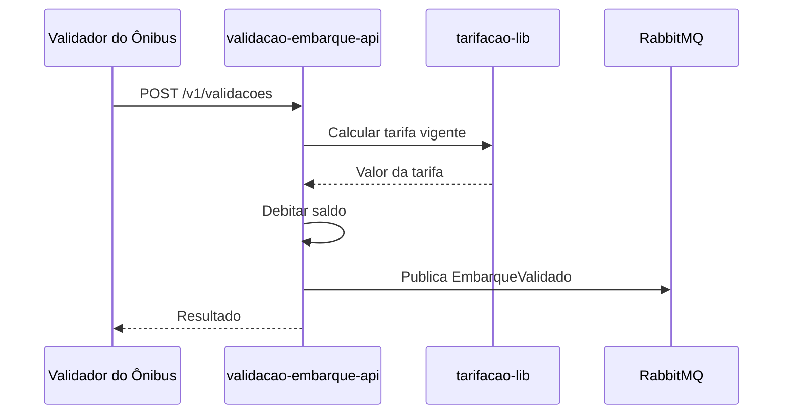
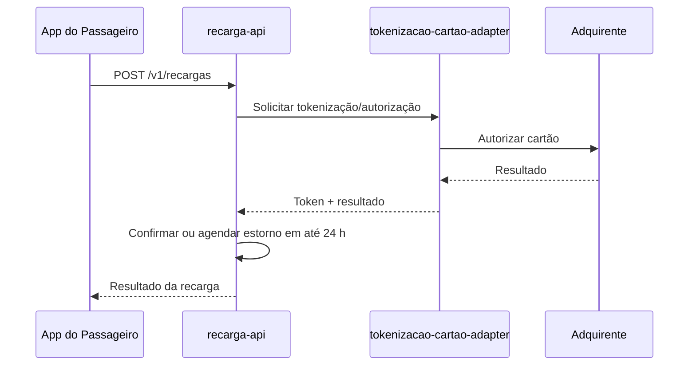
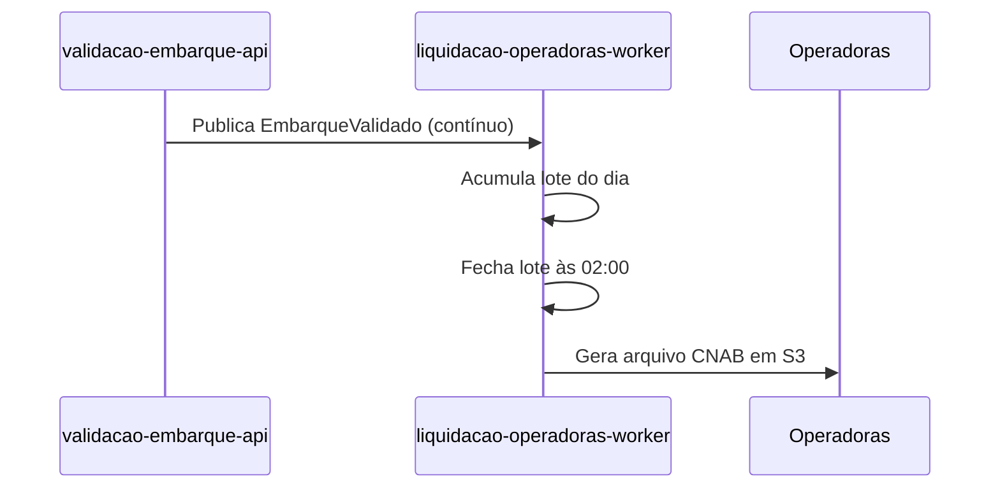

# Integration Flows

## 1. Objetivo

Documentar os principais fluxos de integração entre módulos e sistemas externos da solução Tarifa Viva.

## 2. Fluxo - Validação de Embarque

## 3. Fluxo - Recarga com Tokenização

## 4. Fluxo - Liquidação Diária

## 5. Regras do Fluxo

| Regra | Descrição |
|---|---|
| Nenhum PAN fora do CDE | Apenas tokenizacao-cartao-adapter recebe PAN; demais módulos só recebem token (NFR-02) |
| Reprodutibilidade do lote | O lote diário deve ser reproduzível a partir dos eventos EmbarqueValidado (NFR-04) |
| Janela de integração | Embarques dentro de 60 min não geram nova cobrança integral (FR-04) |

## 6. Pontos de Falha

| Ponto | Tratamento Esperado |
|---|---|
| Falha de confirmação da adquirente em até 24 h | Estorno automático (FR-03) |
| Validador offline por mais de 4 h | Ponto a Validar — política de expiração da lista de bloqueio (VAL-DDD-03) |
| Falha no fechamento do lote às 02:00 | Ponto a Validar — runbook de reprocessamento não definido |
