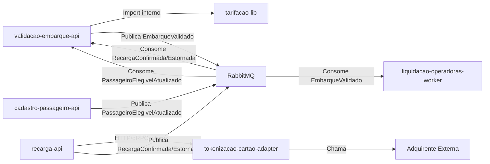

# Module Dependencies Diagram

## 1. Objetivo

Mostrar as dependências diretas e indiretas entre os módulos da solução Tarifa Viva.

## 2. Diagrama

## 3. Matriz de Dependências

| Origem | Destino | Tipo | Obrigatória? | Observação |
|---|---|---|---|---|
| validacao-embarque-api | tarifacao-lib | Package | Sim | Shared Kernel embarcado |
| validacao-embarque-api | RabbitMQ | Assíncrona | Sim | Publica EmbarqueValidado; consome RecargaConfirmada/Estornada e PassageiroElegivelAtualizado |
| recarga-api | tokenizacao-cartao-adapter | Síncrona | Sim | Nunca recebe PAN diretamente |
| recarga-api | RabbitMQ | Assíncrona | Sim | Publica RecargaConfirmada/RecargaEstornada |
| cadastro-passageiro-api | RabbitMQ | Assíncrona | Sim | Publica PassageiroElegivelAtualizado |
| liquidacao-operadoras-worker | RabbitMQ | Assíncrona | Sim | Consome EmbarqueValidado |
| tokenizacao-cartao-adapter | Adquirente (externo) | Externa | Sim | Anticorruption Layer (Context Map) |
| liquidacao-operadoras-worker | Operadoras (externo) | Externa | Sim | Arquivo CNAB via S3 |
