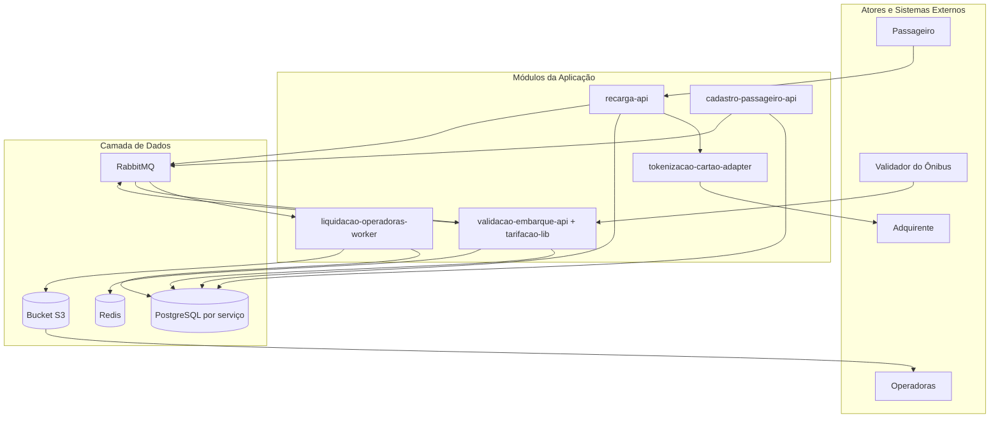

# Solution Architecture Diagram

## 1. Objetivo

Mostrar como os módulos da solução Tarifa Viva se relacionam em alto nível.

## 2. Diagrama

## 3. Observações

- `tarifacao-lib` é empacotada dentro de `validacao-embarque-api` e não aparece como nó de deploy próprio.
- Os cinco bounded contexts aprovados (Validação, Recarga, Tarifação, Liquidação, Cadastro) mapeiam para seis módulos; nenhuma fusão de contextos foi aplicada (ver `docs/product/modules/README.md`, seção 10, VAL-MOD-01).
- O módulo `relatorios-bi` pedido pela diretoria não está representado por falta de evidência documental (ver VAL-MOD-02).
