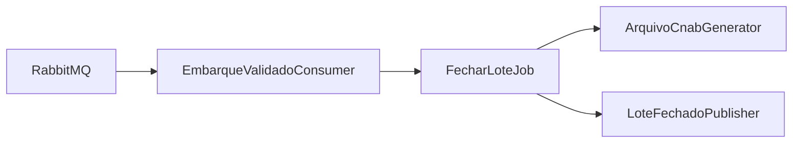
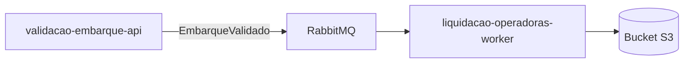
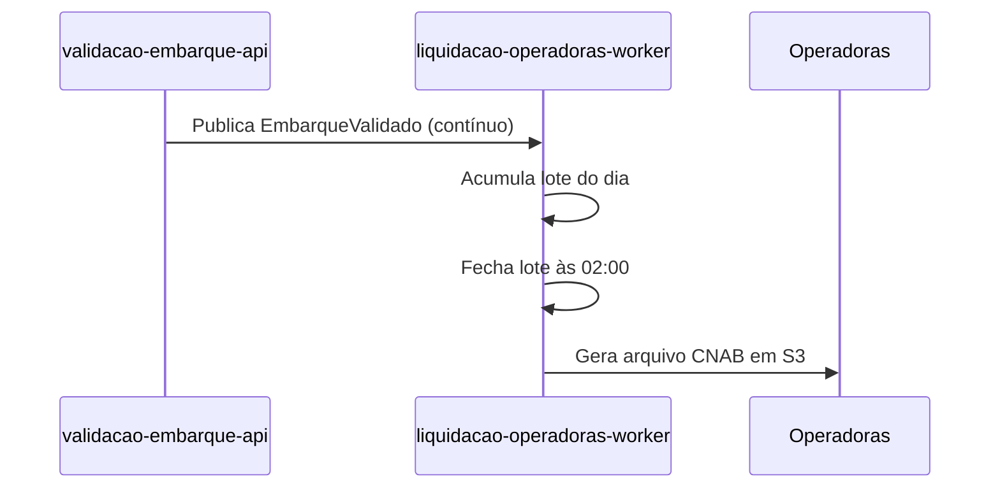

# Module - Liquidação com Operadoras Worker

## 1. Visão Geral

CronJob diário que fecha o lote de tarifas arrecadadas e gera o arquivo de repasse (CNAB) para cada uma das três operadoras (Viação Aurora, TransVale, Expresso Sol).

## 2. Classificação

| Item | Valor |
|---|---|
| Tipo de Módulo | CronJob |
| Deployable Candidato | liquidacao-operadoras-worker |
| Bounded Context Relacionado | Liquidação |
| Subdomínio DDD | Supporting Subdomain |
| Tier / Criticidade | Tier 2 |
| Status | Confirmado |

## 3. Objetivo

Garantir a liquidação diária D+1 para as três operadoras (OBJ-03), reproduzível a partir dos eventos EmbarqueValidado (NFR-04).

## 4. Responsabilidades

- Consumir EmbarqueValidado e acumular o lote do dia.
- Fechar o lote diário às 02:00 (TRD).
- Gerar arquivo CNAB por operadora em bucket S3.
- Publicar LoteLiquidacaoFechado.

## 5. Fora de Escopo

- Validação de embarque em si (pertence a validacao-embarque-api).
- Envio/negociação comercial do repasse com as operadoras (fora do sistema).

## 6. Capacidades Atendidas

| Código | Capability | Descrição |
|---|---|---|
| CAP-04 | Liquidação | Fechar lote diário de liquidação por operadora e gerar arquivo de repasse |

## 7. Bounded Context e Linguagem Ubíqua

| Termo | Definição |
|---|---|
| Lote | Conjunto de embarques validados fechado para liquidação |
| Repasse | Valor devido à operadora referente ao lote |
| Operadora | Empresa de ônibus municipal (Viação Aurora, TransVale, Expresso Sol) |

## 8. Componentes Internos Candidatos

| Componente | Tipo | Responsabilidade |
|---|---|---|
| EmbarqueValidadoConsumer | Consumer | Consumir EmbarqueValidado e acumular lote |
| FecharLoteJob | Worker | Executar o fechamento diário às 02:00 |
| ArquivoCnabGenerator | Adapter | Gerar e publicar o arquivo CNAB em S3 |
| LoteFechadoPublisher | Publisher | Publicar LoteLiquidacaoFechado |

## 9. APIs Principais

```text
Este módulo não expõe API pública. Atua como worker, adapter, package ou componente interno.
```

## 10. Eventos Publicados

| Evento | Quando é publicado | Consumidores |
|---|---|---|
| LoteLiquidacaoFechado | Após o fechamento diário do lote | Externo: operadoras via arquivo |

## 11. Eventos Consumidos

| Evento | Produtor | Finalidade |
|---|---|---|
| EmbarqueValidado | validacao-embarque-api | Compor o lote de tarifas arrecadadas do dia |

## 12. Dados Próprios

| Entidade/Tabela/Collection | Tipo | Banco/Persistência | Observações |
|---|---|---|---|
| lotes_liquidacao | Tabela | PostgreSQL | Nenhum dado sensível |

## 13. Integrações

| Sistema/Módulo | Tipo de Integração | Direção | Observações |
|---|---|---|---|
| validacao-embarque-api | Evento (RabbitMQ) | Entrada | Consome EmbarqueValidado |
| Operadoras (externo) | Arquivo (CNAB via S3) | Saída | Repasse diário D+1 |

## 14. Dependências

### 14.1 Dependências de Domínio

- Bounded context Validação (evento EmbarqueValidado deve ser reproduzível, NFR-04).

### 14.2 Dependências Técnicas

- PostgreSQL, RabbitMQ, bucket S3 (TRD).

### 14.3 Dependências Operacionais

- Job/cron configurado às 02:00.
- Runbook de reprocessamento em caso de falha do fechamento diário.

## 15. Requisitos Não Funcionais Relevantes

| Categoria | Requisito / Observação |
|---|---|
| Performance | Não especificado — Ponto a Validar (janela de execução do fechamento) |
| Segurança | Não processa dados de cartão ou PII |
| Disponibilidade | 99,5% (NFR-05) |
| Observabilidade | Alertar falha de fechamento diário |
| Compliance | Reprodutibilidade auditável do lote (NFR-04) |
| Resiliência | Ponto a Validar (reprocessamento em caso de falha) |
| Privacidade | Não aplicável |
| Auditabilidade | Todo lote deve ser reproduzível a partir de EmbarqueValidado (NFR-04) |

## 16. Compliance Aplicável

| Compliance / Norma / Lei | Aplicável? | Motivo | Impacto no Módulo |
|---|---|---|---|
| PCI DSS | Não | Não processa dados de cartão | — |
| LGPD / GDPR / Privacidade | Não | Não processa PII | — |
| SOX / Auditoria Financeira | Sim | Base do repasse financeiro às operadoras | Deve garantir reprodutibilidade e trilha de auditoria do lote (NFR-04) |

## 17. Observabilidade

| Item | Recomendação Inicial |
|---|---|
| Logs | Logs estruturados com correlation_id do lote |
| Métricas | Total arrecadado por operadora; tempo de fechamento |
| Traces | Não crítico (processo batch) |
| Alertas | Falha ou atraso no fechamento diário |
| Health Checks | Última execução bem-sucedida do cron |
| Auditoria | Lote reproduzível a partir de EmbarqueValidado |

## 18. Diagramas do Módulo

### 18.1 Diagrama de Componentes Internos



### 18.2 Diagrama de Dependências



### 18.3 Diagrama de Fluxo Principal



## 19. Riscos

| Código | Risco | Impacto | Mitigação |
|---|---|---|---|
| RISK-MOD-01 | Falha no fechamento às 02:00 sem reprocessamento definido | Atraso no repasse D+1 às operadoras | Definir runbook de reprocessamento (Ponto a Validar) |

## 20. Pontos a Validar

| Código | Ponto | Impacto | Recomendação |
|---|---|---|---|
| VAL-MOD-01 | Estratégia de reprocessamento em caso de falha do cron | Risco de atraso no repasse D+1 | Definir com arquitetura/operações |

## 21. Backlog Inicial Sugerido

| Tipo | Item | Descrição |
|---|---|---|
| Epic | Liquidação Diária | Implementar fechamento de lote e geração de CNAB |
| Story Técnica | Geração de arquivo CNAB | Implementar layout por operadora |
| Task | Job de fechamento às 02:00 | Implementar cron e consumo de EmbarqueValidado |

## 22. Referências

| Documento | Seção |
|---|---|
| DDD Segmentation | Solution Module Map |
| Context Map | Validação → Liquidação, Published Language |
| NFRD | NFR-04, NFR-05 |
| TRD | Fechamento diário às 02:00, arquivo CNAB em S3 |
