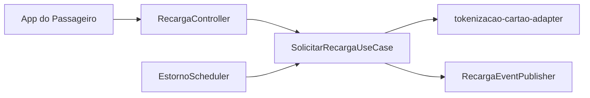
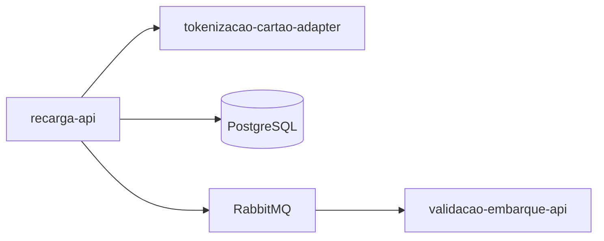
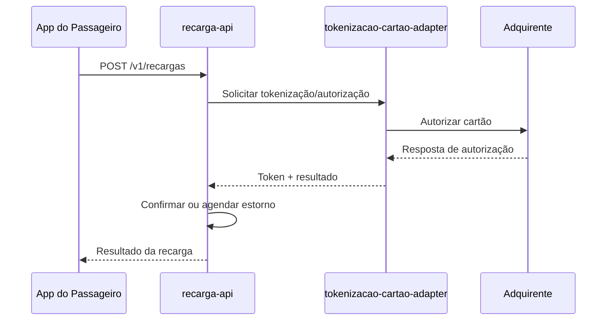

# Module - Recarga API

## 1. Visão Geral

Orquestra o pedido de recarga de saldo do passageiro pelo app, delegando o processamento do cartão de pagamento ao tokenizacao-cartao-adapter e nunca recebendo o PAN diretamente.

## 2. Classificação

| Item | Valor |
|---|---|
| Tipo de Módulo | Microservice |
| Deployable Candidato | recarga-api |
| Bounded Context Relacionado | Recarga |
| Subdomínio DDD | Supporting Subdomain |
| Tier / Criticidade | Tier 1 |
| Status | Confirmado |

## 3. Objetivo

Permitir a recarga de saldo pelo app com cartão de crédito/débito sem que o PAN trafegue fora do componente de tokenização (OBJ-02), com estorno automático em até 24 h quando a adquirente não confirmar (FR-03).

## 4. Responsabilidades

- Receber o pedido de recarga do app (FR-02).
- Orquestrar a tokenização/autorização via tokenizacao-cartao-adapter.
- Estornar recarga não confirmada pela adquirente em até 24 h (FR-03).
- Publicar RecargaConfirmada/RecargaEstornada.

## 5. Fora de Escopo

- Receber ou processar PAN (pertence exclusivamente a tokenizacao-cartao-adapter).
- Débito do saldo no embarque (pertence a validacao-embarque-api).

## 6. Capacidades Atendidas

| Código | Capability | Descrição |
|---|---|---|
| CAP-02 | Recarga | Recarregar saldo do cartão transporte pelo app |

## 7. Bounded Context e Linguagem Ubíqua

| Termo | Definição |
|---|---|
| Recarga | Pedido de crédito de saldo no cartão transporte |
| Token de Cartão | Identificador seguro que substitui o PAN |
| Estorno | Reversão de uma recarga não confirmada pela adquirente |

## 8. Componentes Internos Candidatos

| Componente | Tipo | Responsabilidade |
|---|---|---|
| RecargaController | API Controller | Expor POST /v1/recargas |
| SolicitarRecargaUseCase | Use Case | Orquestrar pedido de recarga |
| EstornoScheduler | Worker | Verificar recargas não confirmadas após 24 h |
| RecargaEventPublisher | Publisher | Publicar RecargaConfirmada/RecargaEstornada |

## 9. APIs Principais

| Método | Endpoint | Finalidade | Consumidores |
|---|---|---|---|
| POST | /v1/recargas | Solicitar recarga de saldo (FR-02) | App do passageiro |

## 10. Eventos Publicados

| Evento | Quando é publicado | Consumidores |
|---|---|---|
| RecargaConfirmada | Adquirente confirma a autorização via tokenizacao-cartao-adapter | validacao-embarque-api |
| RecargaEstornada | Recarga não confirmada em até 24 h (FR-03) | validacao-embarque-api |

## 11. Eventos Consumidos

```text
Este módulo não consome eventos diretamente.
```

## 12. Dados Próprios

| Entidade/Tabela/Collection | Tipo | Banco/Persistência | Observações |
|---|---|---|---|
| pedidos_recarga | Tabela | PostgreSQL | Guarda apenas token_cartao e ultimos4; nunca PAN |

## 13. Integrações

| Sistema/Módulo | Tipo de Integração | Direção | Observações |
|---|---|---|---|
| tokenizacao-cartao-adapter | HTTP interno / gRPC | Saída | Delega tokenização e autorização |
| validacao-embarque-api | Evento (RabbitMQ) | Saída | Publica RecargaConfirmada/RecargaEstornada |

## 14. Dependências

### 14.1 Dependências de Domínio

- Bounded context Recarga (próprio) e dependência funcional do adapter de tokenização.

### 14.2 Dependências Técnicas

- PostgreSQL, RabbitMQ.
- tokenizacao-cartao-adapter (dependência técnica obrigatória para qualquer operação com cartão).

### 14.3 Dependências Operacionais

- Job/scheduler de verificação de estorno em 24 h.

## 15. Requisitos Não Funcionais Relevantes

| Categoria | Requisito / Observação |
|---|---|
| Performance | Não especificado no NFRD — Ponto a Validar |
| Segurança | Nunca recebe PAN (NFR-02) |
| Disponibilidade | 99,5% (NFR-05, "demais" serviços) |
| Observabilidade | Logs sem PAN/CVV (NFR-02) |
| Compliance | PCI DSS — módulo fora do CDE, desde que não receba PAN |
| Resiliência | Estorno automático em falha de confirmação (FR-03) |
| Privacidade | Não aplicável diretamente (dados de pagamento, não pessoais) |
| Auditabilidade | Ponto a Validar |

## 16. Compliance Aplicável

| Compliance / Norma / Lei | Aplicável? | Motivo | Impacto no Módulo |
|---|---|---|---|
| PCI DSS | Ponto a Validar | Orquestra recarga com cartão, mas não deve receber PAN (NFR-02) | Confirmar que nenhum campo de PAN transita por este serviço, nem em log nem em payload |
| LGPD / GDPR / Privacidade | Não | Dados de pagamento tokenizados, sem PII de passageiro | — |
| SOX / Auditoria Financeira | Ponto a Validar | Movimenta saldo do passageiro | Confirmar necessidade de trilha auditável de recargas/estornos |

## 17. Observabilidade

| Item | Recomendação Inicial |
|---|---|
| Logs | Logs estruturados com correlation_id, sem PAN/CVV |
| Métricas | Taxa de recargas confirmadas vs. estornadas |
| Traces | Trace do fluxo app → recarga-api → tokenizacao-cartao-adapter → adquirente |
| Alertas | Taxa de estorno acima do esperado |
| Health Checks | Readiness dependente de PostgreSQL e do adapter de tokenização |
| Auditoria | Toda recarga/estorno deve ser rastreável |

## 18. Diagramas do Módulo

### 18.1 Diagrama de Componentes Internos



### 18.2 Diagrama de Dependências



### 18.3 Diagrama de Fluxo Principal



## 19. Riscos

| Código | Risco | Impacto | Mitigação |
|---|---|---|---|
| RISK-MOD-01 | Atraso na confirmação da adquirente além de 24 h | Estorno indevido ou saldo indisponível | Confirmar SLA da adquirente e política de retry |

## 20. Pontos a Validar

| Código | Ponto | Impacto | Recomendação |
|---|---|---|---|
| VAL-MOD-01 | Performance/SLA de recarga não definidos no NFRD | Falta de meta de latência/disponibilidade específica | Definir junto a negócio/arquitetura |
| VAL-MOD-02 | Necessidade de trilha auditável específica para recargas/estornos | Impacto em SOX/auditoria financeira | Confirmar com compliance |

## 21. Backlog Inicial Sugerido

| Tipo | Item | Descrição |
|---|---|---|
| Epic | Recarga de Saldo | Implementar fluxo de recarga e estorno |
| Story Técnica | Integração com tokenizacao-cartao-adapter | Contrato interno de tokenização/autorização |
| Task | Endpoint POST /v1/recargas | Implementar contrato REST conforme FRD |

## 22. Referências

| Documento | Seção |
|---|---|
| DDD Segmentation | Solution Module Map |
| DDD Segmentation | Data Ownership Matrix |
| Context Map | Adquirente (externo) → Recarga |
| NFRD | NFR-02, NFR-05 |
| TRD | Restrições técnicas aplicáveis |
