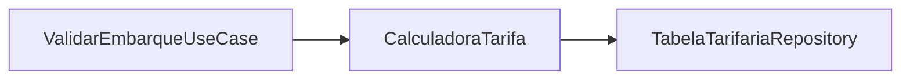
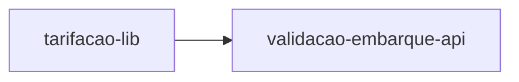
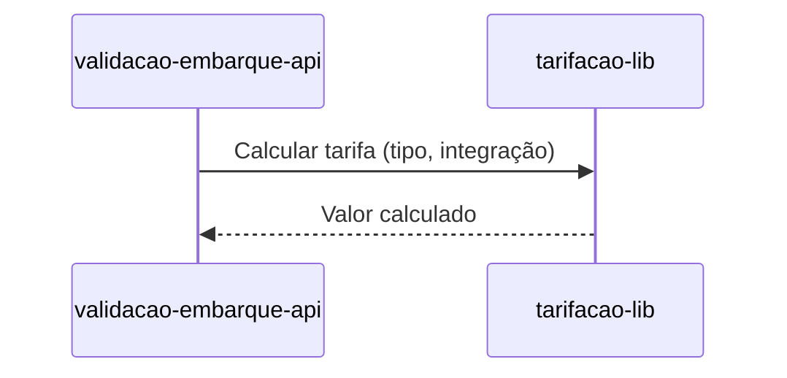

# Module - Tarifação Lib

## 1. Visão Geral

Biblioteca compartilhada com as regras de cálculo de tarifa (inteira, meia estudantil, gratuidade, integração em 60 min), embarcada em validacao-embarque-api como Shared Kernel.

## 2. Classificação

| Item | Valor |
|---|---|
| Tipo de Módulo | Shared Library |
| Deployable Candidato | Empacotada em validacao-embarque-api (sem deploy próprio) |
| Bounded Context Relacionado | Tarifação |
| Subdomínio DDD | Core Domain |
| Tier / Criticidade | Tier 1 (crítico, embora sem deploy próprio) |
| Status | Confirmado |

## 3. Objetivo

Centralizar a regra de cálculo de tarifa em um único pacote versionado, evitando duplicação da lógica entre módulos (FR-04).

## 4. Responsabilidades

- Calcular tarifa inteira, meia estudantil, gratuidade e integração em 60 min.
- Versionar a TabelaTarifaria.
- Expor API de pacote (não HTTP) para validacao-embarque-api.

## 5. Fora de Escopo

- Débito de saldo e persistência de viagens (pertence a validacao-embarque-api).
- Elegibilidade de gratuidade em si (recebida de Cadastro via evento).

## 6. Capacidades Atendidas

| Código | Capability | Descrição |
|---|---|---|
| CAP-03 | Tarifação | Calcular tarifa (inteira, meia estudantil, gratuidade, integração em 60 min) |

## 7. Bounded Context e Linguagem Ubíqua

| Termo | Definição |
|---|---|
| Tarifa Inteira | Valor cheio da passagem |
| Meia Estudantil | Tarifa reduzida para estudantes elegíveis |
| Integração | Janela de 60 min sem cobrança adicional entre embarques |

## 8. Componentes Internos Candidatos

| Componente | Tipo | Responsabilidade |
|---|---|---|
| CalculadoraTarifa | Domain Service | Calcular o valor da tarifa conforme regras vigentes |
| TabelaTarifariaRepository | Repository | Ler a tabela tarifária versionada no pacote |

## 9. APIs Principais

```text
Este módulo não expõe API pública. Atua como worker, adapter, package ou componente interno.
```

## 10. Eventos Publicados

```text
Este módulo não publica eventos de domínio próprios.
```

## 11. Eventos Consumidos

```text
Este módulo não consome eventos diretamente (a elegibilidade chega via validacao-embarque-api, que consome PassageiroElegivelAtualizado).
```

## 12. Dados Próprios

| Entidade/Tabela/Collection | Tipo | Banco/Persistência | Observações |
|---|---|---|---|
| TabelaTarifaria | Dado versionado no pacote | Nenhum (embarcado no artefato de build) | Não é banco de dados; é versionamento de release |

## 13. Integrações

| Sistema/Módulo | Tipo de Integração | Direção | Observações |
|---|---|---|---|
| validacao-embarque-api | Package (import interno) | Bidirecional | Shared Kernel (Context Map) |

## 14. Dependências

### 14.1 Dependências de Domínio

- Bounded context Tarifação (próprio); depende de elegibilidade vinda de Cadastro.

### 14.2 Dependências Técnicas

- Nenhuma dependência de infraestrutura própria (é biblioteca embarcada).

### 14.3 Dependências Operacionais

- Processo de release/versionamento do pacote junto ao ciclo de deploy de validacao-embarque-api.

## 15. Requisitos Não Funcionais Relevantes

| Categoria | Requisito / Observação |
|---|---|
| Performance | Deve respeitar o p99 < 300 ms do módulo hospedeiro (NFR-01) |
| Segurança | Não aplicável diretamente |
| Disponibilidade | Herdada de validacao-embarque-api |
| Observabilidade | Instrumentação delegada ao módulo hospedeiro |
| Compliance | Não aplicável |
| Resiliência | Não aplicável (sem I/O externo) |
| Privacidade | Não aplicável |
| Auditabilidade | Versão da TabelaTarifaria usada deve ser rastreável por embarque |

## 16. Compliance Aplicável

| Compliance / Norma / Lei | Aplicável? | Motivo | Impacto no Módulo |
|---|---|---|---|
| PCI DSS | Não | Não processa dados de cartão | — |
| LGPD / GDPR / Privacidade | Não | Não processa PII | — |
| SOX / Auditoria Financeira | Ponto a Validar | Base do valor cobrado por embarque | Confirmar necessidade de versionamento auditável formal |

## 17. Observabilidade

| Item | Recomendação Inicial |
|---|---|
| Logs | Delegados ao módulo hospedeiro (validacao-embarque-api) |
| Métricas | Distribuição de tarifas aplicadas por tipo (inteira/meia/gratuidade) |
| Traces | Incluído no trace do módulo hospedeiro |
| Alertas | Falha de carregamento da TabelaTarifaria |
| Health Checks | Não aplicável (sem processo próprio) |
| Auditoria | Versão da tabela tarifária usada por cálculo |

## 18. Diagramas do Módulo

### 18.1 Diagrama de Componentes Internos



### 18.2 Diagrama de Dependências



### 18.3 Diagrama de Fluxo Principal



## 19. Riscos

| Código | Risco | Impacto | Mitigação |
|---|---|---|---|
| RISK-MOD-01 | Divergência de versão da lib entre ambientes | Cobrança incorreta de tarifa | Fixar versão da lib no pipeline de build de validacao-embarque-api |

## 20. Pontos a Validar

| Código | Ponto | Impacto | Recomendação |
|---|---|---|---|
| VAL-MOD-01 | Necessidade de trilha auditável formal da versão da TabelaTarifaria por embarque | Auditoria financeira do lote de liquidação | Confirmar com compliance/financeiro |

## 21. Backlog Inicial Sugerido

| Tipo | Item | Descrição |
|---|---|---|
| Epic | Cálculo de Tarifa | Implementar regras de tarifa inteira, meia e integração |
| Story Técnica | Versionamento da TabelaTarifaria | Definir processo de release do pacote |
| Task | CalculadoraTarifa | Implementar cálculo conforme FRD |

## 22. Referências

| Documento | Seção |
|---|---|
| DDD Segmentation | Solution Module Map |
| Context Map | Tarifação → Validação, Shared Kernel |
| FRD | FR-04 |
