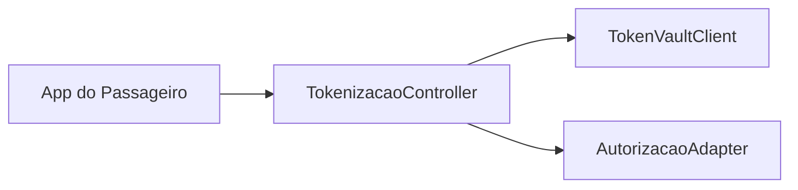
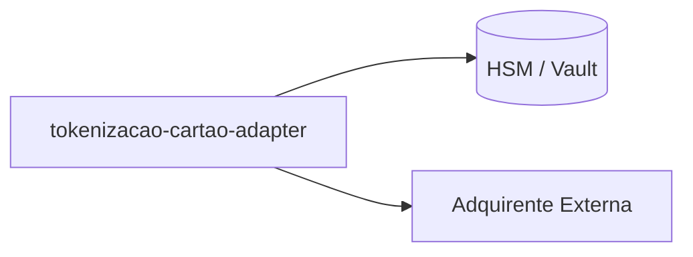
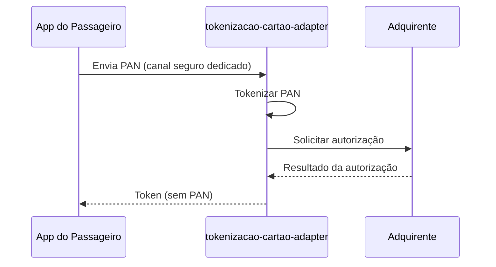

# Module - Tokenização de Cartão Adapter

## 1. Visão Geral

Único ponto da solução que recebe o PAN do app do passageiro; tokeniza e autoriza junto à adquirente, isolando todo o restante da solução do dado de cartão (OBJ-02, NFR-02).

## 2. Classificação

| Item | Valor |
|---|---|
| Tipo de Módulo | Adapter |
| Deployable Candidato | tokenizacao-cartao-adapter |
| Bounded Context Relacionado | Recarga |
| Subdomínio DDD | Supporting Subdomain |
| Tier / Criticidade | Tier 1 |
| Status | Confirmado |

## 3. Objetivo

Concentrar o tratamento de PAN em um único componente auditável, delimitando o CDE (Cardholder Data Environment) exigido pelo PCI DSS 4.0.1.

## 4. Responsabilidades

- Receber o PAN diretamente do app (nunca via recarga-api).
- Tokenizar e solicitar autorização à adquirente.
- Retornar apenas token/resultado para recarga-api.

## 5. Fora de Escopo

- Orquestração do pedido de recarga em si (pertence a recarga-api).
- Qualquer persistência de PAN fora do vault/HSM da adquirente ou do provedor de tokenização.

## 6. Capacidades Atendidas

| Código | Capability | Descrição |
|---|---|---|
| CAP-02 | Recarga | Sub-capacidade de tokenização/autorização de cartão |

## 7. Bounded Context e Linguagem Ubíqua

| Termo | Definição |
|---|---|
| Token de Cartão | Identificador seguro que substitui o PAN após tokenização |
| Anticorruption Layer | Padrão de integração com a adquirente externa (Context Map) |

## 8. Componentes Internos Candidatos

| Componente | Tipo | Responsabilidade |
|---|---|---|
| TokenizacaoController | API Controller | Receber PAN do app de forma segura |
| AutorizacaoAdapter | Adapter | Integrar com o gateway REST da adquirente |
| TokenVaultClient | Adapter | Comunicação com vault/HSM de tokenização |

## 9. APIs Principais

```text
Este módulo não expõe API pública. Atua como worker, adapter, package ou componente interno.
```

Observação: recebe PAN do app por um canal seguro dedicado (endpoint não documentado no FRD público — Ponto a Validar).

## 10. Eventos Publicados

```text
Este módulo não publica eventos de domínio próprios.
```

## 11. Eventos Consumidos

```text
Este módulo não consome eventos diretamente.
```

## 12. Dados Próprios

```text
Este módulo é stateless e não possui dados próprios além do estado transitório de PAN em memória durante o processamento (nunca persistido nas bases de aplicação).
```

## 13. Integrações

| Sistema/Módulo | Tipo de Integração | Direção | Observações |
|---|---|---|---|
| recarga-api | HTTP interno / gRPC | Entrada/Saída | Recebe pedido de tokenização, retorna token |
| Adquirente (externo) | HTTP/REST | Saída | Gateway da adquirente contratada (TRD) |
| HSM/Vault de tokenização | Integração de segurança | Bidirecional | Ponto a Validar: fornecedor não identificado nos artefatos |

## 14. Dependências

### 14.1 Dependências de Domínio

- Bounded context Recarga.

### 14.2 Dependências Técnicas

- Gateway REST da adquirente (TRD).
- HSM ou vault de tokenização (Ponto a Validar — fornecedor não especificado).

### 14.3 Dependências Operacionais

- Certificados/segredos de integração com a adquirente.
- Rotação de chaves de criptografia.

## 15. Requisitos Não Funcionais Relevantes

| Categoria | Requisito / Observação |
|---|---|
| Performance | Ponto a Validar |
| Segurança | Único módulo autorizado a receber PAN; logs sem PAN/CVV (NFR-02) |
| Disponibilidade | 99,5% (NFR-05) |
| Observabilidade | Auditoria obrigatória de todo acesso ao CDE |
| Compliance | PCI DSS 4.0.1 — dentro do CDE |
| Resiliência | Ponto a Validar (retry/circuit breaker com adquirente) |
| Privacidade | Não aplicável (dado de pagamento, não PII de passageiro) |
| Auditabilidade | Todo acesso a PAN deve gerar evento auditável |

## 16. Compliance Aplicável

| Compliance / Norma / Lei | Aplicável? | Motivo | Impacto no Módulo |
|---|---|---|---|
| PCI DSS | Sim | Único módulo que recebe e processa PAN (NFR-02) | Está dentro do CDE; ver compliance-pci-dss.md |
| LGPD / GDPR / Privacidade | Não | Não trata PII de passageiro | — |
| SOX / Auditoria Financeira | Ponto a Validar | Movimenta autorização de pagamento | Confirmar necessidade de trilha específica |

## 17. Observabilidade

| Item | Recomendação Inicial |
|---|---|
| Logs | Logs estruturados com correlation_id; sem PAN/CVV/track data |
| Métricas | Taxa de autorização aprovada/negada pela adquirente |
| Traces | Trace do fluxo tokenização → autorização |
| Alertas | Falha de comunicação com a adquirente ou com o vault |
| Health Checks | Readiness dependente da adquirente e do vault |
| Auditoria | Todo acesso ao CDE deve gerar evento auditável |

## 18. Diagramas do Módulo

### 18.1 Diagrama de Componentes Internos



### 18.2 Diagrama de Dependências



### 18.3 Diagrama de Fluxo Principal



## 19. Riscos

| Código | Risco | Impacto | Mitigação |
|---|---|---|---|
| RISK-MOD-01 | Fornecedor de HSM/vault não identificado nos artefatos | Bloqueio de design técnico e de certificação PCI | Confirmar fornecedor e escopo de certificação antes do detalhamento técnico |

## 20. Pontos a Validar

| Código | Ponto | Impacto | Recomendação |
|---|---|---|---|
| VAL-MOD-01 | Canal seguro pelo qual o app envia o PAN não está documentado no FRD | Define o endpoint/protocolo real do CDE | Confirmar com arquitetura de segurança |
| VAL-MOD-02 | Fornecedor de HSM/vault de tokenização não identificado | Impacta certificação PCI DSS 4.0.1 | Confirmar com Vellus (consultoria PCI) |

## 21. Backlog Inicial Sugerido

| Tipo | Item | Descrição |
|---|---|---|
| Epic | Tokenização de Cartão | Implementar isolamento do CDE |
| Story Técnica | Integração com HSM/vault | Definir fornecedor e contrato |
| Task | Integração com gateway da adquirente | Implementar chamada de autorização |

## 22. Referências

| Documento | Seção |
|---|---|
| DDD Segmentation | Solution Module Map |
| Context Map | Adquirente (externo) → Recarga, Anticorruption Layer |
| NFRD | NFR-02 |
| TRD | Gateway REST da adquirente |
