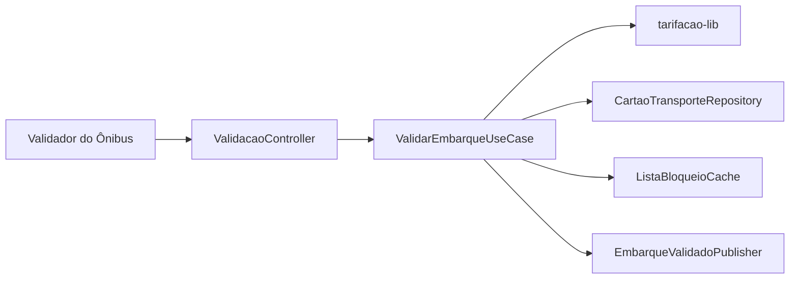
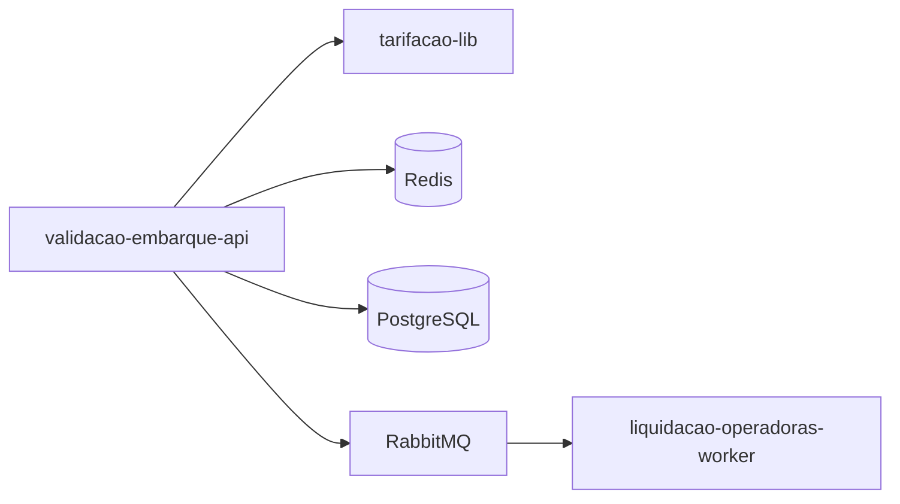
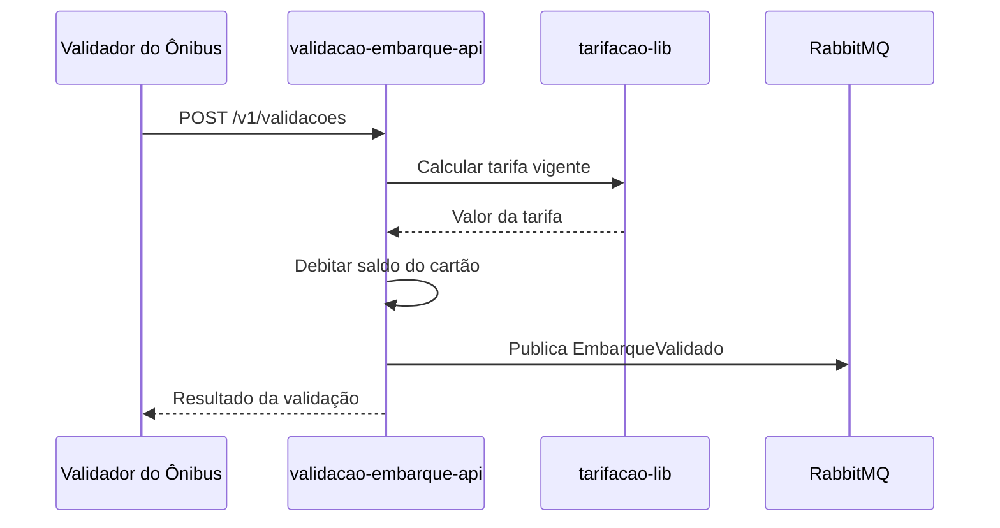

# Module - Validação de Embarque API

## 1. Visão Geral

Recebe as validações de embarque dos validadores instalados nos ônibus, calcula a tarifa devida (via tarifacao-lib) e debita o saldo do cartão transporte ou QR do app, publicando o evento de embarque validado.

## 2. Classificação

| Item | Valor |
|---|---|
| Tipo de Módulo | Microservice |
| Deployable Candidato | validacao-embarque-api (empacota tarifacao-lib) |
| Bounded Context Relacionado | Validação |
| Subdomínio DDD | Core Domain |
| Tier / Criticidade | Tier 1 |
| Status | Confirmado |

## 3. Objetivo

Garantir que todo embarque seja validado e tarifado em até 300 ms (NFR-01), inclusive com o validador operando offline por até 4 horas.

## 4. Responsabilidades

- Validar embarque por cartão transporte ou QR do app (FR-01).
- Calcular a tarifa vigente via tarifacao-lib (FR-04).
- Debitar o saldo do CartaoTransporte e manter cache local de lista de bloqueio para operação offline.
- Publicar EmbarqueValidado para consumo por Liquidação.

## 5. Fora de Escopo

- Emissão/recarga de saldo (pertence a recarga-api).
- Cálculo da regra de tarifa em si, que é responsabilidade da tarifacao-lib (este módulo apenas invoca o pacote).
- Fechamento de lote e repasse a operadoras (pertence a liquidacao-operadoras-worker).

## 6. Capacidades Atendidas

| Código | Capability | Descrição |
|---|---|---|
| CAP-01 | Validação de Embarque | Validar embarque por cartão transporte ou QR e debitar a tarifa vigente |

## 7. Bounded Context e Linguagem Ubíqua

| Termo | Definição |
|---|---|
| Embarque | Evento físico de entrada do passageiro no ônibus |
| Validador | Dispositivo instalado no ônibus que lê cartão/QR |
| Lista de Bloqueio | Cache de cartões inválidos/bloqueados usada para operação offline |

## 8. Componentes Internos Candidatos

| Componente | Tipo | Responsabilidade |
|---|---|---|
| ValidacaoController | API Controller | Expor POST /v1/validacoes |
| ValidarEmbarqueUseCase | Use Case | Orquestrar validação, cálculo de tarifa e débito |
| CartaoTransporteRepository | Repository | Persistir viagens e cartões transporte |
| ListaBloqueioCache | Adapter | Cache local (Redis) da lista de bloqueio, com sincronização periódica |
| EmbarqueValidadoPublisher | Publisher | Publicar evento EmbarqueValidado no RabbitMQ |

## 9. APIs Principais

| Método | Endpoint | Finalidade | Consumidores |
|---|---|---|---|
| POST | /v1/validacoes | Registrar e validar um embarque (FR-01) | Validador de embarque (dispositivo do ônibus) |

## 10. Eventos Publicados

| Evento | Quando é publicado | Consumidores |
|---|---|---|
| EmbarqueValidado | Após validação e débito de tarifa bem-sucedidos | liquidacao-operadoras-worker |

## 11. Eventos Consumidos

| Evento | Produtor | Finalidade |
|---|---|---|
| RecargaConfirmada | recarga-api | Atualizar saldo disponível do cartão transporte |
| RecargaEstornada | recarga-api | Reverter saldo em caso de estorno da adquirente |
| PassageiroElegivelAtualizado | cadastro-passageiro-api | Aplicar gratuidade/meia-tarifa estudantil na tarifação |

## 12. Dados Próprios

| Entidade/Tabela/Collection | Tipo | Banco/Persistência | Observações |
|---|---|---|---|
| viagens | Tabela | PostgreSQL | Nenhum dado sensível |
| cartoes_transporte | Tabela | PostgreSQL | Número lógico, não é cartão de pagamento (não é PAN) |

## 13. Integrações

| Sistema/Módulo | Tipo de Integração | Direção | Observações |
|---|---|---|---|
| recarga-api | Evento (RabbitMQ) | Entrada | Consome RecargaConfirmada/RecargaEstornada |
| cadastro-passageiro-api | Evento (RabbitMQ) | Entrada | Consome PassageiroElegivelAtualizado |
| liquidacao-operadoras-worker | Evento (RabbitMQ) | Saída | Publica EmbarqueValidado |
| tarifacao-lib | Package (import interno) | Interna | Shared Kernel para cálculo de tarifa |
| Redis | Cache | Bidirecional | Lista de bloqueio para operação offline |

## 14. Dependências

### 14.1 Dependências de Domínio

- Bounded context Tarifação (via tarifacao-lib, Shared Kernel) para regras de cálculo.
- Bounded context Cadastro para elegibilidade de gratuidade/meia-tarifa.

### 14.2 Dependências Técnicas

- PostgreSQL (persistência própria).
- Redis (cache de lista de bloqueio).
- RabbitMQ (exchange `tarifa-viva.eventos`).

### 14.3 Dependências Operacionais

- Sincronização periódica do validador offline (frequência a definir — ver VAL-DDD-03 no DDD Segmentation).
- Observabilidade de p99 de latência (NFR-01).

## 15. Requisitos Não Funcionais Relevantes

| Categoria | Requisito / Observação |
|---|---|
| Performance | p99 < 300 ms; validador opera offline até 4 h e sincroniza depois (NFR-01) |
| Segurança | Não trafega PAN; cartão transporte é identificador lógico |
| Disponibilidade | 99,95% (NFR-05) |
| Observabilidade | Logs estruturados com correlation_id; métricas de latência p50/p95/p99 |
| Compliance | Fora do CDE PCI DSS (não processa PAN) |
| Resiliência | Operação offline com sincronização posterior |
| Privacidade | Não armazena dados pessoais diretamente |
| Auditabilidade | Todo lote de liquidação deve ser reproduzível a partir de EmbarqueValidado (NFR-04) |

## 16. Compliance Aplicável

| Compliance / Norma / Lei | Aplicável? | Motivo | Impacto no Módulo |
|---|---|---|---|
| PCI DSS | Não | Não recebe, processa nem armazena PAN (NFR-02) | Fora do CDE |
| LGPD / GDPR / Privacidade | Ponto a Validar | Não armazena PII diretamente, mas consome PassageiroElegivelAtualizado | Confirmar se o payload do evento carrega dados pessoais ou apenas flag de elegibilidade |
| SOX / Auditoria Financeira | Sim | Base do lote de liquidação diário | Precisa garantir reprodutibilidade do evento EmbarqueValidado (NFR-04) |

## 17. Observabilidade

| Item | Recomendação Inicial |
|---|---|
| Logs | Logs estruturados com correlation_id |
| Métricas | Latência p50/p95/p99 da validação; taxa de embarques offline |
| Traces | Trace do fluxo validação → tarifação → débito → publicação de evento |
| Alertas | p99 acima de 300 ms; falha de sincronização da lista de bloqueio |
| Health Checks | Readiness dependente de conectividade com PostgreSQL e Redis |
| Auditoria | Todo débito de tarifa deve ser rastreável ao EmbarqueValidado correspondente |

## 18. Diagramas do Módulo

### 18.1 Diagrama de Componentes Internos

### 18.2 Diagrama de Dependências

### 18.3 Diagrama de Fluxo Principal

## 19. Riscos

| Código | Risco | Impacto | Mitigação |
|---|---|---|---|
| RISK-MOD-01 | Validador offline por mais de 4 h sem sincronizar lista de bloqueio | Aceitar embarque de cartão já bloqueado | Definir política de expiração/negativa segura quando cache expira (ver VAL-DDD-03) |

## 20. Pontos a Validar

| Código | Ponto | Impacto | Recomendação |
|---|---|---|---|
| VAL-MOD-01 | Frequência de sincronização do validador offline (herdado de VAL-DDD-03) | Define janela de risco de fraude offline | Confirmar com arquitetura/negócio |
| VAL-MOD-02 | Payload de PassageiroElegivelAtualizado pode conter PII | Escopo LGPD deste módulo | Confirmar com Cadastro se o evento carrega apenas flag ou dado pessoal |

## 21. Backlog Inicial Sugerido

| Tipo | Item | Descrição |
|---|---|---|
| Epic | Validação de Embarque | Implementar fluxo completo de validação online/offline |
| Story Técnica | Cache de lista de bloqueio | Implementar sincronização periódica com fallback offline |
| Task | Endpoint POST /v1/validacoes | Implementar contrato REST conforme FRD |

## 22. Referências

| Documento | Seção |
|---|---|
| DDD Segmentation | Solution Module Map |
| DDD Segmentation | Candidate Deployables |
| DDD Segmentation | Data Ownership Matrix |
| Context Map | Relações entre contextos |
| NFRD | NFR-01, NFR-04, NFR-05 |
| TRD | Restrições técnicas aplicáveis |
