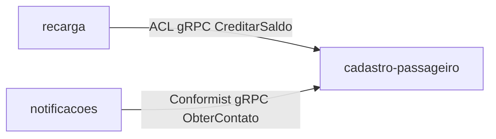
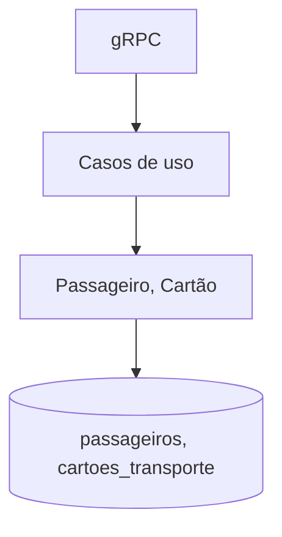
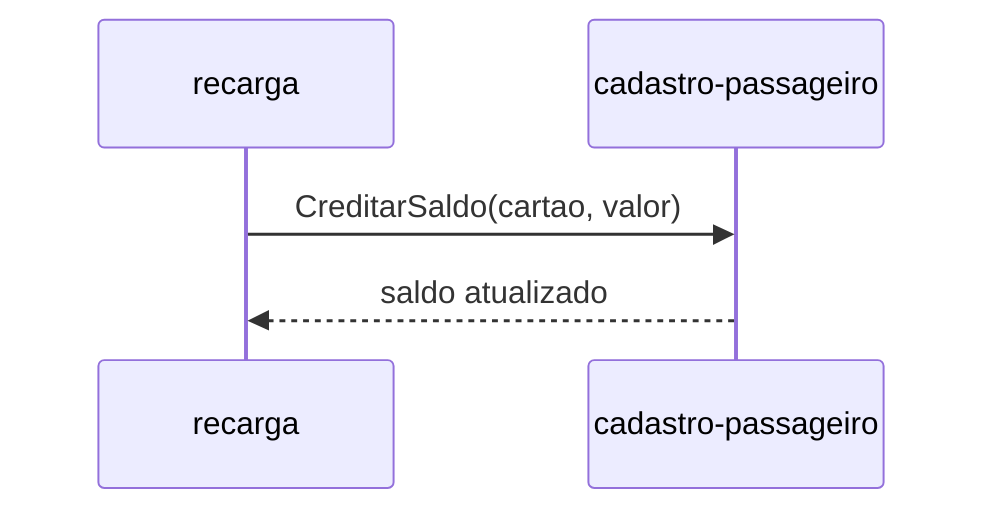
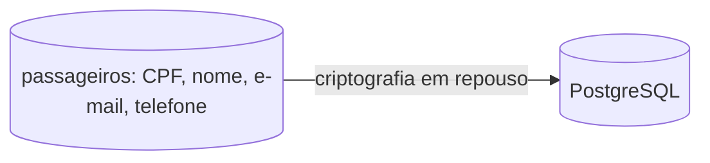

# Módulo cadastro-passageiro

## Identificação

- Nome: cadastro-passageiro
- Bounded context: cadastro-passageiro
- Tipo de subdomínio: Supporting

## Responsabilidade

Cadastra passageiros, emite cartões de transporte e mantém o saldo do cartão, creditado por comando de recarga.

## Ownership de dados

- passageiros (dono)
- cartoes_transporte (dono)

## Dependências

- Saída: nenhuma.
- Entrada: recarga (ACL, gRPC `CreditarSaldo`), notificacoes (Conformist, gRPC `ObterContato`).

## Integrações

- Expõe gRPC `Cartao.CreditarSaldo` e `Passageiro.ObterContato`.

## Deployable

- cadastro-passageiro-service (TRD §Deployables).

## Compliance

- Fora de escopo PCI DSS: não toca dado de cartão bancário.
- Escopo LGPD: trata CPF, nome, e-mail e telefone; base legal execução de contrato (art. 7º, V), conforme RNF-02.

## Arquitetura interna

## Integração

## Compliance (diagrama)

---
Cross-refs: BC `ddd/bounded-contexts/cadastro-passageiro`, deployable cadastro-passageiro-service, RF-01, RF-02, RNF-02.
