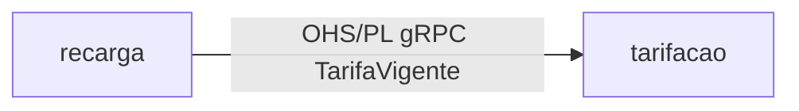
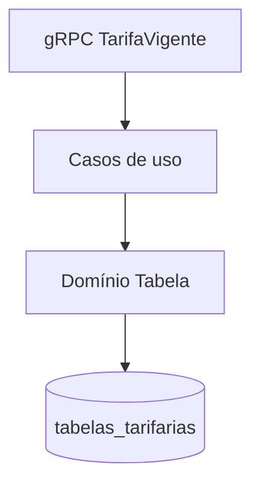
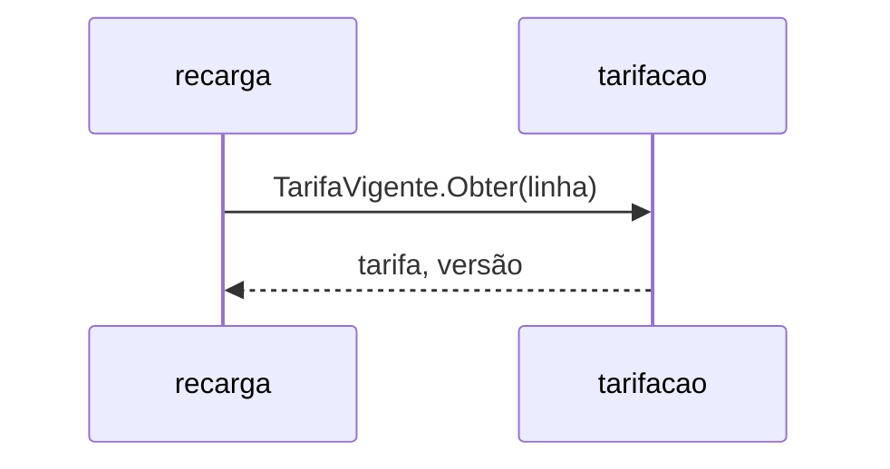

# Módulo tarifacao

## Identificação

- Nome: tarifacao
- Bounded context: tarifacao
- Tipo de subdomínio: Core

## Responsabilidade

Publica e versiona a tabela tarifária aprovada pelo poder concedente e expõe a tarifa vigente como Open Host Service.

## Ownership de dados

- tabelas_tarifarias (dono)

## Dependências

- Saída: nenhuma.
- Entrada: recarga (OHS/PL `TarifaVigente`).

## Integrações

- Expõe gRPC `TarifaVigente.Obter` (contrato `contracts/proto/tarifacao/v1/tarifa.proto`).

## Deployable

- tarifacao-service (TRD §Deployables) — Kotlin/Spring Boot + PostgreSQL.

## Compliance

- Fora de escopo PCI DSS: não toca dado de cartão. Fora de escopo LGPD: não trata PII.

## Arquitetura interna

## Integração

---
Cross-refs: BC `ddd/bounded-contexts/tarifacao`, deployable tarifacao-service (TRD), RF-05, ADR-0001.
