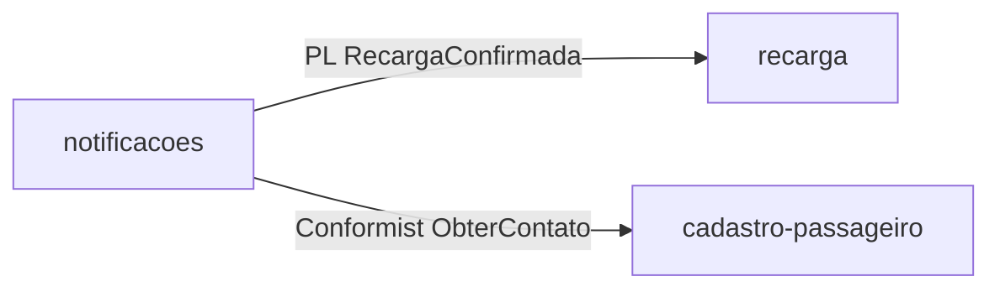
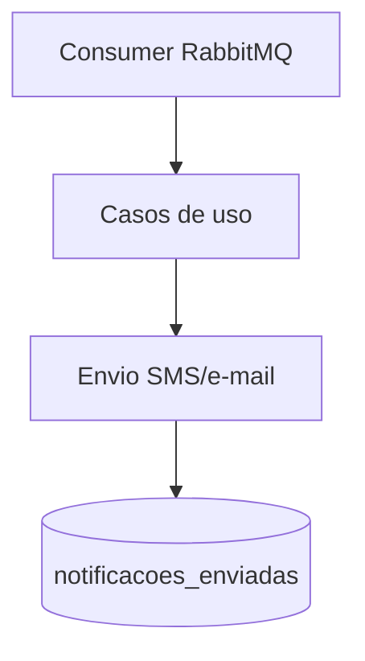
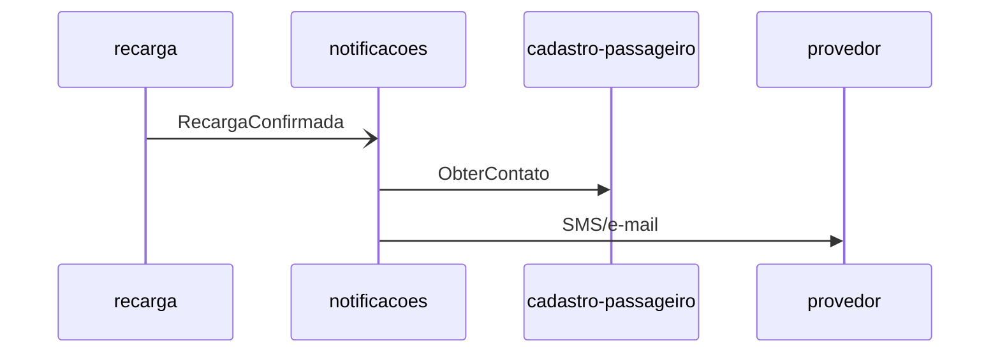
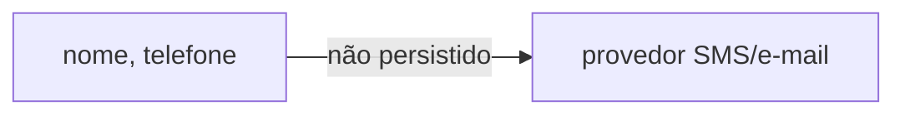

# Módulo notificacoes

## Identificação

- Nome: notificacoes
- Bounded context: notificacoes
- Tipo de subdomínio: Generic

## Responsabilidade

Consome `RecargaConfirmada` e envia SMS e e-mail ao passageiro.

## Ownership de dados

- notificacoes_enviadas (dono)
- passageiros (read-only, via `ObterContato`)

## Dependências

- Saída: recarga (PL, evento `RecargaConfirmada`), cadastro-passageiro (Conformist, gRPC `ObterContato`).
- Entrada: nenhuma.

## Integrações

- Consome evento `RecargaConfirmada` (producer: recarga).
- Chama gRPC `Passageiro.ObterContato`.

## Deployable

- backoffice-monolito (TRD §Deployables), compartilhado com cadastro-passageiro por decisão do ADR-0002; fronteira do módulo mantida por pacote e teste de arquitetura.

## Compliance

- Fora de escopo PCI DSS: não toca dado de cartão.
- Escopo LGPD: usa nome e telefone/e-mail do passageiro; base legal execução de contrato (art. 7º, V), conforme RNF-02.

## Arquitetura interna

## Integração

## Compliance (diagrama)

---
Cross-refs: ADR-0002, BC `ddd/bounded-contexts/notificacoes`, deployable backoffice-monolito, RF-06, RNF-02.
