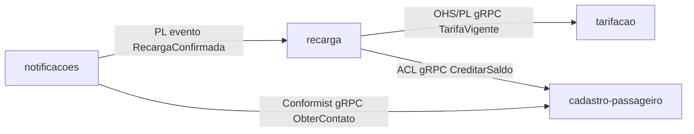

# Relatório de Validação — Módulos

- **Versão:** 2.0.0
- **Data:** 2026-09-26
- **Status:** Aprovado
- **Validador:** module-validator
- **Insumos consultados:** ddd-segmentation.md (1.0.0), bounded-contexts/* (sem versão explícita), subdomains/{core,supporting,generic}/* (sem versão explícita), context-map/{README,relations,patterns,diagram}.md (sem versão explícita), diagrams/c4-level-2-containers.md (sem versão explícita), data-model.md (1.0.0), trd.md (1.4.0), prd.md (sem versão explícita), frd.md (1.1.0), nfrd.md (1.1.0), adr/0001 e adr/0002 (Aceitos), glossary/* (sem versão explícita), modules-validation-report.md anterior (1.0.0, Reprovado)

## Resumo Executivo

4 módulos revalidados (cadastro-passageiro, recarga, tarifacao, notificacoes) após o 2º ciclo do `module-generator`. As duas pendências do relatório 1.0.0 foram resolvidas nos insumos: o ownership de `cartoes_transporte` ficou único (dono `cadastro-passageiro`; `recarga` passou a read-only via `CreditarSaldo`), e `recarga` agora declara deployable próprio (`recarga-service`). O agrupamento de `cadastro-passageiro` e `notificacoes` em `backoffice-monolito` está amparado pelo ADR-0002 e refletido no TRD 1.4.0. Nenhum achado Crítico ou Alto nesta rodada. Um achado Médio (drift entre o C4 nível 2 e o deployable compartilhado do ADR-0002) foi registrado como Ponto a Validar, fora do escopo de correção deste validador. A ausência de contratos OpenAPI/AsyncAPI é esperada (fase pré-implementação) e tratada como achado Baixo, sem impacto no parecer. Parecer: **Aprovado**. Questão adicional do usuário sobre a classificação de `tarifacao` (Core vs. Supporting) está fora do escopo deste agente — ver §11.

## 1. Matriz de Cobertura BC ↔ Módulo

| Bounded Context | Módulo | Tipo Subdomínio (DDD) | Tipo Subdomínio (Módulo) | Status |
|---|---|---|---|---|
| cadastro-passageiro | cadastro-passageiro | Supporting | Supporting | ✅ |
| recarga | recarga | Supporting | Supporting | ✅ |
| tarifacao | tarifacao | Core | Core | ✅ |
| notificacoes | notificacoes | Generic | Generic | ✅ |

**Cobertura:** 4/4 módulos (100%)

## 2. Matriz de Ownership de Dados

| Agregado/Tabela | Módulo Dono | Consumers (read-only) | Status |
|---|---|---|---|
| passageiros | cadastro-passageiro | notificacoes (via `ObterContato`) | ✅ |
| cartoes_transporte | cadastro-passageiro | recarga (via `CreditarSaldo`, sem escrita direta) | ✅ (corrigido desde 1.0.0 — antes tinha dois donos) |
| recargas | recarga | — | ✅ (append-only, RNF-04) |
| tabelas_tarifarias | tarifacao | recarga | ✅ |
| notificacoes_enviadas | notificacoes | — | ✅ |

**Cobertura:** 5/5 agregados do data-model.md (100%)

## 3. Grafo de Dependências

**Ciclos detectados:** nenhum.
**Violações de Context Map:** nenhuma — as 4 arestas batem exatamente com `context-map/relations.md` (OHS/PL recarga→tarifacao, ACL recarga→cadastro-passageiro, PL notificacoes→recarga, Conformist notificacoes→cadastro-passageiro). Travessia Supporting→Core (recarga→tarifacao) e Generic→Supporting (notificacoes→recarga, notificacoes→cadastro-passageiro) têm padrão declarado nos dois lados.

## 4. Matriz Módulo ↔ Deployable

| Módulo | Deployable (TRD 1.4.0) | Stack | Status |
|---|---|---|---|
| cadastro-passageiro | backoffice-monolito (compartilhado, ADR-0002) | Kotlin/Spring Boot + PostgreSQL + RabbitMQ | ✅ |
| notificacoes | backoffice-monolito (compartilhado, ADR-0002) | Kotlin/Spring Boot + PostgreSQL + RabbitMQ | ✅ |
| recarga | recarga-service | Kotlin/Spring Boot + PostgreSQL | ✅ (corrigido desde 1.0.0 — antes sem deployable) |
| tarifacao | tarifacao-service | Kotlin/Spring Boot + PostgreSQL | ✅ |

Sem deployable órfão: os 3 deployables do TRD (`backoffice-monolito`, `recarga-service`, `tarifacao-service`) têm módulo(s) correspondente(s). O compartilhamento de `backoffice-monolito` por dois módulos está documentado e justificado pelo ADR-0002 (volume baixo, equipe única, fronteira por pacote + ArchUnit).

## 5. Achados

### 5.1 Críticas

Nenhuma.

### 5.2 Altas

Nenhuma.

### 5.3 Médias

| ID | Achado | Local | Severidade | Ação |
|---|---|---|---|---|
| MOD-DOC-003 | `docs/product/ddd/diagrams/c4-level-2-containers.md` ainda lista `cadastro-passageiro-service` e `notificacoes-worker` como containers separados; TRD 1.4.0 e ADR-0002 definem um único deployable `backoffice-monolito` para os dois módulos | docs/product/ddd/diagrams/c4-level-2-containers.md | Média | Ponto a Validar |

### 5.4 Baixas

| ID | Achado | Local | Severidade | Ação |
|---|---|---|---|---|
| MOD-INT-003 | Nenhum contrato em `contracts/openapi/` ou `contracts/asyncapi/` (nem `contracts/proto/tarifacao/v1/tarifa.proto`, referenciado no README de tarifacao); esperado, pois a implementação ainda não começou | contracts/ (inexistente) | Baixa | Justificado — esperado nesta fase, conforme §4 do agente e confirmado pelo usuário |

## 6. Correções Aplicadas

Nenhuma correção aplicada nesta rodada — os dois achados do relatório 1.0.0 (MOD-OWN-001 e MOD-DEP-TRD-001) já chegaram resolvidos nos insumos do 2º ciclo do `module-generator`, e o achado MOD-DOC-001 (notificacoes sem diagrama de dependências) já veio corrigido também. Nada neste ciclo exigiu edição de `docs/product/modules/`.

## 7. Conflitos Arquiteturais

Nenhum.

## 8. Pontos a Validar

- **MOD-DOC-003** — o C4 nível 2 (`docs/product/ddd/diagrams/c4-level-2-containers.md`) não é artefato de `docs/product/modules/` e portanto está fora do escopo de correção direta deste validador (cabe a quem mantém os diagramas C4/DDD, tipicamente após rodar `/forge:c4` ou ajuste manual do `ddd-architect`). Recomenda-se atualizar o diagrama para refletir `backoffice-monolito` como container único antes da implementação, para não induzir a equipe a subir dois serviços onde o TRD e o ADR-0002 definem um.

## 9. Recomendações

1. Atualizar `docs/product/ddd/diagrams/c4-level-2-containers.md` para representar `backoffice-monolito` como um único container (cadastro-passageiro + notificacoes), alinhado ao TRD 1.4.0 e ao ADR-0002.
2. Quando a implementação começar, gerar os contratos `contracts/openapi/` (REST `POST /recargas`), `contracts/proto/` (gRPC `CreditarSaldo`, `ObterContato`, `TarifaVigente.Obter`) e `contracts/asyncapi/` (evento `RecargaConfirmada`), e reexecutar o Passo 4 deste validador — hoje tratado como Baixa apenas porque é esperado nesta fase.
3. Levar a pergunta sobre a classificação de `tarifacao` (Core vs. Supporting) ao `ddd-validator`/`ddd-architect` — ver §11 abaixo.

## 10. Parecer Final

**Aprovado**

Os dois achados que bloquearam o relatório 1.0.0 — ownership duplicado de `cartoes_transporte` (Crítica) e ausência de deployable para `recarga` (Alta) — chegam resolvidos e consistentes entre `data-model.md`, os READMEs de módulo e o TRD 1.4.0 neste 2º ciclo. Não há Crítica nem Alta nesta rodada; o único achado Médio (drift do diagrama C4, MOD-DOC-003) é um artefato de documentação fora de `docs/product/modules/`, não bloqueia a cobertura BC↔módulo (100%) nem a matriz de ownership (100%), e fica registrado como Ponto a Validar; o achado Baixo (contratos ainda inexistentes) é esperado e justificado pela fase pré-implementação. Cobertura BC↔Módulo em 100% e zero ciclos/violações de Context Map. Parecer sobe de Reprovado (1.0.0) para **Aprovado** (2.0.0, incremento MAJOR conforme §8.2 do agente).

## 11. Fora de escopo deste validador — pergunta do usuário sobre tarifacao (Core vs. Supporting)

O `module-validator` **não** valida classificação de subdomínio (Core/Supporting/Generic) — essa é responsabilidade do `ddd-validator`/`ddd-architect` (ver §"Anti-Patterns Bloqueados" e §11 "Diferenças vs. outros validators" da definição deste agente). Este relatório não emite parecer sobre se `tarifacao` deveria ser Core ou Supporting.

Registro apenas as evidências já presentes nos insumos lidos, para instruir a decisão de quem tem mandato sobre a segmentação:

- `tarifacao` publica uma tabela tarifária **definida externamente pelo poder concedente** (PRD, linha 5) e apenas versiona/expõe o valor vigente via OHS/PL (`tarifacao/README.md`, RF-05) — não há regra de precificação proprietária nem lógica de negócio diferenciadora além de versionamento e disponibilização.
- O consumidor único hoje é `recarga` (Supporting), via `TarifaVigente.Obter`.
- Nenhum RF/RNF associa `tarifacao` a vantagem competitiva do Passe Urbano; o diferencial de negócio descrito no PRD está em cadastro, recarga tokenizada e notificação, não na tarifação em si.

Essas observações são compatíveis tanto com a leitura de que `tarifacao` é Core (é o dado que toda cobrança depende, e erro nele é crítico ao negócio) quanto com a leitura de que é Supporting (a regra vem de fora, sem diferenciação competitiva própria). A decisão exige critério de negócio do `ddd-validator`/arquiteto de domínio, não deste validador.
