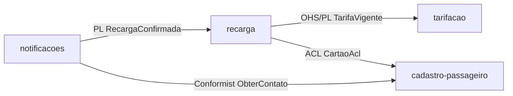

# Relatório de Validação — Módulos

- **Versão:** 1.0.0
- **Data:** 2026-09-26
- **Status:** Reprovado
- **Validador:** module-validator
- **Insumos consultados:** ddd-segmentation.md (1.0.0), bounded-contexts/{cadastro-passageiro,recarga,tarifacao,notificacoes} (sem versão), subdomains/{core,supporting,generic} (sem versão), context-map/{README,relations,patterns,diagram}.md (sem versão), diagrams/c4-level-2-containers.md (sem versão), data-model.md (1.0.0), trd.md (1.3.0), prd.md (1.2.0), frd.md (1.1.0), nfrd.md (1.1.0), adr/0001-grpc-interno-rest-externo.md (Aceito, 2026-07-30), glossary/{domain-glossary,ubiquitous-language}.md (sem versão). Não há `ddd-validation-report.md` nem `trd-validation-report.md` prévios.

## Resumo Executivo

Os 4 módulos do catálogo (cadastro-passageiro, recarga, tarifacao, notificacoes) cobrem 100% dos bounded contexts do DDD, o grafo de dependências é acíclico e respeita os padrões declarados no Context Map (OHS/PL, ACL, Conformist, PL), e o mapeamento módulo↔deployable do TRD é 1:1 sem órfãos. Foi encontrada 1 Crítica não corrigível — ownership duplicado da tabela `cartoes_transporte` (declarada como "a definir" no data-model.md, mas assumida por dois módulos ao mesmo tempo) — que bloqueia a liberação para implementação. Foram aplicadas 2 correções diretas de documentação (Média) e há 2 achados Baixa apenas registrados.

## 1. Matriz de Cobertura BC ↔ Módulo

| Bounded Context | Módulo | Tipo Subdomínio (DDD) | Tipo Subdomínio (Módulo) | Status |
|---|---|---|---|---|
| tarifacao | tarifacao | Core | Core | ✅ |
| recarga | recarga | Supporting | Supporting | ✅ |
| cadastro-passageiro | cadastro-passageiro | Supporting | Supporting | ✅ |
| notificacoes | notificacoes | Generic | Generic | ✅ |

**Cobertura:** 4/4 módulos (100%)

## 2. Matriz de Ownership de Dados

| Agregado/Tabela | Módulo Dono | Consumers (read-only) | Status |
|---|---|---|---|
| passageiros | cadastro-passageiro | notificacoes | ✅ |
| cartoes_transporte | **conflito** — data-model.md diz "a definir"; README de cadastro-passageiro declara dono, README de recarga declara "dono do saldo" | — | ❌ MOD-OWN-001 |
| recargas | recarga | — | ✅ |
| tabelas_tarifarias | tarifacao | recarga | ✅ |
| notificacoes_enviadas | notificacoes | — | ✅ |

## 3. Grafo de Dependências

**Ciclos detectados:** nenhum (grafo acíclico — `tarifacao` e `cadastro-passageiro` são folhas sem saída).
**Violações de Context Map:** nenhuma — todas as 4 arestas têm padrão declarado no `relations.md`/`patterns.md` e o módulo correspondente expõe o mecanismo exigido (OHS/PL exposto por `tarifacao`; ACL `CartaoAcl` declarado em `recarga`; PL do evento `RecargaConfirmada` com producer único; Conformist sem tradução em `notificacoes`).

## 4. Matriz Módulo ↔ Deployable

| Módulo | Deployable (TRD) | Stack | Status |
|---|---|---|---|
| cadastro-passageiro | cadastro-passageiro-service | Kotlin/Spring Boot + PostgreSQL | ✅ |
| recarga | recarga-service | Kotlin/Spring Boot + PostgreSQL | ✅ (seção Deployable ausente — corrigida, ver §6) |
| tarifacao | tarifacao-service | Kotlin/Spring Boot + PostgreSQL | ✅ |
| notificacoes | notificacoes-worker | Kotlin/Spring Boot + RabbitMQ | ✅ |

Todos os 4 deployables do TRD têm módulo correspondente; nenhum módulo ou deployable órfão.

## 5. Achados

### 5.1 Críticas

| ID | Achado | Local | Severidade | Ação |
|---|---|---|---|---|
| MOD-OWN-001 | Tabela `cartoes_transporte` tem ownership "a definir" em `data-model.md` (nota: "cadastro-passageiro emite o cartão; recarga credita o saldo — ownership em discussão"), mas `modules/cadastro-passageiro/README.md` declara "cartoes_transporte (dono)" e `modules/recarga/README.md` declara "cartoes_transporte (dono do saldo; recarga grava o saldo diretamente)" — dois donos simultâneos para o mesmo agregado, e o texto de `recarga` ("grava o saldo diretamente") contradiz a própria seção de Dependências do mesmo README, que declara a atualização de saldo via gRPC ACL `CreditarSaldo` em `cadastro-passageiro`, não por escrita direta | `docs/product/data-model/data-model.md`; `docs/product/modules/cadastro-passageiro/README.md` §Ownership; `docs/product/modules/recarga/README.md` §Ownership | Crítica | Conflito Arquitetural — não corrigido |

### 5.2 Altas

Nenhum achado Alta.

### 5.3 Médias

| ID | Achado | Local | Severidade | Ação |
|---|---|---|---|---|
| MOD-DOC-001 | Módulo `recarga` sem seção dedicada `## Deployable` (informação só aparecia no rodapé de cross-refs) | `docs/product/modules/recarga/README.md` | Média | [CORRIGIDO] |
| MOD-DOC-002 | Módulo `notificacoes` sem diagrama Mermaid de dependências (entrada/saída) na seção `## Dependências`, diferente dos demais 3 módulos | `docs/product/modules/notificacoes/README.md` | Média | [CORRIGIDO] |

### 5.4 Baixas

| ID | Achado | Local | Severidade | Ação |
|---|---|---|---|---|
| MOD-DOC-003 | ADR-0001 (gRPC interno/REST externo) é referenciado nos cross-refs de `recarga` e `tarifacao`, mas não em `cadastro-passageiro` nem `notificacoes`, apesar de ambos exporem/consumirem gRPC internamente | `docs/product/modules/cadastro-passageiro/README.md`; `docs/product/modules/notificacoes/README.md` (rodapé Cross-refs) | Baixa | Não corrigido — recomendação ao `module-generator` |
| MOD-INT-001 | Contrato `contracts/proto/tarifacao/v1/tarifa.proto` referenciado em `tarifacao/README.md` ainda não existe no repositório | `docs/product/modules/tarifacao/README.md` | Baixa (esperado nesta fase pré-implementação) | Não corrigido — registrado para quando `contracts/` for gerado |

## 6. Correções Aplicadas

| ID | Arquivo | Seção | Antes | Depois |
|---|---|---|---|---|
| MOD-DOC-001 | docs/product/modules/recarga/README.md | §Deployable | (seção ausente) | `## Deployable` adicionada com `recarga-service (TRD §Deployables)`, derivado da linha já presente em `docs/product/trd/trd.md` e do rodapé Cross-refs do próprio README |
| MOD-DOC-002 | docs/product/modules/notificacoes/README.md | §Dependências | (sem diagrama) | Diagrama Mermaid `graph LR` adicionado, espelhando as arestas já declaradas em texto (`Saída: recarga`, `cadastro-passageiro`) e o Context Map (`relations.md`) |

## 7. Conflitos Arquiteturais

- **MOD-OWN-001** — Ownership da tabela `cartoes_transporte` (Crítica). O `data-model.md` marca explicitamente a questão como "em discussão" e não define um dono; o catálogo de módulos, no entanto, atribui ownership a `cadastro-passageiro` e simultaneamente a `recarga` (para o campo saldo, "grava diretamente"). Resolver essa decisão é pré-requisito para liberar a implementação, porque muda: (a) qual serviço é dono do schema/tabela `cartoes_transporte` no PostgreSQL; (b) se `recarga` deve escrever saldo via chamada gRPC `CreditarSaldo` (como a própria seção de Dependências de `recarga` já indica) ou via acesso direto ao dado — as duas alternativas descritas no próprio README de `recarga` se contradizem. Per política do agente (anti-pattern §9: não inferir ownership quando `data-model.md` não é claro), este achado não foi corrigido automaticamente; requer decisão humana/arquitetural e atualização do `data-model.md` antes de novo ciclo do `module-generator`.

## 8. Pontos a Validar

- Confirmar se a intenção de arquitetura é que `cadastro-passageiro` seja o único dono de `cartoes_transporte` (incluindo o campo saldo) e que `recarga` sempre credite via gRPC `CreditarSaldo` — isso eliminaria a contradição interna do README de `recarga` e alinharia com o padrão ACL já declarado no Context Map. Essa é a leitura mais consistente com os demais insumos, mas não pode ser assumida como fato sem confirmação, pois o `data-model.md` trata o tema como aberto.

## 9. Recomendações

1. Resolver MOD-OWN-001: atualizar `data-model.md` com o dono definitivo de `cartoes_transporte` e, em seguida, re-executar `module-generator` para que os READMEs de `cadastro-passageiro` e `recarga` fiquem consistentes entre si (prioridade máxima — bloqueia implementação).
2. Padronizar a citação de ADR-0001 nos 4 módulos que usam gRPC interno (hoje só 2 o citam), para completude de cross-refs (MOD-DOC-003).
3. Quando `contracts/proto/`, `contracts/openapi/` e `contracts/asyncapi/` forem gerados, revalidar que o path citado em `tarifacao/README.md` (`contracts/proto/tarifacao/v1/tarifa.proto`) existe de fato (MOD-INT-001).

## 10. Parecer Final

**Reprovado.**

Há 1 achado Crítica (MOD-OWN-001) que não pôde ser corrigido por depender de uma decisão arquitetural ainda em aberto no próprio `data-model.md` — critério de reprovação automática por "1+ Crítica não corrigível" (§7 da definição do agente). A cobertura BC↔Módulo é 100%, o grafo de dependências é acíclico e respeita o Context Map, e o mapeamento módulo↔deployable é completo, então o catálogo está estruturalmente sólido; o bloqueio é pontual e específico ao ownership de `cartoes_transporte`. Recomenda-se resolver o Conflito Arquitetural (§7) e então reenviar ao `module-generator` para nova revisão.
