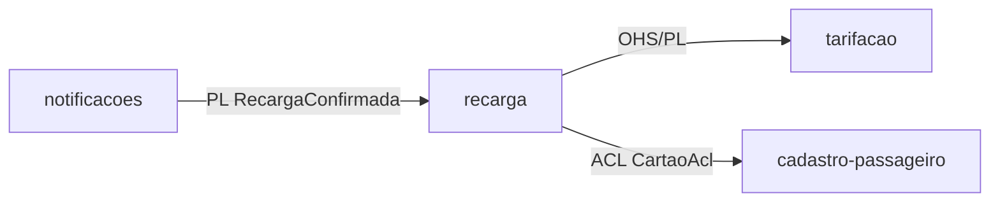
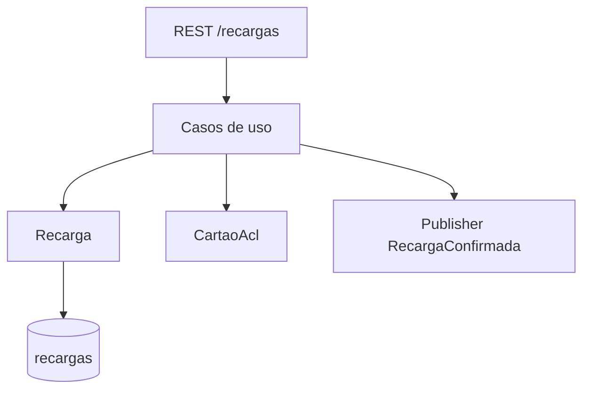
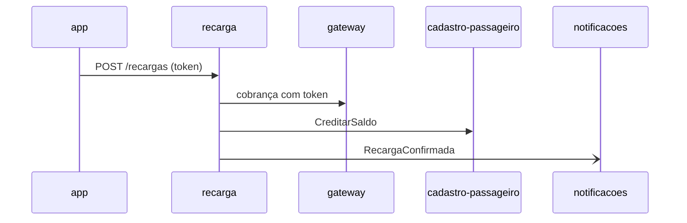
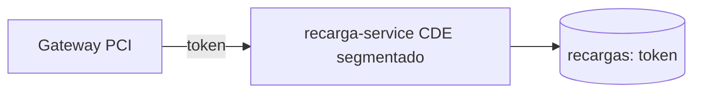

# Módulo recarga

## Identificação

- Nome: recarga
- Bounded context: recarga
- Tipo de subdomínio: Supporting

## Responsabilidade

Recebe o pedido de recarga, cobra o cartão bancário via gateway usando apenas o token, credita o saldo no cartão de transporte e publica `RecargaConfirmada`.

## Ownership de dados

- recargas (dono, append-only; estorno por lançamento compensatório)
- cartoes_transporte (dono do saldo; recarga grava o saldo diretamente)
- tabelas_tarifarias (read-only)

## Dependências

- Saída: tarifacao (OHS/PL `TarifaVigente`), cadastro-passageiro (ACL `CreditarSaldo`, camada `CartaoAcl`).
- Entrada: notificacoes (evento `RecargaConfirmada`, PL).

## Integrações

- Expõe REST `POST /recargas` ao app do passageiro.
- Publica evento `RecargaConfirmada` (producer único) no RabbitMQ.

## Deployable

- recarga-service (TRD §Deployables) — Kotlin/Spring Boot + PostgreSQL, escopo PCI DSS, rede segmentada.

## Compliance

- Escopo PCI DSS 4.0.1: manipula token de cartão (PAN tokenizado pelo gateway); nunca recebe PAN em claro nem CVV (RNF-01).
- LGPD: não armazena PII além do id do passageiro.

## Arquitetura interna

## Integração

## Compliance (diagrama)

---
Cross-refs: BC `ddd/bounded-contexts/recarga`, deployable recarga-service, RF-03, RF-04, RNF-01, RNF-04, ADR-0001.
