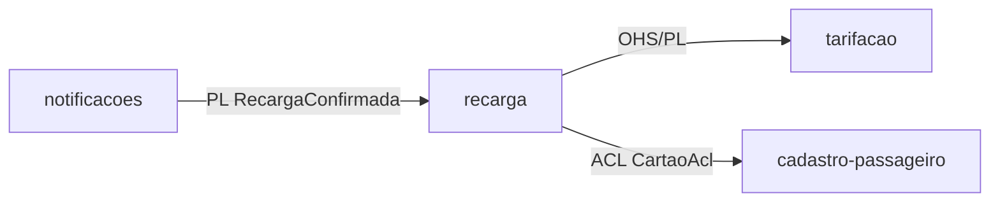
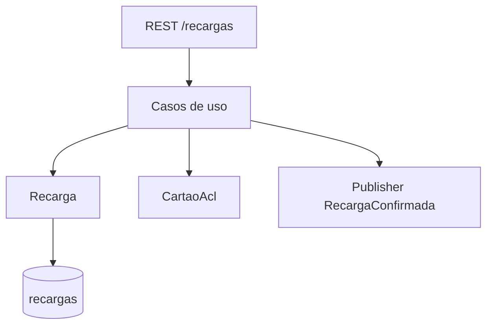
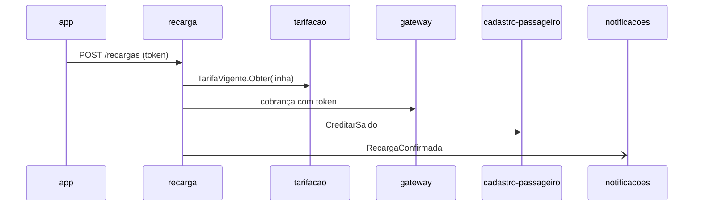
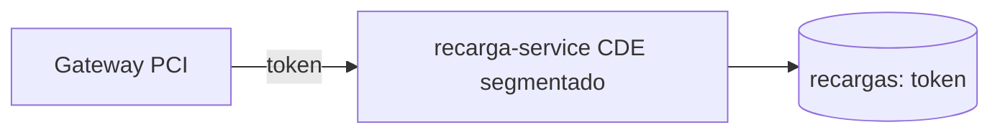

# Módulo recarga

## Identificação

- Nome: recarga
- Bounded context: recarga
- Tipo de subdomínio: Supporting

## Responsabilidade

Recebe o pedido de recarga, consulta a tarifa vigente em tarifacao para calcular a quantidade de passagens exibida (RF-04), cobra o cartão bancário via gateway usando apenas o token, credita o saldo no cartão de transporte via `CreditarSaldo` em cadastro-passageiro e publica `RecargaConfirmada`.

## Ownership de dados

- recargas (dono, append-only; estorno por lançamento compensatório)
- cartoes_transporte (não é dono — atualiza o saldo via `CreditarSaldo`, chamada ACL a cadastro-passageiro; ver Dependências)
- tabelas_tarifarias (read-only)

## Dependências

- Saída: tarifacao (OHS/PL `TarifaVigente`), cadastro-passageiro (ACL `CreditarSaldo`, camada `CartaoAcl`).
- Entrada: nenhuma.
- Consumido por (downstream): notificacoes (evento `RecargaConfirmada`, PL) — recarga publica; não depende de notificacoes.

## Integrações

- Expõe REST `POST /recargas` ao app do passageiro.
- Publica evento `RecargaConfirmada` (producer único) no RabbitMQ.

## Compliance

- Escopo PCI DSS 4.0.1: manipula token de cartão (PAN tokenizado pelo gateway); nunca recebe PAN em claro nem CVV (RNF-01).
- LGPD: não armazena PII além do id do passageiro.
- Desempenho: p95 do fluxo de recarga < 10 s, do pedido à confirmação (RNF-03).

## Arquitetura interna

## Integração

## Compliance (diagrama)

---
Cross-refs: BC `ddd/bounded-contexts/recarga`, deployable recarga-service, RF-03, RF-04, RNF-01, RNF-03, RNF-04, ADR-0001.
