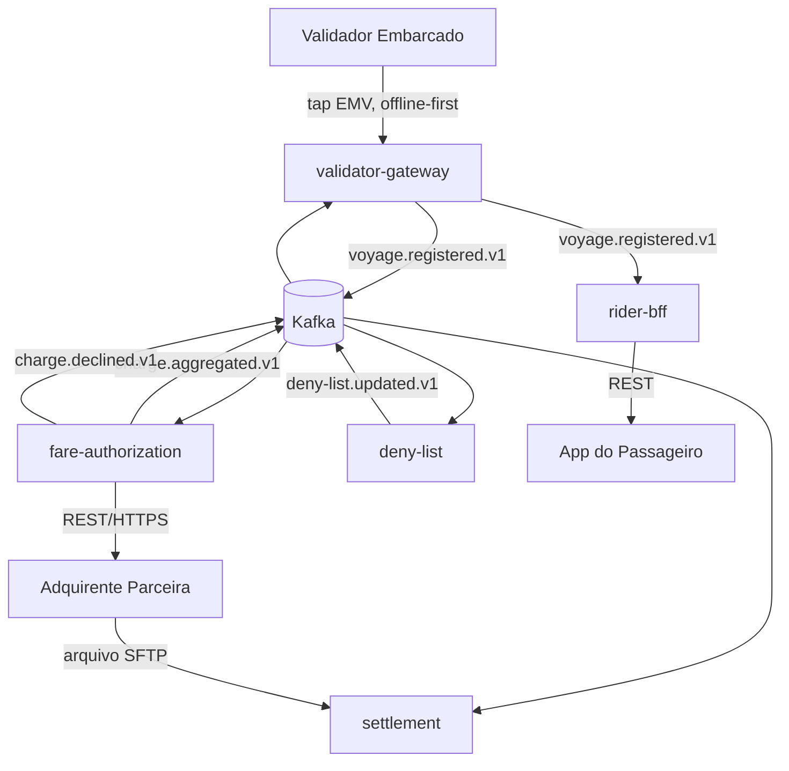
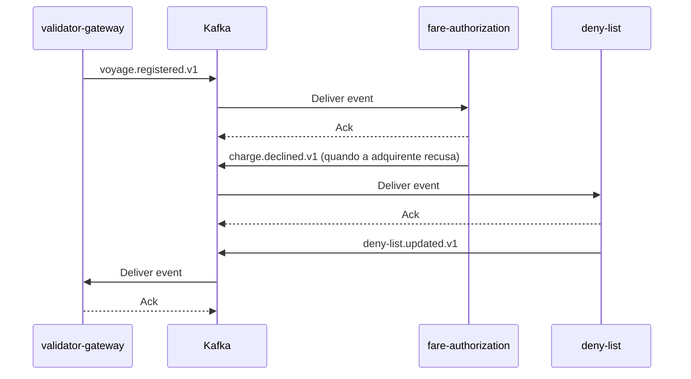
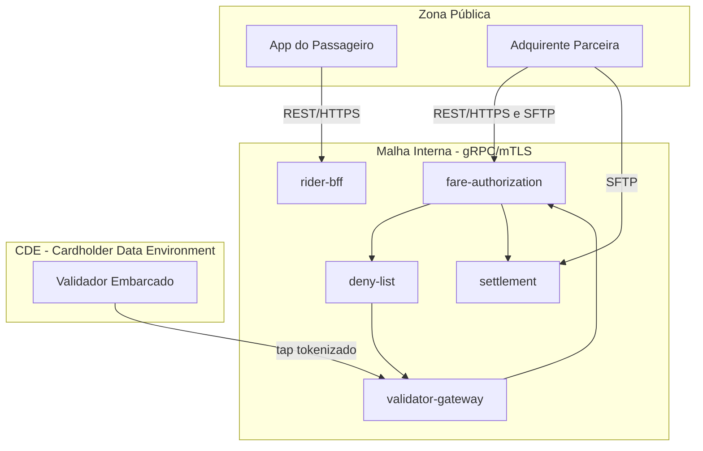

# TRD - Tarifa Aberta

**Produto:** Tarifa Aberta
**Versão:** v1.0
**Data:** 2026-09-28
**Status:** Em revisão
**Fontes Principais:** PRD, FRD, NFRD, ADR, DDD, Modules

---

## Controle de Versão

| Versão | Data | Descrição |
|---|---|---|
| v1.0 | 2026-09-28 | Criação inicial do TRD a partir de PRD, FRD, NFRD, ADR-0001/0002/0003 e DDD. Registra Conflito Arquitetural sobre a proposta de troca de Kafka por RabbitMQ e recusa a produção de pipeline de CI/CD e docker-compose por estarem fora do escopo deste documento. |

---

## Sumário

1. Introdução
2. Objetivo do Documento
3. Referências
4. Consolidação Técnica dos Insumos
5. Visão Técnica da Solução
6. Estilo Arquitetural
7. Módulos e Deployables
8. Arquitetura de APIs
9. Arquitetura de Eventos e Mensageria
10. Arquitetura de Dados
11. Arquitetura de Integração
12. Segurança Técnica
13. Compliance e Privacidade
14. Observabilidade
15. Resiliência, Performance e Escalabilidade
16. Ambientes, Deploy e Configuração
17. CI/CD e Qualidade Técnica
18. Operação e Suporte
19. Diagramas Técnicos
20. Matriz de Rastreabilidade
21. Riscos Técnicos
22. Pontos a Validar
23. Anexos

---

## 1. Introdução

A Tarifa Aberta permite que o passageiro pague a tarifa de ônibus com tap de cartão EMV contactless no validador embarcado, sem cadastro prévio, com liberação offline por até 30 minutos, cobrança agregada diária junto à adquirente e conciliação posterior. Este documento traduz os insumos de produto (PRD), requisitos funcionais e não funcionais (FRD/NFRD), decisões arquiteturais já aceitas (ADR-0001 a ADR-0003) e a segmentação DDD em uma especificação técnica implementável.

## 2. Objetivo do Documento

Definir a arquitetura técnica, os módulos e deployables, os contratos de API e evento, o modelo de dados, a segurança, a compliance, a observabilidade e a operação da solução, com rastreabilidade explícita para PRD/FRD/NFRD/ADR/DDD, sem reabrir decisões de produto ou arquiteturais já aprovadas.

## 3. Referências

| Documento | Caminho | Observação |
|---|---|---|
| PRD | docs/product/prd/prd.md | Fonte de visão e escopo |
| FRD | docs/product/frd-nfrd/frd.md | Fonte de requisitos funcionais |
| NFRD | docs/product/frd-nfrd/nfrd.md | Fonte de requisitos não funcionais |
| ADR-0001 | docs/product/adr/0001-rest-para-superficies-externas.md | REST para superfícies externas |
| ADR-0002 | docs/product/adr/0002-grpc-entre-servicos-internos.md | gRPC entre serviços internos |
| ADR-0003 | docs/product/adr/0003-kafka-como-broker-de-eventos.md | Kafka como broker de eventos |
| DDD | docs/product/ddd/ddd-segmentation.md | Fonte de bounded contexts e domínio |
| Modules | docs/product/modules/README.md | Fonte de módulos e deployables |

---

## 4. Consolidação Técnica dos Insumos

### 4.1 Objetivos Técnicos Derivados

| Código | Objetivo Técnico | Origem | Impacto |
|---|---|---|---|
| TOBJ-01 | Decisão de liberação no validador em até 500 ms p95, inclusive offline, com deny list local | NFR-PERF-01 | Define a arquitetura do validator-gateway como um serviço de borda com cache local |
| TOBJ-02 | Agregar taps por cartão e cobrar a adquirente até 23h59 com um worker diário | RN-03, FRD-aut-01/02 | Define fare-authorization como serviço + worker batch |
| TOBJ-03 | Nunca transportar ou armazenar PAN em claro fora do CDE | NFR-SEC-01 | Restringe onde o PAN pode fluir e exige tokenização/criptografia |
| TOBJ-04 | Publicar eventos de domínio via Kafka com Outbox Pattern e retenção mínima de 7 dias | ADR-0003 | Define o mecanismo de mensageria entre bounded contexts |
| TOBJ-05 | Correlação fim a fim do tap à cobrança | NFR-OBS-01 | Exige correlation_id propagado em toda API e evento |
| TOBJ-06 | Reter transações por 5 anos para auditoria | NFR-RET-01 | Define política de retenção e armazenamento de longo prazo |

### 4.2 Fluxos Críticos

| Código | Fluxo | Criticidade | Requisitos Relacionados |
|---|---|---|---|
| FLOW-01 | Tap EMV → liberação da catraca (online ou offline) | Alta | FRD-tap-01, FRD-tap-02, NFR-PERF-01, NFR-SEC-02 |
| FLOW-02 | Agregação diária de taps por cartão e envio à adquirente | Alta | FRD-aut-01, FRD-aut-02, RN-03 |
| FLOW-03 | Cobrança recusada → inclusão na deny list → distribuição aos validadores | Alta | FRD-den-01, RN-04 |
| FLOW-04 | Conciliação diária com o arquivo de liquidação da adquirente | Alta | FRD-conc-01 |
| FLOW-05 | Consulta de viagens pagas pelo passageiro no app | Média | FRD-cons-01 |

### 4.3 Requisitos Funcionais com Impacto Técnico

| Código | Requisito FRD | Impacto Técnico |
|---|---|---|
| FRD-tap-01 | Capturar o tap EMV e registrar linha, veículo e horário | Validador precisa de storage local e envio assíncrono ao validator-gateway |
| FRD-tap-02 | Liberar a catraca offline por até 30 min consultando deny list local | Deny list distribuída para o validador com TTL/sincronização periódica |
| FRD-aut-01 | Agregar taps do dia por cartão em cobrança única | Estado transacional por cartão/dia no fare-authorization |
| FRD-aut-02 | Enviar cobrança agregada à adquirente até 23h59 | Job agendado (worker batch) com janela de corte diária |
| FRD-cons-01 | Exibir viagens com os 4 últimos dígitos do cartão | Read model dedicado no rider-bff, sem PAN completo |
| FRD-den-01 | Incluir cartão recusado na deny list e distribuir aos validadores | Evento de domínio + push/pull de sincronização para os validadores |
| FRD-den-02 | Remover cartão da deny list após quitação | Mesmo mecanismo de distribuição do FRD-den-01 |
| FRD-conc-01 | Conciliar diariamente cobranças com arquivo de liquidação | Worker batch de settlement com ingestão de arquivo (SFTP/File, conforme ADR-0001) |

### 4.4 Requisitos Não Funcionais com Impacto Técnico

| Código | Requisito NFRD | Impacto Técnico |
|---|---|---|
| NFR-PERF-01 | Liberação no validador p95 ≤ 500 ms, inclusive offline | Decisão local no validador contra cache/deny list replicada, sem chamada síncrona bloqueante ao backend |
| NFR-DISP-01 | Backend de autorização e deny list com 99,9% mensal | Redundância multi-instância e health checks de liveness/readiness |
| NFR-SEC-01 | PAN nunca em claro fora do CDE | Tokenização no ponto de captura; apenas os 4 últimos dígitos saem do CDE |
| NFR-SEC-02 | Comunicação validador-backend autenticada por certificado de dispositivo | mTLS com certificado por dispositivo, alinhado a ADR-0002 para a malha interna |
| NFR-OBS-01 | Correlação fim a fim do tap à cobrança | correlation_id obrigatório em toda API e evento |
| NFR-RET-01 | Retenção de transações por 5 anos | Política de armazenamento em camada fria além da retenção operacional |

### 4.5 Decisões Arquiteturais Existentes

| ADR | Decisão | Impacto no TRD |
|---|---|---|
| ADR-0001 | REST para superfícies externas (app do passageiro, callbacks e arquivos da adquirente); nenhum gRPC exposto a terceiros | Define o BFF (rider-bff) e as integrações com a adquirente como REST/HTTPS ou SFTP |
| ADR-0002 | gRPC com `.proto` versionado entre serviços internos; mTLS obrigatório na malha interna | Define o protocolo padrão entre validator-gateway, fare-authorization, deny-list e settlement |
| ADR-0003 | Kafka como broker de eventos, Outbox Pattern, retenção mínima de 7 dias; RabbitMQ descartado por falta de replay nativo necessário à reagregação diária | Define o mecanismo de mensageria assíncrona entre bounded contexts. Ver **Conflito Arquitetural CONF-TRD-01** na seção 9. |

### 4.6 Bounded Contexts e Módulos

| Bounded Context | Módulo / Deployable | Observação |
|---|---|---|
| tap-capture | validator-gateway | Serviço de borda que recebe os taps dos validadores |
| fare-authorization | fare-authorization | Serviço + worker de agregação diária |
| deny-list | deny-list | Serviço que publica a lista para os validadores |
| rider-history | rider-bff | BFF do app do passageiro |
| settlement | settlement | Worker batch de conciliação |

### 4.7 Integrações Externas

| Código | Sistema Externo | Tipo | Impacto Técnico |
|---|---|---|---|
| INT-01 | Adquirente parceira — autorização agregada | API (REST/HTTPS) | fare-authorization consome API síncrona ou assíncrona da adquirente conforme contrato dela; ADR-0001 restringe a superfície de saída a REST/HTTPS |
| INT-02 | Adquirente parceira — arquivo de liquidação | File (SFTP) | settlement ingere arquivo de liquidação diário para conciliação |
| INT-03 | App do passageiro | API (REST/HTTPS) | rider-bff expõe consulta de viagens pagas |

### 4.8 Dados Críticos

| Código | Dado | Categoria | Impacto Técnico |
|---|---|---|---|
| DATA-01 | PAN (Primary Account Number) | Financeiro/Cartão | Nunca armazenado em claro fora do CDE; tokenizado na captura (NFR-SEC-01) |
| DATA-02 | 4 últimos dígitos do cartão | Financeiro | Único dado de cartão exposto ao passageiro e fora do CDE |
| DATA-03 | Viagem (linha, veículo, horário, cartão tokenizado) | Operacional | Base do FLOW-01 e do FRD-cons-01; retenção de 5 anos (NFR-RET-01) |
| DATA-04 | Deny list (cartão tokenizado, motivo, status) | Financeiro/Operacional | Precisa de distribuição de baixa latência para os validadores |
| DATA-05 | Cobrança agregada diária por cartão | Financeiro | Base da conciliação e da trilha de auditoria |

### 4.9 Pontos a Validar (preliminares)

Ver consolidação completa na seção 22.

---

## 5. Visão Técnica da Solução

### Estilo Arquitetural

Arquitetura de **microsserviços orientada a eventos**, com comunicação síncrona interna em gRPC (ADR-0002), comunicação síncrona externa em REST/HTTPS (ADR-0001), mensageria assíncrona entre bounded contexts em Kafka (ADR-0003) e um componente de borda (validator-gateway) com decisão local offline-first no dispositivo validador.

### Visão de Alto Nível

O validador embarcado captura o tap EMV e decide localmente a liberação da catraca contra uma deny list replicada, com tolerância a até 30 minutos offline. O validator-gateway recebe os taps de forma assíncrona e os registra como viagens. O fare-authorization agrega os taps por cartão/dia e, via worker batch, envia a cobrança consolidada à adquirente até 23h59. Recusas de cobrança geram evento de domínio consumido pelo deny-list, que distribui a lista atualizada aos validadores. O settlement concilia diariamente as cobranças enviadas com o arquivo de liquidação da adquirente. O rider-bff expõe ao passageiro, via REST, as viagens pagas.

### Decisões Técnicas Norteadoras

| Decisão | Origem | Justificativa |
|---|---|---|
| REST/HTTPS para toda superfície externa (app, adquirente) | ADR-0001 | Nenhum gRPC exposto a terceiros |
| gRPC com `.proto` versionado + mTLS entre serviços internos | ADR-0002 | Contrato único, tipado, na malha interna |
| Kafka com Outbox Pattern para eventos de domínio | ADR-0003 | Replay nativo necessário para reprocessar a agregação diária; RabbitMQ foi avaliado e descartado nessa ADR |
| Decisão de liberação local no validador, sem chamada síncrona bloqueante | NFR-PERF-01 | p95 ≤ 500 ms inclusive offline só é atingível com decisão local |
| Tokenização do PAN na captura | NFR-SEC-01 | PAN nunca pode trafegar em claro fora do CDE |

---

## 6. Estilo Arquitetural

Detalhado na seção 5. Complementarmente: os cinco bounded contexts da segmentação DDD (tap-capture, fare-authorization, deny-list, rider-history, settlement) mapeiam 1:1 para os cinco deployables candidatos listados em `docs/product/modules/README.md`, sem fusão ou fragmentação adicional identificada nos insumos disponíveis.

---

## 7. Módulos e Deployables

| Deployable | Tipo | Módulos Incluídos | Bounded Context | Responsabilidade | Criticidade |
|---|---|---|---|---|---|
| validator-gateway | Gateway | tap-capture | tap-capture | Receber taps dos validadores, registrar viagens, distribuir deny list local | Alta |
| fare-authorization | Microservice + Worker | fare-authorization | fare-authorization | Agregar taps por cartão/dia e cobrar a adquirente | Alta |
| deny-list | Microservice | deny-list | deny-list | Manter e distribuir a deny list aos validadores | Alta |
| rider-bff | BFF | rider-history | rider-history | Expor viagens pagas ao app do passageiro | Média |
| settlement | Batch/Worker | settlement | settlement | Conciliar cobranças com o arquivo de liquidação da adquirente | Alta |

### Deployable - validator-gateway

**Objetivo:** ser o ponto de borda entre os validadores físicos embarcados e a malha interna, registrando viagens e replicando a deny list.

**Responsabilidades:** ingestão dos taps, validação de assinatura de dispositivo, registro de viagem, distribuição da deny list para os validadores.

**Módulos Internos**

| Módulo | Responsabilidade |
|---|---|
| tap-ingest | Recebe e valida o tap EMV do validador |
| voyage-recorder | Registra a viagem (linha, veículo, horário) |
| deny-list-sync | Distribui a deny list atualizada para os validadores |

**APIs Expostas**

| API | Protocolo | Consumidores |
|---|---|---|
| /internal/v1/voyages | gRPC | fare-authorization, rider-bff (via read model) |

**Eventos Publicados**

| Evento | Consumidores |
|---|---|
| voyage.registered.v1 | fare-authorization |

**Eventos Consumidos**

| Evento | Produtor |
|---|---|
| deny-list.updated.v1 | deny-list |

**Dados Próprios**

| Entidade/Tabela/Collection | Persistência |
|---|---|
| voyages | Relational DB (PostgreSQL) |
| deny_list_cache (réplica local) | Cache |

**Dependências**

| Dependência | Tipo | Obrigatória? |
|---|---|---|
| deny-list | Evento (Kafka) | Sim |
| fare-authorization | gRPC / Evento | Sim |

### Deployable - fare-authorization

**Objetivo:** agregar os taps de um cartão no dia e enviar a cobrança consolidada à adquirente.

**Responsabilidades:** acumular taps por cartão/dia, fechar a janela às 23h59, enviar cobrança agregada, tratar recusa.

**Módulos Internos**

| Módulo | Responsabilidade |
|---|---|
| daily-aggregator | Agrega taps por cartão no dia |
| acquirer-client | Envia a cobrança agregada à adquirente (REST/HTTPS, ADR-0001) |
| closing-worker | Job batch que fecha a janela diária às 23h59 |

**APIs Expostas**

| API | Protocolo | Consumidores |
|---|---|---|
| /internal/v1/charges | gRPC | settlement |

**Eventos Publicados**

| Evento | Consumidores |
|---|---|
| charge.aggregated.v1 | settlement |
| charge.declined.v1 | deny-list |

**Eventos Consumidos**

| Evento | Produtor |
|---|---|
| voyage.registered.v1 | validator-gateway |

**Dados Próprios**

| Entidade/Tabela/Collection | Persistência |
|---|---|
| daily_charges | Relational DB (PostgreSQL) |

**Dependências**

| Dependência | Tipo | Obrigatória? |
|---|---|---|
| Adquirente (API de autorização) | REST/HTTPS externo | Sim |
| validator-gateway | Evento (Kafka) | Sim |

### Deployable - deny-list

**Objetivo:** manter a lista de cartões com cobrança recusada e distribuí-la para os validadores.

**Responsabilidades:** processar `charge.declined.v1`, incluir/remover cartão, publicar atualização.

**Módulos Internos**

| Módulo | Responsabilidade |
|---|---|
| deny-list-manager | Inclui e remove cartões da lista |

**APIs Expostas**

| API | Protocolo | Consumidores |
|---|---|---|
| /internal/v1/deny-list | gRPC | validator-gateway |

**Eventos Publicados**

| Evento | Consumidores |
|---|---|
| deny-list.updated.v1 | validator-gateway |

**Eventos Consumidos**

| Evento | Produtor |
|---|---|
| charge.declined.v1 | fare-authorization |

**Dados Próprios**

| Entidade/Tabela/Collection | Persistência |
|---|---|
| deny_list_entries | Relational DB (PostgreSQL) |

**Dependências**

| Dependência | Tipo | Obrigatória? |
|---|---|---|
| fare-authorization | Evento (Kafka) | Sim |

### Deployable - rider-bff

**Objetivo:** expor ao passageiro, via app, as viagens pagas.

**Responsabilidades:** autenticar o passageiro, consultar o read model de viagens, mascarar dados de cartão.

**Módulos Internos**

| Módulo | Responsabilidade |
|---|---|
| voyage-query | Consulta o read model de viagens pagas |

**APIs Expostas**

| API | Protocolo | Consumidores |
|---|---|---|
| /api/v1/voyages | REST | App do passageiro |

**Eventos Publicados**

| Evento | Consumidores |
|---|---|
| — | — |

**Eventos Consumidos**

| Evento | Produtor |
|---|---|
| voyage.registered.v1 | validator-gateway |

**Dados Próprios**

| Entidade/Tabela/Collection | Persistência |
|---|---|
| voyages_read_model | Relational DB (réplica de leitura) |

**Dependências**

| Dependência | Tipo | Obrigatória? |
|---|---|---|
| validator-gateway | Evento (Kafka) | Sim |

### Deployable - settlement

**Objetivo:** conciliar diariamente as cobranças enviadas com o arquivo de liquidação da adquirente.

**Responsabilidades:** ingerir o arquivo de liquidação, comparar com `charge.aggregated.v1`, registrar divergências.

**Módulos Internos**

| Módulo | Responsabilidade |
|---|---|
| settlement-file-ingest | Recebe o arquivo de liquidação (SFTP) |
| reconciliation-engine | Compara cobranças enviadas com o arquivo liquidado |

**APIs Expostas**

| API | Protocolo | Consumidores |
|---|---|---|
| — | — | — |

**Eventos Publicados**

| Evento | Consumidores |
|---|---|
| settlement.reconciled.v1 | (observabilidade/relatórios — Ponto a Validar) |

**Eventos Consumidos**

| Evento | Produtor |
|---|---|
| charge.aggregated.v1 | fare-authorization |

**Dados Próprios**

| Entidade/Tabela/Collection | Persistência |
|---|---|
| settlement_records | Relational DB (PostgreSQL) |

**Dependências**

| Dependência | Tipo | Obrigatória? |
|---|---|---|
| Adquirente (arquivo de liquidação) | File (SFTP) externo | Sim |
| fare-authorization | Evento (Kafka) | Sim |

---

## 8. Arquitetura de APIs

### Princípios

Versionamento explícito (`/api/v1/...`), autenticação obrigatória, autorização por perfil, idempotência via `Idempotency-Key` nas operações de escrita financeira, paginação em listagens, erros padronizados, rate limiting nas APIs externas, correlação fim a fim via `X-Correlation-Id`.

### APIs

| API | Método/Operação | Protocolo | Produtor | Consumidor | Autenticação | Finalidade |
|---|---|---|---|---|---|---|
| /api/v1/voyages | GET | REST | rider-bff | App do passageiro | JWT do passageiro | Consultar viagens pagas |
| /internal/v1/voyages | RegisterVoyage | gRPC | validator-gateway | fare-authorization | mTLS (cert. de serviço) | Registrar viagem para agregação |
| /internal/v1/deny-list | GetDenyList | gRPC | deny-list | validator-gateway | mTLS (cert. de serviço) | Sincronizar deny list |
| Adquirente — Autorização | POST charge | REST/HTTPS | fare-authorization | Adquirente parceira | Credencial de integração (segredo gerenciado) | Enviar cobrança agregada |

### Padrão de Erro

```json
{
  "error_code": "string",
  "message": "string",
  "details": [],
  "correlation_id": "string"
}
```

### Padrão de Headers

| Header | Obrigatório | Finalidade |
|---|---|---|
| X-Correlation-Id | Sim | Correlação fim a fim (NFR-OBS-01) |
| Idempotency-Key | Sim em POST /charges e ingestão de tap | Idempotência das operações financeiras |

---

## 9. Arquitetura de Eventos e Mensageria

### Princípios

Eventos no passado e versionados, Published Language entre bounded contexts, idempotência de consumers por `event_id`, Dead Letter Queue, correlação fim a fim, retenção mínima de 7 dias (ADR-0003), ordenação por partição quando aplicável ao agregado (cartão).

### Conflito Arquitetural

```text
Conflito Arquitetural
```

**CONF-TRD-01 — Solicitação de troca de Kafka por RabbitMQ.**

O pedido do usuário instrui usar RabbitMQ em vez de Kafka "porque ficou combinado ontem com o time de plataforma". A ADR-0003 (Status: Aceito, 2026-08-27) já avaliou e descartou explicitamente RabbitMQ, com a justificativa registrada de que ele "não tem replay nativo, necessário para reprocessar a agregação diária" — exatamente o fluxo FLOW-02/TOBJ-02 deste TRD (`fare-authorization`, fechamento diário às 23h59). Este TRD **preserva Kafka como broker de eventos**, conforme a decisão vigente, e não incorpora RabbitMQ no Event Catalog abaixo.

O TRD Generator não tem escopo para substituir uma ADR aprovada sem registrar o conflito, nem para editar o arquivo da ADR — isso é responsabilidade de quem edita `docs/product/adr/` (fluxo de ADR, não de TRD). Ver seção 22, VAL-TRD-01, para o encaminhamento recomendado.

### Event Catalog

| Evento | Produtor | Consumidores | Canal/Tópico/Fila | Retenção | Criticidade |
|---|---|---|---|---|---|
| voyage.registered.v1 | validator-gateway | fare-authorization, rider-bff | Kafka `voyage.registered` | 7 dias (mín. ADR-0003) | Alta |
| charge.aggregated.v1 | fare-authorization | settlement | Kafka `charge.aggregated` | 7 dias (mín. ADR-0003) | Alta |
| charge.declined.v1 | fare-authorization | deny-list | Kafka `charge.declined` | 7 dias (mín. ADR-0003) | Alta |
| deny-list.updated.v1 | deny-list | validator-gateway | Kafka `deny-list.updated` | 7 dias (mín. ADR-0003) | Alta |
| settlement.reconciled.v1 | settlement | Ponto a Validar | Kafka `settlement.reconciled` | 7 dias (mín. ADR-0003) | Média |

### Contrato de Evento

```json
{
  "event_id": "uuid",
  "event_type": "string",
  "event_version": "v1",
  "occurred_at": "datetime",
  "correlation_id": "string",
  "tenant_id": "uuid",
  "payload": {}
}
```

### Políticas de Consumer

| Política | Descrição |
|---|---|
| Idempotência | Consumers tratam duplicidade por `event_id` |
| DLQ | Mensagens não processáveis vão para Dead Letter Queue |
| Retry | Tentativas controladas por política explícita, com backoff |
| Outbox Pattern | Publicação de evento e escrita de estado no mesmo commit transacional (ADR-0003) |

---

## 10. Arquitetura de Dados

### Princípios

Cada bounded context tem ownership exclusivo de seus dados; apenas o dono escreve; demais módulos consomem via API, evento ou read model; nenhum join entre bancos de contextos diferentes; dados de cartão seguem NFR-SEC-01 e a seção 13 (CDE).

### Data Ownership Matrix

| Módulo / Contexto | Entidade/Tabela/Collection | Banco/Persistência | Dono da Escrita | Consumidores | Forma de Consumo |
|---|---|---|---|---|---|
| validator-gateway | voyages | PostgreSQL | validator-gateway | fare-authorization | Evento |
| validator-gateway | deny_list_cache | Cache local no validador | validator-gateway (via sync) | Validador embarcado | Evento/pull |
| fare-authorization | daily_charges | PostgreSQL | fare-authorization | settlement | Evento |
| deny-list | deny_list_entries | PostgreSQL | deny-list | validator-gateway | Evento |
| rider-bff | voyages_read_model | PostgreSQL (réplica de leitura) | rider-bff | App do passageiro | API |
| settlement | settlement_records | PostgreSQL | settlement | Ponto a Validar (relatórios) | A definir |

### Bancos e Persistências

| Persistência | Uso | Módulos | Observações |
|---|---|---|---|
| Relational DB (PostgreSQL) | Dados transacionais de viagem, cobrança, deny list e conciliação | validator-gateway, fare-authorization, deny-list, rider-bff, settlement | Valores monetários em `*_cents` (BIGINT), tabelas em `snake_case` |
| Cache | Réplica local da deny list no validador para decisão offline | validator-gateway | TTL e estratégia de sync — Ponto a Validar |
| Object Storage | Retenção fria de transações (5 anos) | settlement/arquivamento | Ponto a Validar quanto ao provedor |

### Read Models

| Read Model | Fonte | Consumidor | Atualização |
|---|---|---|---|
| voyages_read_model | voyage.registered.v1 | rider-bff | Evento |

### Retenção de Dados

| Dado | Retenção | Motivo | Expurgo |
|---|---|---|---|
| Transações (viagem, cobrança, conciliação) | 5 anos | NFR-RET-01 (auditoria) | Expurgo/arquivamento — Ponto a Validar |
| Eventos Kafka | Mínimo 7 dias | ADR-0003 | Política de retenção do broker |

> Valores monetários sempre como inteiros em centavos (`*_cents`, `BIGINT`); tabelas em `snake_case`; tabelas de auditoria/ledger append-only com trigger de imutabilidade (`.forge/rules/domain/audit-immutability.md`, `.forge/rules/domain/money-as-cents.md`).

---

## 11. Arquitetura de Integração

### Integrações Externas

| Sistema | Finalidade | Protocolo | Autenticação | Direção | Criticidade |
|---|---|---|---|---|---|
| Adquirente parceira | Autorização agregada de cobranças | REST/HTTPS | Credencial de integração (segredo gerenciado) | Saída | Alta |
| Adquirente parceira | Arquivo de liquidação diária | SFTP | Chave SSH/credencial gerenciada | Entrada | Alta |
| App do passageiro | Consulta de viagens pagas | REST/HTTPS | JWT do passageiro | Saída (resposta) | Média |

### Integrações Internas

| Origem | Destino | Protocolo | Contrato | Observações |
|---|---|---|---|---|
| validator-gateway | fare-authorization | Evento (Kafka) | `voyage.registered.v1` | Outbox Pattern (ADR-0003) |
| fare-authorization | settlement | Evento (Kafka) | `charge.aggregated.v1` | Outbox Pattern (ADR-0003) |
| fare-authorization | deny-list | Evento (Kafka) | `charge.declined.v1` | Outbox Pattern (ADR-0003) |
| deny-list | validator-gateway | Evento (Kafka) | `deny-list.updated.v1` | Outbox Pattern (ADR-0003) |
| validator-gateway | fare-authorization | gRPC | `.proto` de voyages | ADR-0002, mTLS |

### Padrões de Integração

| Padrão | Quando usar |
|---|---|
| Anti-Corruption Layer | Na ingestão do arquivo de liquidação da adquirente (formato externo) |
| Adapter | No `acquirer-client` do fare-authorization |
| Outbox Pattern | Em toda publicação de evento (ADR-0003) |
| Retry | Em chamadas à adquirente e ingestão de arquivo |
| Circuit Breaker | Em chamadas síncronas à adquirente |

---

## 12. Segurança Técnica

### Princípios

Menor privilégio, defesa em profundidade, segregação de funções, não exposição de PAN em logs, criptografia em trânsito e repouso.

### Autenticação

| Canal | Mecanismo |
|---|---|
| Usuário humano (passageiro) | JWT via app |
| Serviço interno | mTLS com certificado de serviço (ADR-0002) |
| Validador embarcado | Certificado de dispositivo (NFR-SEC-02) |
| Sistema externo (adquirente) | Credencial de integração gerenciada |

### Autorização

| Perfil/Papel | Permissões Técnicas |
|---|---|
| Passageiro | Leitura das próprias viagens (`/api/v1/voyages` escopado ao `user_id` do token) |
| Serviço interno | Escopo por `.proto`/RPC, sem acesso amplo entre contextos |

### Criptografia

| Dado/Canal | Em trânsito | Em repouso | Observação |
|---|---|---|---|
| PAN | TLS 1.2+/tokenização na captura | Não armazenado em claro fora do CDE | NFR-SEC-01 |
| Comunicação validador-backend | mTLS por certificado de dispositivo | — | NFR-SEC-02 |
| Comunicação interna entre serviços | mTLS (ADR-0002) | Criptografia de disco do banco | — |

### Gestão de Segredos

| Segredo | Armazenamento | Rotação |
|---|---|---|
| Credencial de integração com a adquirente | Secret Manager | Ponto a Validar (periodicidade) |
| Certificado de dispositivo do validador | Secret Manager / PKI própria | Ponto a Validar |

### Segurança de APIs

| Controle | Aplicação |
|---|---|
| Rate limit | `/api/v1/voyages` e endpoints externos |
| Input validation | Todas as APIs REST e gRPC |
| Idempotency key | POST de cobrança e ingestão de tap |
| WAF/API Gateway | Superfície REST externa (ADR-0001) |

> Nenhum segredo em código, imagem ou repositório; mTLS interno via cert-manager + Intermediate CA.

---

## 13. Compliance e Privacidade

### Compliance Aplicável

| Compliance / Norma / Lei | Aplicável? | Motivo | Impacto Técnico |
|---|---|---|---|
| PCI DSS | Sim | Captura e processamento de dados de cartão EMV (NFR-SEC-01) | CDE restrito ao ponto de captura/tokenização; escopo de auditoria QSA |
| LGPD | Sim | Dados de viagem associáveis ao passageiro via app | Minimização de dados pessoais no rider-bff; base legal — Ponto a Validar |

### Dados Sensíveis

| Dado | Categoria | Módulo Dono | Proteção |
|---|---|---|---|
| PAN | Cartão | Ponto de captura (validador) | Tokenização imediata; nunca persiste em claro |
| 4 últimos dígitos do cartão | Cartão | rider-bff | Único dado de cartão exposto fora do CDE |
| Dados de viagem (linha, horário, cartão tokenizado) | PII/Operacional | validator-gateway | Retenção de 5 anos, acesso restrito |

### Controles Técnicos

| Controle | Aplicação | Evidência Esperada |
|---|---|---|
| Tokenização | PAN na captura | Log de tokenização sem PAN em claro |
| Mascaramento | Exibição de cartão ao passageiro (4 últimos dígitos) | Revisão de payload da API |
| Auditoria | Trilha de cobrança e conciliação | Tabelas append-only (settlement_records, daily_charges) |
| Retenção | 5 anos para transações | Política de arquivamento — Ponto a Validar |

### CDE - Cardholder Data Environment

| Componente | Dentro do CDE? | Justificativa |
|---|---|---|
| Validador embarcado (ponto de tap) | Sim | Captura o PAN diretamente do cartão EMV |
| validator-gateway | Ponto a Validar | Depende de onde ocorre a tokenização — se o validador tokeniza antes de enviar, o gateway fica fora do CDE |
| fare-authorization | Não | Opera apenas sobre cartão tokenizado |
| rider-bff | Não | Só expõe os 4 últimos dígitos |

### Fluxo de PII

| Dado Pessoal | Coleta | Processamento | Armazenamento | Retenção | Descarte |
|---|---|---|---|---|---|
| Histórico de viagens do passageiro | App (login) associa viagens ao usuário | rider-bff | voyages_read_model | 5 anos (NFR-RET-01) | Ponto a Validar (expurgo/anonimização) |

---

## 14. Observabilidade

### Princípios

Logs estruturados, correlação fim a fim, métricas por módulo, tracing distribuído, health checks, alertas acionáveis, dashboards por fluxo crítico.

### Logging

| Campo | Obrigatório | Descrição |
|---|---|---|
| timestamp | Sim | Instante do evento de log |
| level | Sim | Severidade |
| service_name | Sim | Nome do deployable |
| correlation_id | Sim | Correlação fim a fim (NFR-OBS-01) |
| tenant_id | Quando aplicável | Não identificado nos insumos — Ponto a Validar |
| user_id | Quando aplicável | Mascarado; nunca acompanhado de PAN |

### Métricas

| Métrica | Módulo | Tipo | Objetivo |
|---|---|---|---|
| tap_decision_duration_ms | validator-gateway | Histogram | Acompanhar NFR-PERF-01 (p95 ≤ 500 ms) |
| charge_error_count | fare-authorization | Counter | Monitorar falhas de envio à adquirente |
| deny_list_sync_lag | deny-list | Gauge | Acompanhar atraso de distribuição da deny list |
| kafka_consumer_lag | Todos os consumidores | Gauge | Acompanhar acúmulo nos tópicos Kafka |

### Tracing

| Fluxo | Trace Obrigatório? | Observação |
|---|---|---|
| FLOW-01 (tap → liberação) | Sim | Inclui decisão local offline |
| FLOW-02 (agregação → cobrança) | Sim | Cobre worker batch diário |

### Health Checks

| Módulo | Liveness | Readiness | Dependências |
|---|---|---|---|
| validator-gateway | Sim | Sim | Kafka, PostgreSQL |
| fare-authorization | Sim | Sim | Kafka, PostgreSQL, Adquirente |
| deny-list | Sim | Sim | Kafka, PostgreSQL |
| rider-bff | Sim | Sim | PostgreSQL (réplica) |
| settlement | Sim | Sim | Kafka, PostgreSQL, SFTP da adquirente |

### Alertas

| Alerta | Condição | Severidade | Ação Esperada |
|---|---|---|---|
| p95 de decisão do validador acima de 500 ms | tap_decision_duration_ms p95 > 500 ms | Alta | Acionar SRE, verificar cache local e dependências |
| Falha no fechamento diário de cobrança | closing-worker não conclui até 23h59 | Crítica | Acionar plantão financeiro/operação |
| Acúmulo em tópico Kafka | kafka_consumer_lag acima do limiar | Alta | Investigar consumer travado |

> Seguir OTel + Prometheus + Loki + Jaeger; `correlationId` obrigatório; PII proibido em logs.

---

## 15. Resiliência, Performance e Escalabilidade

### Performance

| Fluxo / Módulo | Métrica | Meta | Observação |
|---|---|---|---|
| FLOW-01 / validator-gateway | Latência p95 | ≤ 500 ms, inclusive offline | NFR-PERF-01 |

### Escalabilidade

| Módulo | Estratégia | Métrica de Escala |
|---|---|---|
| validator-gateway | Horizontal | Volume de taps por segundo |
| fare-authorization | Horizontal (serviço) + batch (worker) | Volume de cartões ativos no dia |
| deny-list | Horizontal | Taxa de atualização da lista |
| rider-bff | Horizontal | Requisições do app |
| settlement | Batch/Event-driven | Volume do arquivo de liquidação |

### Resiliência

| Cenário de Falha | Tratamento Esperado | Módulos Impactados |
|---|---|---|
| Adquirente indisponível | Retry + circuit breaker; cobrança reprocessada na próxima janela | fare-authorization |
| Perda de conectividade do validador | Decisão local offline por até 30 min contra deny list em cache | validador embarcado, validator-gateway |
| Consumer Kafka travado | DLQ + alerta + reprocessamento manual/automático | Todos os consumidores de evento |

### Idempotência

| Operação | Chave de Idempotência | Retenção |
|---|---|---|
| Registro de tap | `Idempotency-Key` por tap | Ponto a Validar |
| Envio de cobrança à adquirente | `Idempotency-Key` por cartão/dia | Ponto a Validar |

### Timeouts, Retries e Circuit Breakers

| Integração | Timeout | Retry | Circuit Breaker |
|---|---|---|---|
| fare-authorization → Adquirente (API) | Ponto a Validar | Com backoff | Sim |
| settlement → Adquirente (SFTP) | Ponto a Validar | Com backoff | Não aplicável (batch) |

---

## 16. Ambientes, Deploy e Configuração

### Ambientes

| Ambiente | Finalidade | Observações |
|---|---|---|
| Local | Desenvolvimento | Ver nota de escopo abaixo |
| Development | Integração inicial | — |
| Staging | Homologação | — |
| Production | Produção | — |

### Estratégia de Deploy

| Módulo | Estratégia | Observação |
|---|---|---|
| validator-gateway, fare-authorization, deny-list, rider-bff | Rolling | Serviços com tráfego contínuo |
| settlement (worker/batch) | Recreate | Execução em janela batch |

### Configuração

| Configuração | Módulo | Fonte | Sensível? |
|---|---|---|---|
| Credencial de integração com a adquirente | fare-authorization | Secret Manager | Sim |
| Certificado de dispositivo (validação) | deny-list, validator-gateway | Secret Manager / PKI | Sim |
| Endpoint Kafka | Todos | ConfigMap/Environment | Não |

### Feature Flags

| Feature Flag | Finalidade | Módulo |
|---|---|---|
| Ponto a Validar | Não há indicação nos insumos de necessidade de feature flag | — |

> Imagens de container multi-arch obrigatórias (`linux/amd64` + `linux/arm64`); sem tag `latest` em qualquer ambiente.

**Nota de escopo:** o pedido do usuário incluiu criar `.github/workflows/ci.yml` e o `docker-compose.yml` de desenvolvimento. Esses artefatos não são gerados por este documento — ver seção 22, VAL-TRD-02, e o item "Fora do escopo deste TRD" abaixo.

---

## 17. CI/CD e Qualidade Técnica

### Pipeline Esperado (requisitos técnicos, não o pipeline em si)

| Etapa | Objetivo |
|---|---|
| Build | Compilar/empacotar cada deployable |
| Unit Tests | Validar regras locais (Domain/Application) |
| Integration Tests | Validar integrações (Kafka, PostgreSQL, adquirente) |
| Contract Tests | Validar `.proto` internos (ADR-0002) e contratos REST externos (ADR-0001) |
| Security Scan | SAST/Dependency scan/Secret scan |
| Container Scan | Validar imagem multi-arch |
| Deploy | Implantar no ambiente alvo |

### Gates de Qualidade

| Gate | Critério |
|---|---|
| Testes unitários | TDD obrigatório em Domain/Application |
| Cobertura mínima | Domain ≥ 95%/90%, Application ≥ 85%/80%, Infrastructure ≥ 70%, Frontend ≥ 80%/75% |
| Vulnerabilidades críticas | Bloqueiam o deploy |
| Lint/format | Bloqueia o merge |
| Contratos | `.proto` e REST versionados, sem breaking change fora de nova versão |

```text
Ponto a Validar
```

**VAL-TRD-02 — Pipeline de CI/CD e ambiente de desenvolvimento local solicitados fora do escopo do TRD.**

O usuário pediu a criação de `.github/workflows/ci.yml` (build, testes, scan de container) e de `docker-compose.yml` de desenvolvimento "para o pessoal começar amanhã". Este documento define **requisitos técnicos** de CI/CD (a tabela acima) — não cria pipelines reais nem provisiona infraestrutura de desenvolvimento; isso está explicitamente fora do escopo do TRD Generator ("criar pipelines reais", "provisionar infraestrutura", "criar código"), cujos arquivos de saída se limitam a `docs/product/trd/`. Nenhum arquivo `.github/workflows/ci.yml` ou `docker-compose.yml` foi criado nesta execução. Recomenda-se que esse trabalho seja conduzido por uma tarefa de implementação (agente/fluxo de scaffolding de CI/CD e ambiente local) a partir dos requisitos técnicos aqui registrados.

---

## 18. Operação e Suporte

### Runbooks Iniciais

| Cenário | Ação Operacional | Responsável |
|---|---|---|
| Falha em integração externa (adquirente) | Verificar circuit breaker, acionar retry manual se necessário, escalar para plantão financeiro | SRE / Operação financeira |
| Fila acumulada (Kafka) | Verificar consumer travado, checar DLQ, reprocessar | SRE |
| Erro de autenticação em massa (validadores) | Verificar validade dos certificados de dispositivo (PKI) | SRE / Segurança |
| Alta latência no validador | Verificar cache local da deny list e conectividade | SRE |

### Suporte

| Nível | Responsabilidade |
|---|---|
| N1 | Triagem inicial e runbooks conhecidos |
| N2 | Investigação de incidentes de serviço |
| N3 | Engenharia de plantão / arquitetura |

### Auditoria Operacional

| Evidência | Origem | Retenção |
|---|---|---|
| Trilha de cobrança agregada | daily_charges (append-only) | 5 anos (NFR-RET-01) |
| Trilha de conciliação | settlement_records (append-only) | 5 anos (NFR-RET-01) |

---

## 19. Diagramas Técnicos

### Architecture Overview



### Event Flow



### Security Boundary



---

## 20. Matriz de Rastreabilidade

| Origem | Item | TRD Seção | Status |
|---|---|---|---|
| PRD | OBJ-01/02/03 | 5. Visão Técnica | Coberto |
| PRD | F-01 a F-05 | 7. Módulos e Deployables | Coberto |
| FRD | FRD-tap-01, FRD-tap-02 | 7. validator-gateway | Coberto |
| FRD | FRD-aut-01, FRD-aut-02 | 7. fare-authorization | Coberto |
| FRD | FRD-cons-01 | 7. rider-bff | Coberto |
| FRD | FRD-den-01, FRD-den-02 | 7. deny-list | Coberto |
| FRD | FRD-conc-01 | 7. settlement | Coberto |
| NFRD | NFR-PERF-01 | 15. Performance | Coberto |
| NFRD | NFR-DISP-01 | 14. Health Checks | Coberto |
| NFRD | NFR-SEC-01, NFR-SEC-02 | 12. Segurança Técnica, 13. CDE | Coberto |
| NFRD | NFR-OBS-01 | 14. Observabilidade | Coberto |
| NFRD | NFR-RET-01 | 10. Retenção de Dados | Coberto |
| ADR-0001 | REST para superfícies externas | 8, 11 | Coberto |
| ADR-0002 | gRPC interno + mTLS | 8, 11, 12 | Coberto |
| ADR-0003 | Kafka + Outbox Pattern | 9 | Coberto, com Conflito Arquitetural registrado (CONF-TRD-01) frente ao pedido de RabbitMQ |
| DDD | 5 bounded contexts | 7. Módulos e Deployables | Coberto |
| Pedido do usuário | Troca para RabbitMQ | 9. Conflito Arquitetural | Não incorporado — ver CONF-TRD-01 |
| Pedido do usuário | ci.yml e docker-compose.yml | 17. Nota de escopo | Não coberto — fora do escopo do TRD (VAL-TRD-02) |

---

## 21. Riscos Técnicos

| Código | Risco | Impacto | Probabilidade | Mitigação |
|---|---|---|---|---|
| RISK-TRD-01 | Cache local de deny list desatualizado durante janela offline de 30 min permite embarque de cartão já recusado | Média | Média | Sincronização frequente da deny list quando o validador está online; limitar exposição financeira por transação |
| RISK-TRD-02 | Fechamento diário (23h59) do fare-authorization falhar e atrasar o envio à adquirente | Alta | Baixa | Alertar sobre falha do closing-worker (ver seção 18) e permitir reprocessamento manual |
| RISK-TRD-03 | Tokenização do PAN implementada incorretamente expõe dado de cartão fora do CDE | Alta | Baixa | Revisão de segurança e escopo PCI DSS (QSA) antes de produção |
| RISK-TRD-04 | Decisão de adotar RabbitMQ sem revalidar a ADR-0003 quebra o reprocessamento diário que a própria ADR cita como motivo da escolha do Kafka | Alta | Baixa (mitigado por este TRD não incorporar a troca) | Manter Kafka até que a ADR-0003 seja formalmente revista, com evidência de que o replay necessário existe em RabbitMQ |

---

## 22. Pontos a Validar

| Código | Ponto | Origem | Impacto | Recomendação |
|---|---|---|---|---|
| VAL-TRD-01 | Pedido do usuário para trocar Kafka por RabbitMQ e atualizar a ADR-0003 | Tarefa do usuário × ADR-0003 | Alto — mensageria é usada por 4 dos 5 deployables e sustenta o replay da agregação diária | Não incorporado neste TRD. Se a troca for realmente decidida com o time de plataforma, abrir uma revisão formal da ADR-0003 (fluxo de ADR, fora do escopo do TRD Generator) demonstrando que o mecanismo de replay necessário ao FLOW-02 existe em RabbitMQ; só então este TRD deve ser atualizado |
| VAL-TRD-02 | Pedido do usuário para gerar `.github/workflows/ci.yml` e `docker-compose.yml` de desenvolvimento | Tarefa do usuário | Médio — bloqueia o time de plataforma de começar amanhã | Fora do escopo de saída do TRD Generator (`docs/product/trd/` apenas). Os requisitos técnicos de pipeline estão na seção 17; a criação dos arquivos reais deve ser conduzida por uma tarefa de implementação/scaffolding separada |
| VAL-TRD-03 | Onde exatamente termina o CDE (validador vs. validator-gateway) | NFR-SEC-01, insumos não detalham o ponto exato de tokenização | Alto (escopo PCI DSS) | Validar com segurança/QSA o ponto exato de tokenização do PAN |
| VAL-TRD-04 | Estratégia de sincronização (push/pull, TTL) da deny list no cache local do validador | FRD-tap-02, NFR-PERF-01 | Médio | Definir com o time de plataforma/validadores |
| VAL-TRD-05 | Consumidor de `settlement.reconciled.v1` | FRD-conc-01 | Baixo | Definir se é relatório, dashboard, notificação ou nenhum consumidor por ora |
| VAL-TRD-06 | Política de rotação de credenciais/certificados | NFR-SEC-02, segurança de segredos | Médio | Definir periodicidade com segurança |
| VAL-TRD-07 | Política de expurgo/anonimização após os 5 anos de retenção | NFR-RET-01, LGPD | Médio | Definir com jurídico/compliance |
| VAL-TRD-08 | Chave e retenção de idempotência em registro de tap e envio de cobrança | Resiliência (seção 15) | Médio | Definir com engenharia de plataforma |

---

## 23. Anexos

Nenhum anexo adicional nesta versão. Os diagramas técnicos estão consolidados na seção 19.
