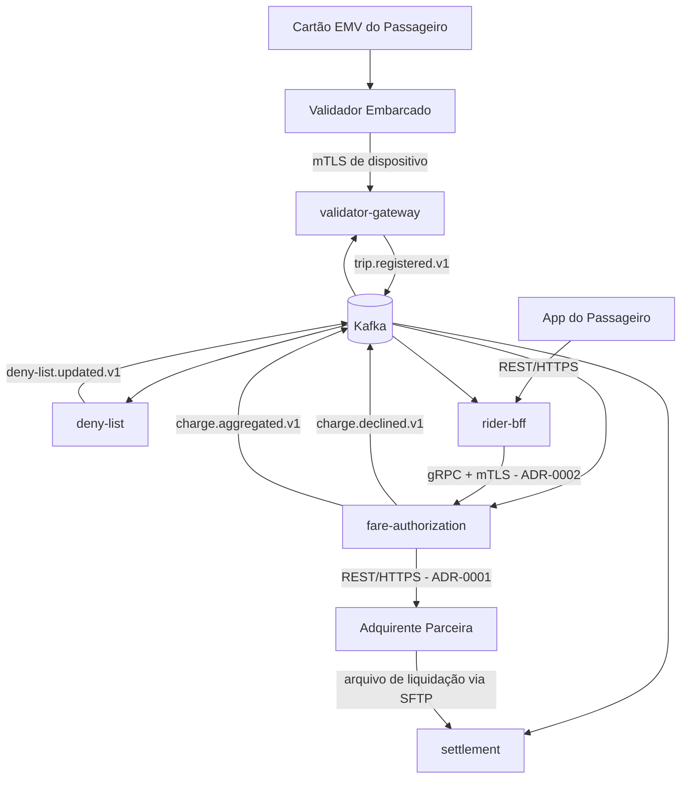
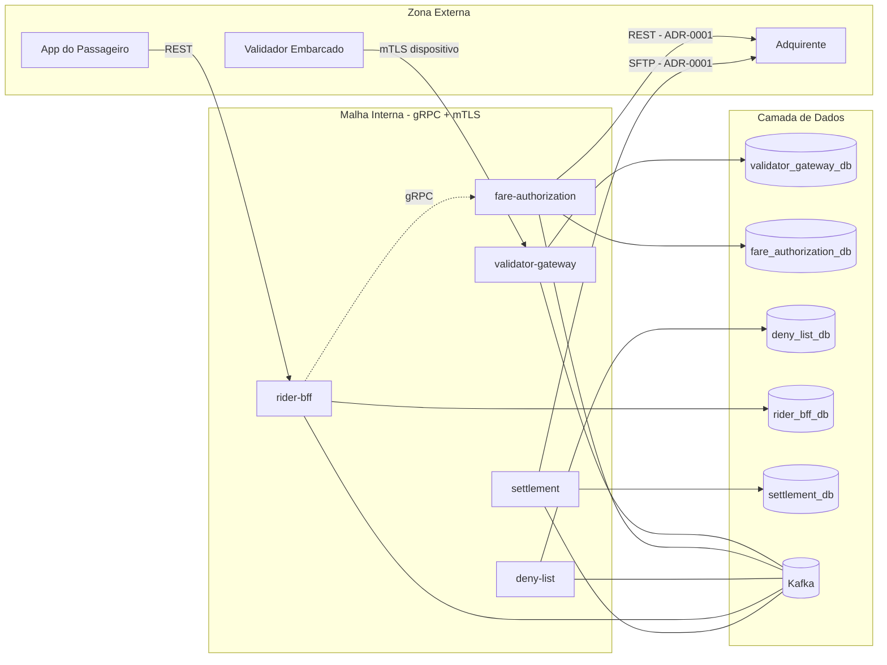
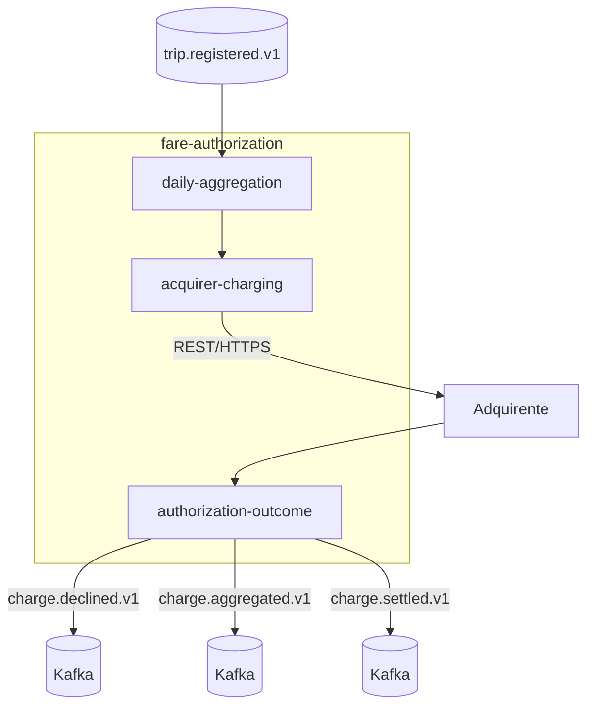
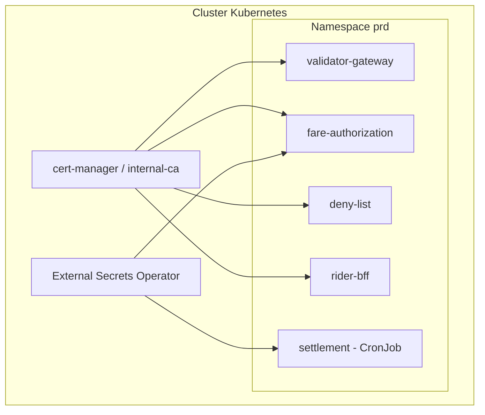
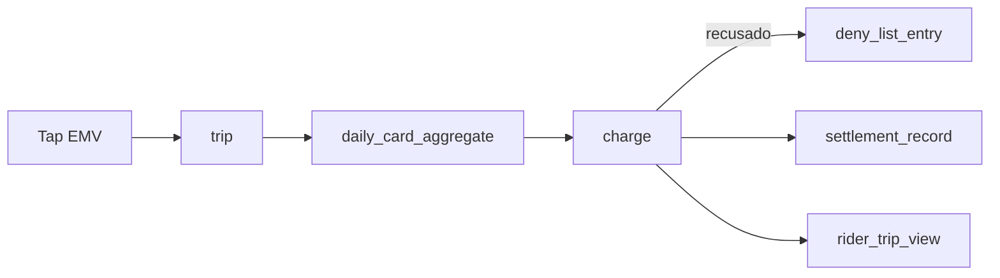
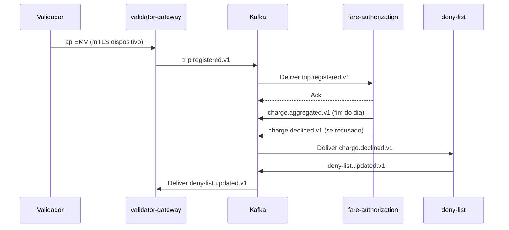
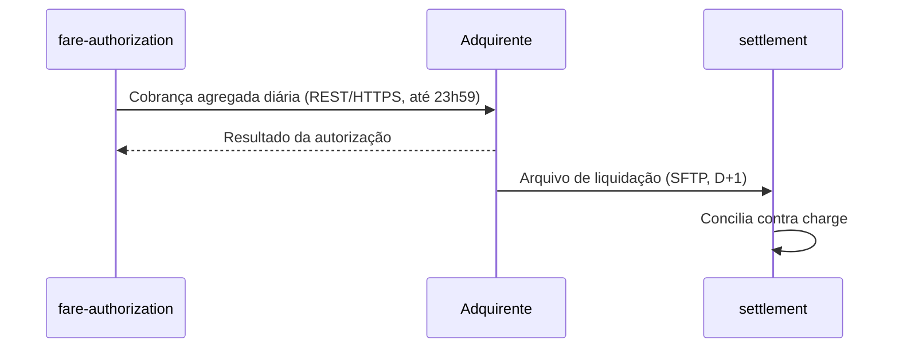
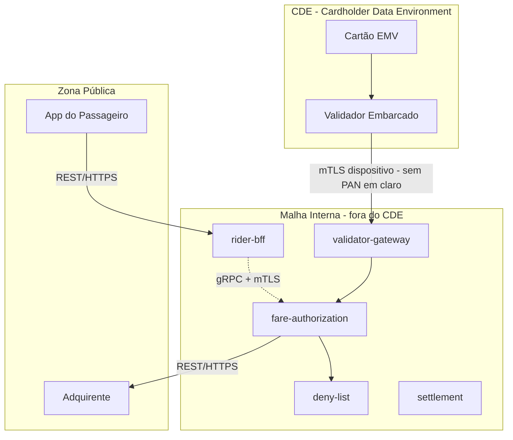
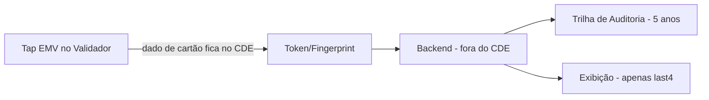
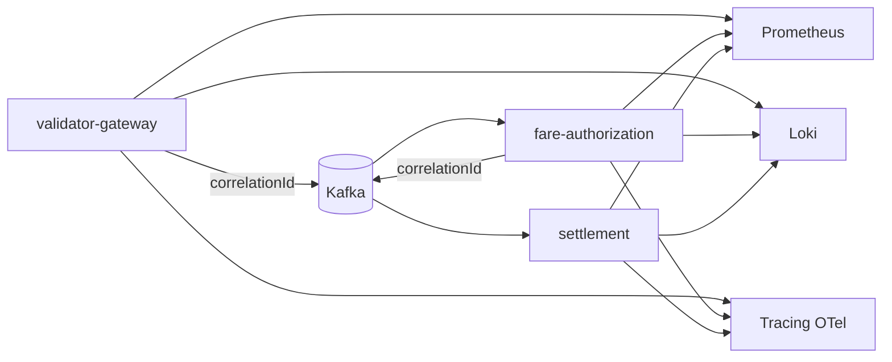

# TRD - Tarifa Aberta

**Produto:** Tarifa Aberta
**Versão:** v1.0
**Data:** 2026-09-26
**Status:** Rascunho
**Fontes Principais:** PRD, FRD, NFRD, ADR-0001 a ADR-0003, DDD, Modules

---

## Controle de Versão

| Versão | Data | Descrição |
|---|---|---|
| v1.0 | 2026-09-26 | Criação inicial do TRD a partir de PRD, FRD, NFRD, ADR-0001/0002/0003, segmentação DDD e README de módulos aprovados |

---

## Sumário

1. Introdução
2. Objetivo do Documento
3. Referências
4. Consolidação Técnica dos Insumos
5. Visão Técnica da Solução
6. Estilo Arquitetural
7. Módulos e Deployables
8. Arquitetura de APIs
9. Arquitetura de Eventos e Mensageria
10. Arquitetura de Dados
11. Arquitetura de Integração
12. Segurança Técnica
13. Compliance e Privacidade
14. Observabilidade
15. Resiliência, Performance e Escalabilidade
16. Ambientes, Deploy e Configuração
17. CI/CD e Qualidade Técnica
18. Operação e Suporte
19. Diagramas Técnicos
20. Matriz de Rastreabilidade
21. Riscos Técnicos
22. Pontos a Validar
23. Anexos

---

## 1. Introdução

A Tarifa Aberta permite que o passageiro pague a tarifa de ônibus encostando um cartão de crédito ou débito contactless (EMV) no validador embarcado, sem cadastro prévio e sem cartão de transporte dedicado, com a operadora recebendo o valor pela adquirente parceira e conciliando diariamente. Este TRD consolida o PRD, o FRD, o NFRD, os ADR-0001 a ADR-0003 e a segmentação DDD/módulos já aprovados em uma especificação técnica única, implementável pelas equipes de engenharia, DevOps e pelo QSA responsável pela avaliação PCI DSS 4.0.1, cobrindo arquitetura, deployables, APIs, eventos, dados, segurança, observabilidade, deploy e operação, com rastreabilidade completa para os artefatos de produto que o antecedem.

## 2. Objetivo do Documento

Traduzir os requisitos de produto (PRD), os requisitos funcionais (FRD), os requisitos não funcionais (NFRD), as decisões arquiteturais já aceitas (ADR-0001, ADR-0002, ADR-0003) e a modelagem de domínio (DDD e módulos) em requisitos técnicos implementáveis, preservando integralmente as decisões de negócio e de arquitetura já tomadas, sem reabri-las, e explicitando como cada uma delas se materializa em componentes, contratos, dados, controles de segurança e operação. Este TRD é a base de revisão para engenharia, DevOps e para o QSA que avaliará o ambiente de dados de cartão (CDE) da solução.

## 3. Referências

| Documento | Caminho | Observação |
|---|---|---|
| PRD | docs/product/prd/prd.md | Fonte de visão, objetivos, funcionalidades e regras de negócio |
| FRD | docs/product/frd-nfrd/frd.md | Fonte de requisitos funcionais e regras de negócio |
| NFRD | docs/product/frd-nfrd/nfrd.md | Fonte de requisitos não funcionais, incluindo NFR-SEC-01 (PCI DSS) |
| ADR-0001 | docs/product/adr/0001-rest-para-superficies-externas.md | REST/HTTPS ou SFTP para toda superfície externa |
| ADR-0002 | docs/product/adr/0002-grpc-entre-servicos-internos.md | gRPC + mTLS para comunicação síncrona interna |
| ADR-0003 | docs/product/adr/0003-kafka-como-broker-de-eventos.md | Kafka + Outbox Pattern para eventos de domínio |
| DDD | docs/product/ddd/ddd-segmentation.md | Subdomínios e bounded contexts |
| Modules | docs/product/modules/README.md | Módulos e deployables candidatos |

**Ponto a Validar:** não foram encontrados `docs/product/frd-nfrd/business-rules.md`, `docs/product/frd-nfrd/use-cases.md`, `docs/product/frd-nfrd/error-messages.md`, `docs/product/ddd/context-map/`, `docs/product/ddd/bounded-contexts/`, `docs/product/data-model/data-model.md`, `docs/product/glossary/` nem `docs/discovery/discovery-notes.md`. Nenhuma variação legada de path (`docs/prd/`, `docs/frd/`, `docs/adr/` etc.) foi encontrada como fallback. Este TRD foi derivado apenas do PRD, FRD, NFRD, ADR-0001/0002/0003, `ddd-segmentation.md` e `modules/README.md` — ver VAL-TRD-01.

---

## 4. Consolidação Técnica dos Insumos

### 4.1 Objetivos Técnicos Derivados

| Código | Objetivo Técnico | Origem | Impacto |
|---|---|---|---|
| TOBJ-01 | Decisão de liberação de catraca em até 500ms p95, inclusive offline | NFR-PERF-01 | Define validador com decisão local e cache de deny list embarcado |
| TOBJ-02 | Serviços de autorização e deny list com 99,9% de disponibilidade mensal | NFR-DISP-01 | Exige réplicas, health checks e estratégia de deploy sem downtime |
| TOBJ-03 | PAN nunca trafega nem é armazenado em claro fora do CDE | NFR-SEC-01 | Define fronteira de CDE, tokenização no validador/adquirente e trilha de evidência para o QSA |
| TOBJ-04 | Comunicação validador-backend autenticada por certificado de dispositivo | NFR-SEC-02 | mTLS de dispositivo entre validador e `validator-gateway`, distinto do mTLS interno de serviço a serviço (ADR-0002) |
| TOBJ-05 | Correlação fim a fim do tap até a cobrança | NFR-OBS-01 | `correlationId` propagado em toda a cadeia tap → agregação → cobrança → conciliação |
| TOBJ-06 | Retenção de transações para auditoria por 5 anos | NFR-RET-01 | Tabelas de transação/ledger com política de retenção e imutabilidade |

### 4.2 Fluxos Críticos

| Código | Fluxo | Criticidade | Requisitos Relacionados |
|---|---|---|---|
| FLOW-01 | Tap EMV → decisão de liberação da catraca (online ou offline) | Alta | FRD-tap-01, FRD-tap-02, BR-02, NFR-PERF-01, NFR-SEC-02 |
| FLOW-02 | Agregação diária de taps por cartão e envio da cobrança à adquirente | Alta | FRD-aut-01, FRD-aut-02, BR-03 |
| FLOW-03 | Distribuição e atualização da deny list nos validadores | Alta | FRD-den-01, FRD-den-02, BR-02 |
| FLOW-04 | Consulta de viagens pagas pelo passageiro no app | Média | FRD-cons-01 |
| FLOW-05 | Conciliação diária com o arquivo de liquidação da adquirente | Alta | FRD-conc-01 |

### 4.3 Requisitos Funcionais com Impacto Técnico

| Código | Requisito FRD | Impacto Técnico |
|---|---|---|
| FRD-tap-01 | Capturar o tap EMV e registrar a viagem com linha, veículo e horário | `validator-gateway` recebe o evento do validador, valida e persiste `trip` com correlação |
| FRD-tap-02 | Liberar a catraca offline por até 30 minutos consultando a deny list local | Validador mantém cache local da deny list e relógio de tolerância de 30 minutos sem conectividade |
| FRD-aut-01 | Agregar os taps do dia por cartão em uma cobrança única | `fare-authorization` roda um worker de agregação diária por `card_fingerprint` |
| FRD-aut-02 | Enviar a cobrança agregada à adquirente até as 23h59 | Job agendado com deadline rígido às 23h59 (fuso do projeto — Ponto a Validar) e reprocessamento em caso de falha |
| FRD-cons-01 | Exibir viagens pagas ao passageiro, identificando o cartão pelos 4 últimos dígitos | `rider-bff` expõe consulta autenticada; nunca expõe o PAN completo, apenas o `last4` |
| FRD-den-01 | Incluir na deny list o cartão com cobrança recusada e distribuí-la aos validadores | `deny-list` publica evento e/ou snapshot consumido pelo `validator-gateway`/validadores |
| FRD-den-02 | Remover o cartão da deny list após quitação | Fluxo simétrico de remoção com o mesmo canal de distribuição |
| FRD-conc-01 | Conciliar diariamente as cobranças com o arquivo de liquidação da adquirente | `settlement` consome arquivo de liquidação (SFTP/API, conforme ADR-0001) e reconcilia contra `fare-authorization` |

### 4.4 Requisitos Não Funcionais com Impacto Técnico

| Código | Requisito NFRD | Impacto Técnico |
|---|---|---|
| NFR-PERF-01 | Decisão de liberação no validador, p95 ≤ 500ms inclusive offline | Decisão local no validador com deny list em cache; `validator-gateway` não é dependência síncrona do embarque |
| NFR-DISP-01 | 99,9% mensal para autorização e deny list | Réplicas ≥ 2 por serviço, health checks de liveness/readiness, estratégia de deploy sem downtime |
| NFR-SEC-01 | PAN nunca em claro fora do CDE (PCI DSS 4.0.1) | Tokenização/leitura EMV restrita ao validador certificado + adquirente; backend nunca recebe nem persiste PAN |
| NFR-SEC-02 | Comunicação validador-backend autenticada por certificado de dispositivo | mTLS de dispositivo (certificado por validador) terminando no `validator-gateway` |
| NFR-OBS-01 | Correlação fim a fim do tap à cobrança | `correlationId` gerado no tap, propagado em logs, eventos Kafka e chamadas gRPC/REST |
| NFR-RET-01 | Retenção de transações por 5 anos | Tabelas de `trip`/`charge`/ledger com retenção de 5 anos e política de expurgo controlada |

### 4.5 Decisões Arquiteturais Existentes

| ADR | Decisão | Impacto no TRD |
|---|---|---|
| ADR-0001 | REST/HTTPS ou troca de arquivo SFTP para toda superfície exposta a terceiros (app via BFF, callbacks e arquivos da adquirente); nenhum gRPC exposto fora da malha interna | `rider-bff` e a interface com a adquirente são REST/SFTP; nenhum deployable expõe gRPC publicamente |
| ADR-0002 | gRPC com `.proto` versionado para comunicação síncrona interna; serviço dono do contrato é fonte da verdade; mTLS obrigatório na malha interna | Chamadas síncronas entre `validator-gateway`, `fare-authorization`, `deny-list`, `rider-bff` e `settlement` usam gRPC + mTLS |
| ADR-0003 | Kafka como broker de eventos, um tópico por tipo de evento, publicação via Outbox Pattern, retenção mínima de 7 dias | Todo evento de domínio (tap registrado, cobrança agregada, cartão incluído/removido da deny list, conciliação concluída) é publicado em Kafka via Outbox |

### 4.6 Bounded Contexts e Módulos

| Bounded Context | Módulo / Deployable | Observação |
|---|---|---|
| tap-capture | validator-gateway | Serviço de borda que recebe os taps dos validadores |
| fare-authorization | fare-authorization | Serviço + worker de agregação diária |
| deny-list | deny-list | Serviço que publica a lista para os validadores |
| rider-history | rider-bff | BFF do app do passageiro |
| settlement | settlement | Worker batch de conciliação |

### 4.7 Integrações Externas

| Código | Sistema Externo | Tipo | Impacto Técnico |
|---|---|---|---|
| INT-01 | Adquirente parceira — autorização agregada | API (REST, conforme ADR-0001) | `fare-authorization` envia cobrança agregada por cartão até as 23h59 |
| INT-02 | Adquirente parceira — arquivo de liquidação | File (SFTP, conforme ADR-0001) | `settlement` consome o arquivo diário para conciliação |
| INT-03 | App do passageiro | API (REST via `rider-bff`, conforme ADR-0001) | Consulta de viagens pagas |
| INT-04 | Validador embarcado (hardware EMV) | API (mTLS de dispositivo) | Tap, liberação offline e sincronização de deny list — protocolo exato é Ponto a Validar |

### 4.8 Dados Críticos

| Código | Dado | Categoria | Impacto Técnico |
|---|---|---|---|
| DATA-01 | Dados do cartão EMV (PAN, trilha) | Financeiro / Regulatório (PCI) | Nunca trafega nem é persistido em claro fora do CDE; backend trabalha apenas com token/fingerprint do cartão |
| DATA-02 | Últimos 4 dígitos do cartão (`last4`) | Financeiro | Único identificador de cartão exposto ao passageiro via `rider-bff` |
| DATA-03 | Registro de viagem (`trip`) | Operacional | Linha, veículo, horário, correlação com a cobrança |
| DATA-04 | Cobrança agregada (`charge`) | Financeiro | Valor em centavos, cartão (token), data, status junto à adquirente |
| DATA-05 | Deny list | Financeiro / Risco | Lista de tokens de cartão com cobrança recusada, distribuída aos validadores |
| DATA-06 | Arquivo de liquidação da adquirente | Financeiro / Regulatório | Base para conciliação e evidência de auditoria |

### 4.9 Pontos a Validar (consolidação)

Ver seção 22 para a lista consolidada e numerada.

---

## 5. Visão Técnica da Solução

### Estilo Arquitetural

A solução adota uma arquitetura de **microsserviços orientada a eventos**, organizada por bounded context, com comunicação síncrona interna em gRPC (ADR-0002), comunicação assíncrona via Kafka com Outbox Pattern (ADR-0003) e toda superfície externa — app do passageiro e integração com a adquirente — em REST/HTTPS ou SFTP (ADR-0001). O validador embarcado opera como um cliente de borda com capacidade de decisão offline, mantendo cache local da deny list para atender ao requisito de liberação em até 500ms mesmo sem conectividade (NFR-PERF-01, BR-02).

### Visão de Alto Nível

O passageiro encosta o cartão EMV no validador, que decide localmente (online ou offline) se libera a catraca, consultando a deny list em cache. O `validator-gateway` recebe o evento de tap via canal autenticado por certificado de dispositivo (mTLS de dispositivo), valida e registra a viagem, publicando um evento de domínio em Kafka. O `fare-authorization` consome os eventos de tap, agrega por cartão ao longo do dia e envia a cobrança agregada à adquirente até as 23h59 (FRD-aut-01, FRD-aut-02). Cartões com cobrança recusada entram na deny list mantida pelo `deny-list`, que distribui a lista atualizada de volta aos validadores via `validator-gateway`. O `rider-bff` expõe ao app do passageiro a consulta das viagens pagas, mostrando apenas os últimos 4 dígitos do cartão. O `settlement` roda como worker batch, consumindo o arquivo de liquidação da adquirente e conciliando contra as cobranças registradas pelo `fare-authorization`.

### Decisões Técnicas Norteadoras

| Decisão | Origem | Justificativa |
|---|---|---|
| Comunicação síncrona interna em gRPC com contratos `.proto` versionados e mTLS | ADR-0002 | Já aprovada; aplica-se a toda comunicação entre `validator-gateway`, `fare-authorization`, `deny-list`, `rider-bff` e `settlement` |
| Toda superfície externa (app, adquirente) em REST/HTTPS ou SFTP | ADR-0001 | Já aprovada; nenhum gRPC exposto a terceiros, inclusive à adquirente |
| Eventos de domínio em Kafka com Outbox Pattern, um tópico por tipo de evento, retenção mínima de 7 dias | ADR-0003 | Já aprovada; permite replay para reprocessar a agregação diária, algo que RabbitMQ não oferecia nativamente |
| Decisão de liberação da catraca é local ao validador, com deny list em cache | NFR-PERF-01, BR-02 | p95 ≤ 500ms inclusive offline só é atingível sem chamada síncrona de rede no caminho crítico do embarque |
| Backend nunca recebe nem persiste o PAN em claro | NFR-SEC-01 | Requisito PCI DSS 4.0.1 explícito no NFRD; ver seção 13 (CDE) |

---

## 6. Estilo Arquitetural

Microsserviços por bounded context, orientados a eventos, com um deployable de borda (`validator-gateway`) que isola o hardware do validador do restante da malha interna. Não há indício nos insumos de necessidade de arquitetura serverless, edge computing ou mobile-first para os serviços de backend — o único componente "mobile-first" é o app do passageiro, consumido via `rider-bff`, e o único componente de borda física é o validador embarcado, tratado como dispositivo IoT autenticado por certificado.

---

## 7. Módulos e Deployables

| Deployable | Tipo | Módulos Incluídos | Bounded Context | Responsabilidade | Criticidade |
|---|---|---|---|---|---|
| validator-gateway | Gateway | validator-gateway | tap-capture | Receber taps dos validadores, autenticar por certificado de dispositivo, registrar viagens, publicar eventos e distribuir a deny list | Alta |
| fare-authorization | Microservice + Worker | fare-authorization | fare-authorization | Agregar taps por cartão e enviar cobrança diária à adquirente | Alta |
| deny-list | Microservice | deny-list | deny-list | Manter e distribuir a deny list de cartões com cobrança recusada | Alta |
| rider-bff | BFF | rider-bff | rider-history | Expor ao app do passageiro a consulta de viagens pagas | Média |
| settlement | Batch | settlement | settlement | Conciliar diariamente as cobranças com o arquivo de liquidação da adquirente | Alta |

### Deployable - validator-gateway

#### Objetivo

Ser a fronteira entre o hardware do validador embarcado e a malha de serviços internos, garantindo que o embarque seja liberado dentro do orçamento de latência definido em NFR-PERF-01, inclusive sem conectividade.

#### Responsabilidades

Autenticar cada validador por certificado de dispositivo; receber e validar o evento de tap; registrar a viagem (`trip`); publicar o evento de domínio da viagem; distribuir snapshots/atualizações da deny list para os validadores.

#### Módulos Internos

| Módulo | Responsabilidade |
|---|---|
| tap-ingestion | Receber e validar o payload do tap enviado pelo validador |
| trip-registration | Persistir o registro da viagem com linha, veículo e horário |
| deny-list-distribution | Repassar a deny list publicada pelo `deny-list` aos validadores |

#### APIs Expostas

| API | Protocolo | Consumidores |
|---|---|---|
| Ingestão de tap do validador | mTLS de dispositivo (REST ou gRPC sobre TLS mútuo — Ponto a Validar) | Validador embarcado |
| Sincronização da deny list | mTLS de dispositivo | Validador embarcado |

#### Eventos Publicados

| Evento | Consumidores |
|---|---|
| `trip.registered.v1` | fare-authorization |

#### Eventos Consumidos

| Evento | Produtor |
|---|---|
| `deny-list.updated.v1` | deny-list |

#### Dados Próprios

| Entidade/Tabela/Collection | Persistência |
|---|---|
| `trip` | Relational DB (PostgreSQL) |
| `device_certificate` (metadados do certificado do validador) | Relational DB (PostgreSQL) |

#### Dependências

| Dependência | Tipo | Obrigatória? |
|---|---|---|
| Kafka (publicação de `trip.registered.v1`) | Mensageria | Sim |
| deny-list (consumo de `deny-list.updated.v1`) | Evento | Sim |
| internal-ca / cert-manager (validação do certificado do dispositivo) | Infraestrutura | Sim |

### Deployable - fare-authorization

#### Objetivo

Agregar os taps de cada cartão ao longo do dia em uma única cobrança e enviá-la à adquirente dentro do prazo definido pelo negócio.

#### Responsabilidades

Consumir eventos de viagem; manter o agregado diário por cartão (token); dentro da janela até as 23h59, montar e enviar a cobrança agregada à adquirente; registrar o resultado da autorização; sinalizar cartões recusados ao `deny-list`.

#### Módulos Internos

| Módulo | Responsabilidade |
|---|---|
| daily-aggregation | Agregar taps por cartão ao longo do dia |
| acquirer-charging | Montar e enviar a cobrança agregada à adquirente até as 23h59 |
| authorization-outcome | Registrar aprovação/recusa e disparar a inclusão em deny list quando recusado |

#### APIs Expostas

| API | Protocolo | Consumidores |
|---|---|---|
| Consulta interna de status de cobrança | gRPC (conforme ADR-0002) | rider-bff, settlement |

#### Eventos Publicados

| Evento | Consumidores |
|---|---|
| `charge.aggregated.v1` | settlement |
| `charge.declined.v1` | deny-list |
| `charge.settled.v1` | rider-bff, settlement |

#### Eventos Consumidos

| Evento | Produtor |
|---|---|
| `trip.registered.v1` | validator-gateway |

#### Dados Próprios

| Entidade/Tabela/Collection | Persistência |
|---|---|
| `daily_card_aggregate` | Relational DB (PostgreSQL) |
| `charge` | Relational DB (PostgreSQL) |

#### Dependências

| Dependência | Tipo | Obrigatória? |
|---|---|---|
| Adquirente (API de autorização) | Integração externa REST (ADR-0001) | Sim |
| Kafka | Mensageria | Sim |
| Scheduler/cron para o corte das 23h59 | Infraestrutura | Sim |

### Deployable - deny-list

#### Objetivo

Manter a lista de cartões com cobrança recusada e garantir sua distribuição confiável aos validadores, inclusive em cenários de baixa conectividade.

#### Responsabilidades

Incluir cartão na deny list ao receber `charge.declined.v1`; remover cartão após quitação; publicar snapshots/deltas da deny list para o `validator-gateway`.

#### Módulos Internos

| Módulo | Responsabilidade |
|---|---|
| deny-list-management | Incluir e remover entradas da deny list |
| deny-list-publishing | Publicar a deny list atualizada |

#### APIs Expostas

| API | Protocolo | Consumidores |
|---|---|---|
| Consulta administrativa da deny list | gRPC (conforme ADR-0002) | Ferramentas internas de operação (Ponto a Validar) |

#### Eventos Publicados

| Evento | Consumidores |
|---|---|
| `deny-list.updated.v1` | validator-gateway |

#### Eventos Consumidos

| Evento | Produtor |
|---|---|
| `charge.declined.v1` | fare-authorization |
| `debt.settled.v1` | fare-authorization (Ponto a Validar — evento de quitação de dívida não detalhado nos insumos) |

#### Dados Próprios

| Entidade/Tabela/Collection | Persistência |
|---|---|
| `deny_list_entry` | Relational DB (PostgreSQL) |

#### Dependências

| Dependência | Tipo | Obrigatória? |
|---|---|---|
| Kafka | Mensageria | Sim |
| validator-gateway (canal de distribuição aos validadores) | gRPC/evento | Sim |

### Deployable - rider-bff

#### Objetivo

Expor ao app do passageiro a consulta das viagens pagas, sem jamais expor dados sensíveis de cartão além dos últimos 4 dígitos.

#### Responsabilidades

Autenticar o passageiro; consultar viagens e cobranças associadas ao cartão informado; mascarar o PAN, exibindo apenas `last4`.

#### Módulos Internos

| Módulo | Responsabilidade |
|---|---|
| rider-auth | Autenticação do passageiro no app (mecanismo não definido nos insumos — Ponto a Validar) |
| trip-query | Consultar viagens e status de cobrança |

#### APIs Expostas

| API | Protocolo | Consumidores |
|---|---|---|
| `GET /api/v1/trips` | REST (ADR-0001) | App do passageiro |

#### Eventos Publicados

| Evento | Consumidores |
|---|---|
| — | — |

#### Eventos Consumidos

| Evento | Produtor |
|---|---|
| `trip.registered.v1` | validator-gateway |
| `charge.settled.v1` | fare-authorization |

#### Dados Próprios

| Entidade/Tabela/Collection | Persistência |
|---|---|
| `rider_trip_view` (read model) | Relational DB (PostgreSQL) ou cache dedicado |

#### Dependências

| Dependência | Tipo | Obrigatória? |
|---|---|---|
| fare-authorization (gRPC) | Interno | Sim |
| validator-gateway / eventos de viagem | Evento | Sim |

### Deployable - settlement

#### Objetivo

Conciliar diariamente as cobranças enviadas à adquirente com o arquivo de liquidação recebido dela.

#### Responsabilidades

Consumir o arquivo de liquidação (SFTP, conforme ADR-0001); casar cada item do arquivo com a cobrança correspondente registrada por `fare-authorization`; reportar divergências.

#### Módulos Internos

| Módulo | Responsabilidade |
|---|---|
| settlement-file-ingestion | Ler e validar o arquivo de liquidação diário |
| reconciliation-engine | Conciliar cobranças com o arquivo |

#### APIs Expostas

| API | Protocolo | Consumidores |
|---|---|---|
| — (worker batch, sem API síncrona exposta) | — | — |

#### Eventos Publicados

| Evento | Consumidores |
|---|---|
| `settlement.completed.v1` | (nenhum consumidor identificado nos insumos — Ponto a Validar) |
| `settlement.mismatch.v1` | (nenhum consumidor identificado nos insumos — Ponto a Validar) |

#### Eventos Consumidos

| Evento | Produtor |
|---|---|
| `charge.aggregated.v1` | fare-authorization |

#### Dados Próprios

| Entidade/Tabela/Collection | Persistência |
|---|---|
| `settlement_record` | Relational DB (PostgreSQL) |

#### Dependências

| Dependência | Tipo | Obrigatória? |
|---|---|---|
| Adquirente (arquivo de liquidação via SFTP) | Integração externa (ADR-0001) | Sim |
| fare-authorization (dados de cobrança) | Interno (gRPC ou evento) | Sim |

---

## 8. Arquitetura de APIs

### Princípios

Versionamento obrigatório (`/api/v1/`); autenticação forte em toda API (mTLS de dispositivo para o validador, autenticação de usuário para o `rider-bff`, mTLS de serviço para gRPC interno); idempotência nas operações de escrita sensíveis (registro de tap, envio de cobrança); paginação e filtros na consulta de viagens; erros padronizados com `correlationId`; rate limiting nas APIs expostas externamente; correlação fim a fim obrigatória (NFR-OBS-01).

### APIs

| API | Método/Operação | Protocolo | Produtor | Consumidor | Autenticação | Finalidade |
|---|---|---|---|---|---|---|
| Ingestão de tap | POST | mTLS de dispositivo (REST/gRPC — Ponto a Validar) | validator-gateway | Validador embarcado | Certificado de dispositivo | FRD-tap-01 |
| Sincronização da deny list | GET/stream | mTLS de dispositivo | validator-gateway | Validador embarcado | Certificado de dispositivo | FRD-tap-02, FRD-den-01/02 |
| Consulta de status de cobrança | RPC | gRPC (ADR-0002) | fare-authorization | rider-bff, settlement | mTLS interno | Suporte a FRD-cons-01, FRD-conc-01 |
| Consulta administrativa da deny list | RPC | gRPC (ADR-0002) | deny-list | Ferramentas internas | mTLS interno | Operação (Ponto a Validar) |
| `GET /api/v1/trips` | GET | REST (ADR-0001) | rider-bff | App do passageiro | Autenticação do passageiro (mecanismo a definir) | FRD-cons-01 |
| Recebimento de callback/arquivo da adquirente | POST/SFTP | REST/SFTP (ADR-0001) | fare-authorization, settlement | Adquirente | Credenciais da adquirente (Ponto a Validar) | FRD-aut-02, FRD-conc-01 |

### Padrão de Erro

```json
{
  "error_code": "string",
  "message": "string",
  "details": [],
  "correlation_id": "string"
}
```

> **Nota de coerência com `.forge/rules/architecture/api-and-contracts.md`:** o padrão de erro do projeto usa as chaves `error`, `code` e `correlationId` (camelCase). Este TRD mantém o template padrão do agente acima e recomenda, como Ponto a Validar, alinhar a chave final ao padrão já vigente no projeto antes da implementação, para não introduzir dois formatos de erro concorrentes.

### Padrão de Headers

| Header | Obrigatório | Finalidade |
|---|---|---|
| X-Correlation-Id | Sim | Correlação fim a fim (NFR-OBS-01) |
| Idempotency-Key | Sim, em ingestão de tap e envio de cobrança | Evitar duplicidade de registro de viagem e de cobrança |

---

## 9. Arquitetura de Eventos e Mensageria

### Princípios

Eventos nomeados no passado e versionados (`v1`); Kafka como broker único (ADR-0003), um tópico por tipo de evento; publicação via Outbox Pattern para garantir consistência transacional entre a escrita de domínio e a publicação do evento; consumidores idempotentes por `event_id`; Dead Letter Queue para mensagens não processáveis; retenção mínima de 7 dias por tópico (ADR-0003); ordenação por chave de partição igual ao identificador do cartão nos eventos de cobrança, para preservar a ordem de agregação por cartão.

### Event Catalog

| Evento | Produtor | Consumidores | Canal/Tópico/Fila | Retenção | Criticidade |
|---|---|---|---|---|---|
| `trip.registered.v1` | validator-gateway | fare-authorization, rider-bff | Kafka: `trip.registered.v1` | 7 dias (mínimo ADR-0003); 5 anos em armazenamento de auditoria fora do tópico (NFR-RET-01) | Alta |
| `deny-list.updated.v1` | deny-list | validator-gateway | Kafka: `deny-list.updated.v1` | 7 dias | Alta |
| `charge.aggregated.v1` | fare-authorization | settlement | Kafka: `charge.aggregated.v1` | 7 dias | Alta |
| `charge.declined.v1` | fare-authorization | deny-list | Kafka: `charge.declined.v1` | 7 dias | Alta |
| `charge.settled.v1` | fare-authorization | rider-bff, settlement | Kafka: `charge.settled.v1` | 7 dias | Média |
| `settlement.completed.v1` | settlement | (Ponto a Validar) | Kafka: `settlement.completed.v1` | 7 dias | Média |
| `settlement.mismatch.v1` | settlement | (Ponto a Validar) | Kafka: `settlement.mismatch.v1` | 7 dias | Alta |

### Contrato de Evento

```json
{
  "event_id": "uuid",
  "event_type": "string",
  "event_version": "v1",
  "occurred_at": "datetime",
  "correlation_id": "string",
  "tenant_id": "uuid",
  "payload": {}
}
```

> **Ponto a Validar:** os insumos não indicam se a Tarifa Aberta é multi-tenant (múltiplas operadoras/linhas na mesma plataforma) ou single-tenant por operadora. O envelope acima preserva `tenant_id` por consistência com o template; se o projeto for single-tenant, o campo pode ser fixo ou omitido — decisão de produto a confirmar.

### Políticas de Consumer

| Política | Descrição |
|---|---|
| Idempotência | Consumers tratam duplicidade por `event_id`, especialmente em `charge.aggregated.v1` e `charge.declined.v1`, cuja duplicação indevida geraria cobrança ou bloqueio de cartão em duplicidade |
| DLQ | Mensagens não processáveis vão para Dead Letter Queue por tópico |
| Retry | Tentativas controladas por política explícita de backoff, com replay possível via Kafka (retenção mínima de 7 dias, ADR-0003) para reprocessar a agregação diária em caso de falha do worker |

---

## 10. Arquitetura de Dados

### Princípios

Cada bounded context tem ownership exclusivo dos seus dados; apenas o dono escreve; os demais consomem via gRPC, evento ou read model; nenhum join entre bancos de contextos diferentes; dados de cartão seguem a fronteira de CDE definida na seção 13; valores monetários são sempre inteiros em centavos (`*_cents`, `BIGINT`), nunca `decimal`/`float`, conforme convenção de domínio do projeto.

### Data Ownership Matrix

| Módulo / Contexto | Entidade/Tabela/Collection | Banco/Persistência | Dono da Escrita | Consumidores | Forma de Consumo |
|---|---|---|---|---|---|
| tap-capture | `trip` | PostgreSQL (`validator_gateway_db`) | validator-gateway | fare-authorization, rider-bff | Evento (`trip.registered.v1`) |
| tap-capture | `device_certificate` | PostgreSQL (`validator_gateway_db`) | validator-gateway | — | Interno |
| fare-authorization | `daily_card_aggregate` | PostgreSQL (`fare_authorization_db`) | fare-authorization | — | Interno |
| fare-authorization | `charge` | PostgreSQL (`fare_authorization_db`) | fare-authorization | rider-bff, settlement | gRPC + Evento |
| deny-list | `deny_list_entry` | PostgreSQL (`deny_list_db`) | deny-list | validator-gateway | Evento (`deny-list.updated.v1`) |
| rider-history | `rider_trip_view` | PostgreSQL ou cache (`rider_bff_db`) | rider-bff | App do passageiro | API REST |
| settlement | `settlement_record` | PostgreSQL (`settlement_db`) | settlement | — | Interno |

### Bancos e Persistências

| Persistência | Uso | Módulos | Observações |
|---|---|---|---|
| Relational DB (PostgreSQL) | Persistência transacional de todas as entidades de negócio | Todos os deployables | Um schema/banco lógico por bounded context; sem cross-database join |
| Cache | Deny list local no validador embarcado; opcionalmente cache de leitura no `rider-bff` | validator-gateway (embarcado), rider-bff | Cache local do validador é o mecanismo que sustenta NFR-PERF-01 e BR-02 |
| Object Storage | Armazenamento do arquivo de liquidação recebido da adquirente | settlement | Retenção alinhada a NFR-RET-01 |
| Search Index | Não identificado nos insumos | — | — |

### Read Models

| Read Model | Fonte | Consumidor | Atualização |
|---|---|---|---|
| `rider_trip_view` | `trip.registered.v1`, `charge.settled.v1` | App do passageiro via rider-bff | Evento |

### Retenção de Dados

| Dado | Retenção | Motivo | Expurgo |
|---|---|---|---|
| `trip`, `charge`, registros de auditoria de cobrança | 5 anos | NFR-RET-01 | Expurgo controlado após o período, com trilha de decisão registrada |
| Tópicos Kafka | Mínimo 7 dias | ADR-0003 | Retenção do broker, não substitui a retenção de auditoria de 5 anos |
| Dados de cartão em claro (PAN) | Não retido fora do CDE | NFR-SEC-01 | Não aplicável — o backend nunca recebe o dado |

> **Observação de domínio:** valores monetários (tarifa de R$ 4,40, agregados diários, cobranças) são representados como inteiro em centavos (`amount_in_cents`, `BIGINT NOT NULL`) em todo o domínio, nunca `decimal`/`float`, conforme convenção do projeto. Tabelas de auditoria/ledger (`charge`, histórico de deny list) devem ser append-only com trigger de imutabilidade a nível de banco, não apenas por lógica de aplicação.

---

## 11. Arquitetura de Integração

### Integrações Externas

| Sistema | Finalidade | Protocolo | Autenticação | Direção | Criticidade |
|---|---|---|---|---|---|
| Adquirente — autorização | Enviar cobrança agregada diária | REST/HTTPS (ADR-0001) | Credenciais/API key da adquirente (Ponto a Validar) | Saída | Alta |
| Adquirente — liquidação | Receber arquivo de liquidação para conciliação | SFTP (ADR-0001) | Chave SSH/credencial SFTP (Ponto a Validar) | Entrada | Alta |
| App do passageiro | Consulta de viagens pagas | REST/HTTPS via rider-bff (ADR-0001) | Autenticação do passageiro (Ponto a Validar) | Bidirecional | Média |
| Validador embarcado | Tap, liberação offline e sincronização de deny list | mTLS de dispositivo | Certificado de dispositivo | Bidirecional | Alta |

### Integrações Internas

| Origem | Destino | Protocolo | Contrato | Observações |
|---|---|---|---|---|
| validator-gateway | fare-authorization | Evento | `trip.registered.v1` (Kafka) | Consistência via Outbox |
| fare-authorization | deny-list | Evento | `charge.declined.v1` (Kafka) | — |
| deny-list | validator-gateway | Evento | `deny-list.updated.v1` (Kafka) | — |
| rider-bff | fare-authorization | gRPC | `.proto` de status de cobrança (ADR-0002) | mTLS interno obrigatório |
| settlement | fare-authorization | gRPC ou Evento | A definir (Ponto a Validar) | — |

### Padrões de Integração

| Padrão | Quando usar |
|---|---|
| Anti-Corruption Layer | Na integração com a API/arquivo da adquirente, para não vazar o modelo dela no domínio interno de `fare-authorization`/`settlement` |
| Adapter | Para encapsular o protocolo específico do validador embarcado dentro do `validator-gateway` |
| Outbox Pattern | Em todo evento publicado pelos cinco deployables (ADR-0003) |
| Retry | Em falhas transitórias de rede com a adquirente e entre serviços internos |
| Circuit Breaker | Em chamadas síncronas do `fare-authorization`/`settlement` à adquirente, para não propagar indisponibilidade externa ao restante da malha |

---

## 12. Segurança Técnica

### Princípios

Menor privilégio, defesa em profundidade, segregação de funções, criptografia em trânsito e em repouso, não exposição de dados sensíveis em logs — em particular PAN, que nunca aparece fora do CDE (NFR-SEC-01).

### Autenticação

| Canal | Mecanismo |
|---|---|
| Usuário humano (passageiro no app) | A definir — Ponto a Validar; não há indicação de OAuth2/OIDC ou de outro mecanismo nos insumos |
| Serviço interno | mTLS entre serviços via `internal-ca`/cert-manager (ADR-0002 + convenção de mTLS do projeto) |
| Dispositivo (validador embarcado) | Certificado de dispositivo por validador (NFR-SEC-02), distinto do mTLS de serviço a serviço |
| Sistema externo (adquirente) | Credenciais/API key ou certificado — Ponto a Validar |

### Autorização

| Perfil/Papel | Permissões Técnicas |
|---|---|
| Passageiro autenticado | Consultar apenas as próprias viagens via `rider-bff` |
| Validador certificado | Enviar taps e sincronizar deny list, apenas com certificado válido e não revogado |
| Operador interno | Consulta administrativa da deny list (perfil e escopo exatos — Ponto a Validar) |

### Criptografia

| Dado/Canal | Em trânsito | Em repouso | Observação |
|---|---|---|---|
| Comunicação validador → validator-gateway | mTLS de dispositivo | — | NFR-SEC-02 |
| Comunicação interna entre serviços | mTLS via `internal-ca` | — | ADR-0002 + convenção de mTLS do projeto |
| API REST externa (rider-bff, adquirente) | TLS 1.2+ | — | ADR-0001 |
| `trip`, `charge`, `deny_list_entry` e demais dados em banco | — | Criptografia em repouso do banco gerenciado | Sem PAN armazenado; dado é token/fingerprint do cartão |
| PAN / dados de trilha do EMV | Não trafega além do validador certificado e da rede EMV/adquirente | Não armazenado no backend | NFR-SEC-01; ver seção 13 (CDE) |

### Gestão de Segredos

| Segredo | Armazenamento | Rotação |
|---|---|---|
| Certificado de dispositivo do validador | Emitido/gerenciado por PKI interna; não hardcoded no dispositivo | Conforme política de PKI do projeto — Ponto a Validar (nenhum ADR de PKI/certificate-lifecycle foi encontrado nos insumos deste projeto) |
| Certificados mTLS internos | Kubernetes Secret via cert-manager (`internal-ca`) | Renovação automática pelo cert-manager |
| Credenciais da adquirente | Kubernetes Secret via External Secrets Operator, nunca em `.env` de stg/prd | Rotação periódica — Ponto a Validar |

### Segurança de APIs

| Controle | Aplicação |
|---|---|
| Rate limit | `rider-bff` e endpoints REST expostos externamente |
| Input validation | Todo payload de tap, cobrança e consulta, validado antes de qualquer efeito colateral |
| Idempotency key | Ingestão de tap e envio de cobrança agregada |
| WAF/API Gateway | Na borda das APIs REST externas (rider-bff, callback da adquirente) — componente não detalhado nos insumos, Ponto a Validar |

---

## 13. Compliance e Privacidade

### Compliance Aplicável

| Compliance / Norma / Lei | Aplicável? | Motivo | Impacto Técnico |
|---|---|---|---|
| PCI DSS 4.0.1 | Sim | Processamento de cartão EMV contactless (NFR-SEC-01) | CDE restrito ao validador certificado e ao canal com a adquirente; backend fora do CDE por design |
| LGPD | Sim | Dados pessoais do passageiro (viagens, eventualmente identificação do cartão) | Minimização de dados, mascaramento de `last4`, retenção definida |

### Dados Sensíveis

| Dado | Categoria | Módulo Dono | Proteção |
|---|---|---|---|
| PAN / trilha EMV | Cartão | Validador embarcado (fora do backend) | Nunca sai do validador em claro; backend recebe apenas token/fingerprint |
| `last4` do cartão | Cartão (não sensível para exibição, PCI permite exibir os últimos 4 dígitos) | rider-bff | Único dado de cartão exposto ao passageiro |
| Histórico de viagens do passageiro | PII | rider-bff | Acesso restrito ao próprio passageiro autenticado |

### Controles Técnicos

| Controle | Aplicação | Evidência Esperada |
|---|---|---|
| Mascaramento | Exibição de `last4` no app; nenhum log contém PAN, CPF ou dado de pagamento completo | Amostragem de logs sem PAN/PII para o QSA |
| Tokenização | Cartão referenciado por token/fingerprint em todo o backend, nunca pelo PAN | Esquema de dados sem coluna de PAN nas tabelas do backend |
| Auditoria | Toda ação sensível (inclusão/remoção em deny list, envio de cobrança) registrada com quem, quando, origem | Trilha de auditoria imutável por 5 anos (NFR-RET-01) |
| Retenção | `trip`/`charge` retidos por 5 anos, com expurgo controlado após o período | Política de retenção documentada e testada |

### Fluxos de Compliance

Ver diagrama "Compliance Flow" na seção 19.

### CDE - Cardholder Data Environment

| Componente | Dentro do CDE? | Justificativa |
|---|---|---|
| Validador embarcado (leitor EMV) | Sim | Único componente que lê o PAN/trilha do cartão |
| Rede/canal entre o validador e a adquirente para autorização de baixo nível EMV | Sim | Transporta dado de cartão até ser tokenizado/autorizado |
| validator-gateway | Não | Recebe apenas o evento de tap já sem PAN em claro — Ponto a Validar a confirmar com o QSA, pois depende do desenho exato do protocolo do validador (ver VAL-TRD nesta seção) |
| fare-authorization, deny-list, rider-bff, settlement | Não | Operam exclusivamente sobre token/fingerprint do cartão, nunca sobre o PAN |
| Backend geral (bancos PostgreSQL, Kafka) | Não | Nenhuma dessas entidades armazena ou transmite PAN em claro, por design (NFR-SEC-01) |

**Ponto a Validar (crítico para o QSA):** os insumos não detalham o protocolo exato entre o validador e o `validator-gateway` — se o próprio validador tokeniza/autoriza o EMV localmente (por exemplo, via SDK/HSM do fabricante do validador) antes de qualquer transmissão de rede, ou se algum dado de cartão de baixo nível chega a trafegar até a borda do `validator-gateway`. Essa definição determina se o `validator-gateway` entra ou não no escopo do CDE e deve ser confirmada com o fabricante do validador e validada formalmente com o QSA antes da implementação.

### Fluxo de PII

| Dado Pessoal | Coleta | Processamento | Armazenamento | Retenção | Descarte |
|---|---|---|---|---|---|
| Histórico de viagens associado ao cartão | No tap, via validador | Agregação e consulta pelo `fare-authorization`/`rider-bff` | PostgreSQL, por bounded context | 5 anos (NFR-RET-01) | Expurgo controlado após retenção |

---

## 14. Observabilidade

### Princípios

Logs estruturados, correlação fim a fim via `correlationId` (NFR-OBS-01), métricas por módulo, tracing distribuído, health checks de liveness/readiness, alertas acionáveis, dashboards por fluxo crítico (tap → cobrança → conciliação).

### Logging

| Campo | Obrigatório | Descrição |
|---|---|---|
| timestamp | Sim | Instante do evento de log |
| level | Sim | Severidade |
| service_name | Sim | Deployable de origem |
| correlation_id | Sim | Correlação fim a fim do tap à cobrança (NFR-OBS-01) |
| tenant_id | Quando aplicável | Ver Ponto a Validar sobre multi-tenancy na seção 9 |
| user_id | Quando aplicável | Mascarado quando necessário; nunca PAN/CPF em log, conforme convenção do projeto |

### Métricas

| Métrica | Módulo | Tipo | Objetivo |
|---|---|---|---|
| request_duration | validator-gateway | Histogram | Medir se a decisão de liberação respeita p95 ≤ 500ms (NFR-PERF-01) |
| error_count | Todos | Counter | Erros por módulo |
| queue_depth | fare-authorization, deny-list | Gauge | Acúmulo de mensagens Kafka pendentes de consumo |
| offline_release_count | validator-gateway (embarcado) | Counter | Quantidade de liberações offline, para acompanhar o uso da tolerância de 30 minutos (BR-02) |

### Tracing

| Fluxo | Trace Obrigatório? | Observação |
|---|---|---|
| FLOW-01 (tap → liberação) | Sim | Cobre NFR-OBS-01 |
| FLOW-02 (agregação → cobrança) | Sim | — |
| FLOW-03 (distribuição de deny list) | Sim | — |
| FLOW-05 (conciliação) | Sim | — |

### Health Checks

| Módulo | Liveness | Readiness | Dependências |
|---|---|---|---|
| validator-gateway | Sim | Sim | Kafka, banco próprio, PKI/cert-manager |
| fare-authorization | Sim | Sim | Kafka, banco próprio, adquirente (readiness não deve depender de disponibilidade externa) |
| deny-list | Sim | Sim | Kafka, banco próprio |
| rider-bff | Sim | Sim | fare-authorization (gRPC), banco/cache próprio |
| settlement | Sim | Sim | Banco próprio, acesso SFTP à adquirente |

### Alertas

| Alerta | Condição | Severidade | Ação Esperada |
|---|---|---|---|
| Latência de liberação acima do orçamento | p95 > 500ms | Crítica | Investigar validator-gateway/cache local (NFR-PERF-01) |
| Disponibilidade abaixo de 99,9% | Janela mensal violada | Crítica | Acionar plantão, revisar réplicas e health checks (NFR-DISP-01) |
| Falha no envio da cobrança até 23h59 | Job de `acquirer-charging` não concluído no prazo | Crítica | Acionar plantão, revisar retry/circuit breaker com a adquirente |
| Divergência na conciliação | `settlement.mismatch.v1` acima do limiar | Alta | Investigar `settlement`/`fare-authorization` |

---

## 15. Resiliência, Performance e Escalabilidade

### Performance

| Fluxo / Módulo | Métrica | Meta | Observação |
|---|---|---|---|
| FLOW-01 (validador) | Latência p95 | ≤ 500ms, inclusive offline | NFR-PERF-01 |

### Escalabilidade

| Módulo | Estratégia | Métrica de Escala |
|---|---|---|
| validator-gateway | Horizontal | Volume de taps por minuto |
| fare-authorization | Horizontal (serviço) + Batch (worker de agregação/cobrança) | Volume de cartões agregados por dia |
| deny-list | Horizontal | Frequência de atualização/distribuição |
| rider-bff | Horizontal | Requisições do app |
| settlement | Batch | Tamanho do arquivo de liquidação diário |

### Resiliência

| Cenário de Falha | Tratamento Esperado | Módulos Impactados |
|---|---|---|
| Integração externa indisponível (adquirente) | Retry + circuit breaker + fallback quando aplicável; reprocessamento via replay de Kafka | fare-authorization, settlement |
| Validador sem conectividade | Decisão local com deny list em cache por até 30 minutos (BR-02) | validator-gateway (embarcado) |
| Falha no worker de agregação diária | Reprocessamento via replay dos eventos `trip.registered.v1` retidos no Kafka (mínimo 7 dias, ADR-0003) | fare-authorization |

### Idempotência

| Operação | Chave de Idempotência | Retenção |
|---|---|---|
| Registro de tap | `Idempotency-Key` do validador + `event_id` | Alinhada à retenção do tópico (mínimo 7 dias) |
| Envio de cobrança agregada | Identificador da cobrança por cartão/dia | Alinhada à retenção do tópico |

### Timeouts, Retries e Circuit Breakers

| Integração | Timeout | Retry | Circuit Breaker |
|---|---|---|---|
| fare-authorization → Adquirente (autorização) | A definir — Ponto a Validar | Backoff exponencial | Sim |
| settlement → Adquirente (arquivo SFTP) | A definir — Ponto a Validar | Retry com alerta em caso de arquivo ausente/corrompido | Não aplicável (transferência de arquivo, não RPC) |

---

## 16. Ambientes, Deploy e Configuração

### Ambientes

| Ambiente | Finalidade | Observações |
|---|---|---|
| Local | Desenvolvimento | `.env` permitido apenas aqui, nunca commitado |
| Development | Integração inicial | — |
| Staging | Homologação | Inclui homologação com a adquirente em sandbox, quando disponível |
| Production | Produção | Segredos via Kubernetes Secrets/External Secrets Operator |

### Estratégia de Deploy

| Módulo | Estratégia | Observação |
|---|---|---|
| validator-gateway | Rolling | Serviço de borda crítico para NFR-DISP-01 |
| fare-authorization | Rolling | Cuidado com o corte diário às 23h59 — evitar deploy durante a janela de agregação/envio |
| deny-list | Rolling | — |
| rider-bff | Rolling ou Canary | Menor criticidade permite rollout mais gradual |
| settlement | Recreate (worker batch) | Executa fora do caminho crítico em tempo real |

### Configuração

| Configuração | Módulo | Fonte | Sensível? |
|---|---|---|---|
| Endpoint/credenciais da adquirente | fare-authorization, settlement | Secret Manager | Sim |
| Certificado de dispositivo (raiz de confiança) | validator-gateway | Secret Manager / cert-manager | Sim |
| Janela de tolerância offline (30 minutos) | validator-gateway (embarcado) | ConfigMap | Não |
| Valor da tarifa (R$ 4,40) | fare-authorization | ConfigMap ou tabela de configuração — Ponto a Validar se deve ser hardcoded, configurável por deploy, ou uma entidade de domínio versionada para suportar reajuste futuro | Não |

### Feature Flags

| Feature Flag | Finalidade | Módulo |
|---|---|---|
| Nenhuma identificada nos insumos | — | — |

> **Observação para o projeto:** imagens de container multi-arch (`linux/amd64` + `linux/arm64`) são obrigatórias para todos os deployables acima, sem tag `latest` em nenhum ambiente, conforme convenção do projeto.

---

## 17. CI/CD e Qualidade Técnica

### Pipeline Esperado

| Etapa | Objetivo |
|---|---|
| Build | Compilar/empacotar cada um dos cinco deployables |
| Unit Tests | Validar regras locais, especialmente agregação diária e cálculo de deny list |
| Integration Tests | Validar integrações internas (gRPC, Kafka) e com a adquirente (mock/sandbox) |
| Contract Tests | Validar contratos REST/gRPC/eventos entre os cinco deployables |
| Security Scan | SAST, dependency scan e secret scan em todo o pipeline |
| Container Scan | Trivy em toda imagem antes do deploy |
| Deploy | Implantar no ambiente alvo com a estratégia da seção 16 |

### Gates de Qualidade

| Gate | Critério |
|---|---|
| Testes unitários | Obrigatórios em toda lógica de domínio, especialmente agregação diária e deny list |
| Cobertura mínima | Conforme thresholds por camada já definidos no projeto (Domain e Application com cobertura mais alta que Infrastructure/Frontend) |
| Vulnerabilidades críticas | Zero tolerância para CVEs com correção disponível |
| Lint/format | Obrigatório em todo pipeline |
| Contratos | Testes de contrato (Pact ou similar) obrigatórios para toda nova integração consumer/provider, incluindo a integração com a adquirente |

---

## 18. Operação e Suporte

### Runbooks Iniciais

| Cenário | Ação Operacional | Responsável |
|---|---|---|
| Falha em integração externa (adquirente indisponível) | Acionar circuit breaker, monitorar fila de retry, escalar se o prazo das 23h59 estiver em risco | Equipe de plantão / DevOps |
| Fila acumulada (Kafka) | Verificar `queue_depth`, escalar consumidores, investigar consumer travado | Equipe de plantão |
| Erro de autenticação em massa (certificados de validador) | Verificar validade/revogação de certificados via PKI/cert-manager | Segurança / DevOps |
| Alta latência no validator-gateway | Verificar réplicas, cache de deny list, dependências de rede | Equipe de plantão |
| Job de agregação/cobrança não concluído até 23h59 | Escalar imediatamente — risco de descumprir BR-03 e atrasar receita da operadora | Equipe de plantão / Produto |

### Suporte

| Nível | Responsabilidade |
|---|---|
| N1 | Triagem inicial de incidentes reportados pelo passageiro ou pela operação de campo |
| N2 | Diagnóstico técnico dos cinco deployables e das integrações |
| N3 | Engenharia de plataforma e arquitetura para incidentes estruturais |

### Auditoria Operacional

| Evidência | Origem | Retenção |
|---|---|---|
| Log de decisões de liberação (online/offline) | validator-gateway | 5 anos (NFR-RET-01) |
| Log de cobrança agregada e resultado da adquirente | fare-authorization | 5 anos |
| Histórico de inclusão/remoção em deny list | deny-list | 5 anos |
| Registro de conciliação e divergências | settlement | 5 anos |

---

## 19. Diagramas Técnicos

### Architecture Overview



### Container Diagram



### Component Diagram — fare-authorization



### Deployment Diagram



### Data Flow Diagram



### Event Flow



### Integration Flow Diagram



### Security Boundary



### Compliance Flow Diagram



### Observability Flow Diagram



---

## 20. Matriz de Rastreabilidade

| Origem | Item | TRD Seção | Status |
|---|---|---|---|
| PRD | OBJ-01 (reduzir tempo de embarque) | 5, 15 | Coberto |
| PRD | OBJ-02 (eliminar manuseio de dinheiro) | 5 | Coberto |
| PRD | OBJ-03 (consulta de viagens pelo app) | 7 (rider-bff), 8 | Coberto |
| PRD | F-01 (tap e liberação da catraca) | 7, 8, 15 | Coberto |
| PRD | F-02 (autorização agregada) | 7, 8, 9 | Coberto |
| PRD | F-03 (consulta pelo app) | 7, 8 | Coberto |
| PRD | F-04 (deny list) | 7, 9, 10 | Coberto |
| PRD | F-05 (conciliação diária) | 7, 9, 11 | Coberto |
| PRD | RN-01 a RN-04 | 4.1, 4.3, 10, 16 | Coberto |
| FRD | FRD-tap-01, FRD-tap-02 | 7 (validator-gateway), 15 | Coberto |
| FRD | FRD-aut-01, FRD-aut-02 | 7 (fare-authorization), 9 | Coberto |
| FRD | FRD-cons-01 | 7 (rider-bff), 8, 13 | Coberto |
| FRD | FRD-den-01, FRD-den-02 | 7 (deny-list), 9 | Coberto |
| FRD | FRD-conc-01 | 7 (settlement), 11 | Coberto |
| NFRD | NFR-PERF-01 | 4.1, 5, 15 | Coberto |
| NFRD | NFR-DISP-01 | 4.1, 14, 16 | Coberto |
| NFRD | NFR-SEC-01 | 4.1, 12, 13 | Coberto — com Ponto a Validar sobre o desenho exato do protocolo do validador (seção 13) |
| NFRD | NFR-SEC-02 | 4.1, 12 | Coberto |
| NFRD | NFR-OBS-01 | 4.1, 14 | Coberto |
| NFRD | NFR-RET-01 | 4.1, 10, 18 | Coberto |
| ADR-0001 | REST/SFTP para superfícies externas | 5, 6, 7, 8, 11 | Coberto |
| ADR-0002 | gRPC + mTLS interno | 5, 6, 7, 8, 12 | Coberto |
| ADR-0003 | Kafka + Outbox | 5, 6, 9 | Coberto |
| DDD | Bounded contexts (tap-capture, fare-authorization, deny-list, rider-history, settlement) | 4.6, 7 | Coberto |
| Modules | validator-gateway, fare-authorization, deny-list, rider-bff, settlement | 7 | Coberto |

---

## 21. Riscos Técnicos

| Código | Risco | Impacto | Probabilidade | Mitigação |
|---|---|---|---|---|
| RISK-TRD-01 | O `validator-gateway` acabar dentro do escopo do CDE por decisão de protocolo do validador ainda não definida | Alta (custo e tempo de certificação PCI) | Média | Confirmar com o fabricante do validador e o QSA o desenho exato do protocolo (VAL-TRD-01) antes da implementação |
| RISK-TRD-02 | Job de agregação/cobrança não concluir até as 23h59 por indisponibilidade da adquirente | Alta (descumprimento de BR-03, atraso de receita) | Média | Circuit breaker, retry com backoff e alerta crítico com folga antes do corte |
| RISK-TRD-03 | Ausência de mecanismo de autenticação do passageiro no app definido | Média (bloqueia FRD-cons-01) | Alta | Definir mecanismo de autenticação do `rider-bff` na fase de design |
| RISK-TRD-04 | Deny list desatualizada em validador offline por mais de 30 minutos, permitindo embarque com cartão já bloqueado | Média (perda financeira pontual) | Baixa a Média | Sincronização proativa da deny list sempre que houver conectividade, mesmo fora do fluxo de tap |
| RISK-TRD-05 | Multi-tenancy não definida gerar retrabalho na modelagem de dados e no envelope de evento | Média | Média | Confirmar com produto se há mais de uma operadora/linha na mesma plataforma |

---

## 22. Pontos a Validar

| Código | Ponto | Origem | Impacto | Recomendação |
|---|---|---|---|---|
| VAL-TRD-01 | Protocolo exato entre validador embarcado e `validator-gateway` — se o validador tokeniza/autoriza o EMV localmente antes de qualquer transmissão de rede | NFR-SEC-01, especificação de hardware não presente nos insumos | Determina se `validator-gateway` entra no CDE | Confirmar com o fabricante do validador e validar com o QSA antes da implementação |
| VAL-TRD-02 | Mecanismo de autenticação do passageiro no app (`rider-bff`) | FRD-cons-01, sem detalhe no PRD/FRD | Bloqueia o desenho final da API `GET /api/v1/trips` | Definir na fase de design técnico (OAuth2/OIDC, magic link, etc.) |
| VAL-TRD-03 | Fuso horário e definição operacional exata do corte "23h59" (RN-03) | FRD-aut-02 | Pode gerar disputa sobre em qual dia um tap é agregado, perto da meia-noite | Confirmar fuso horário oficial da operação e regra de corte com o produto |
| VAL-TRD-04 | Multi-tenancy da plataforma (uma operadora/linha ou várias) | Envelope de evento (seção 9), modelo de dados | Afeta modelagem de dados, particionamento Kafka e escopo de `tenant_id` | Confirmar com produto antes de fechar o modelo de dados |
| VAL-TRD-05 | Protocolo de credenciamento e rotação de credenciais com a adquirente (API key, certificado, OAuth) | INT-01, INT-02 | Afeta a seção de gestão de segredos | Confirmar com a adquirente o método de autenticação suportado |
| VAL-TRD-06 | Evento de quitação de dívida do cartão em deny list (`FRD-den-02`) não tem produtor claro nos insumos | FRD-den-02 | Sem esse evento, a remoção da deny list não tem gatilho técnico definido | Definir se a quitação é um evento de `fare-authorization`, uma ação administrativa, ou um fluxo externo |
| VAL-TRD-07 | Ausência de `business-rules.md`, `use-cases.md`, `error-messages.md`, context map, bounded-contexts detalhados, `data-model.md` e glossário nos paths canônicos esperados pelo agente | Seção 3 (Referências) | Este TRD foi derivado com o insumo disponível; detalhes de casos de uso e modelo de dados completo podem exigir revisão quando esses artefatos existirem | Gerar ou apontar esses artefatos, se existirem em outro local, e reexecutar/atualizar este TRD |
| VAL-TRD-08 | Consumidores dos eventos `settlement.completed.v1` e `settlement.mismatch.v1` não identificados nos insumos | Seção 9 (Event Catalog) | Sem consumidor definido, o valor operacional desses eventos fica incompleto | Definir se alimentam um dashboard, um canal de alerta ou um sistema financeiro de conciliação |
| VAL-TRD-09 | Perfil e escopo exatos de "operador interno" que consulta a deny list administrativamente | Seção 7 (deployable deny-list) | Afeta RBAC | Definir perfis operacionais na fase de design de segurança |

---

## 23. Anexos

Nenhum anexo adicional além dos diagramas da seção 19 e das tabelas de contrato de erro/evento das seções 8 e 9. Os arquivos complementares opcionais (`api-contracts.md`, `event-contracts.md`, `integration-contracts.md`, `data-architecture.md`, `security-architecture.md`, `observability-architecture.md`, `deployment-architecture.md`, `operations-runbook.md`, `traceability-matrix.md`) não foram criados separadamente porque o volume do projeto — cinco deployables e um domínio único — não justifica a fragmentação; todo o conteúdo foi consolidado neste `trd.md` único, conforme o critério do agente ("só crie arquivos adicionais quando houver volume ou complexidade suficiente").
