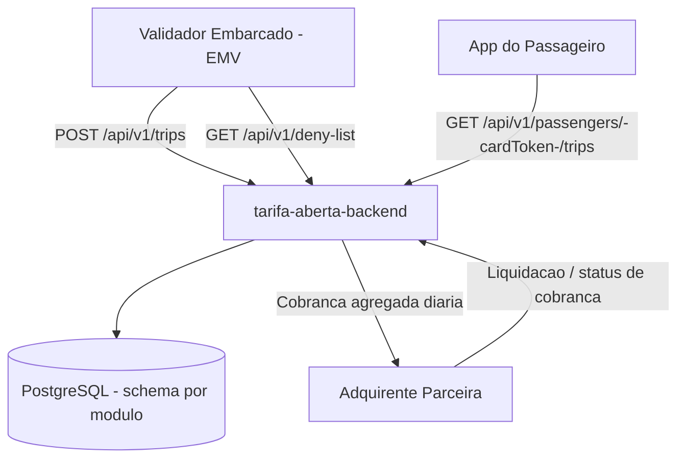
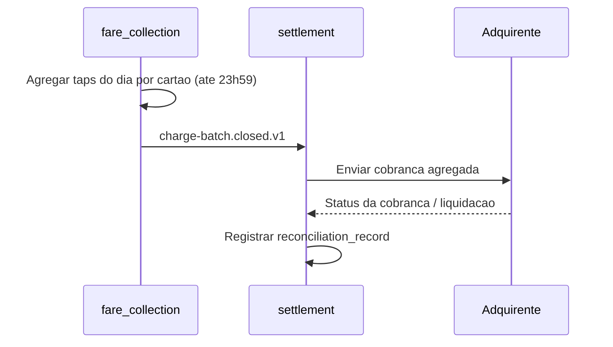
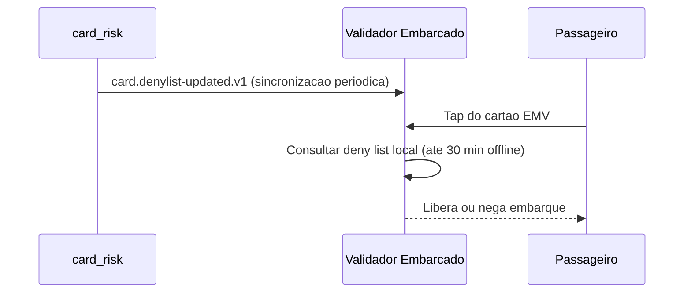
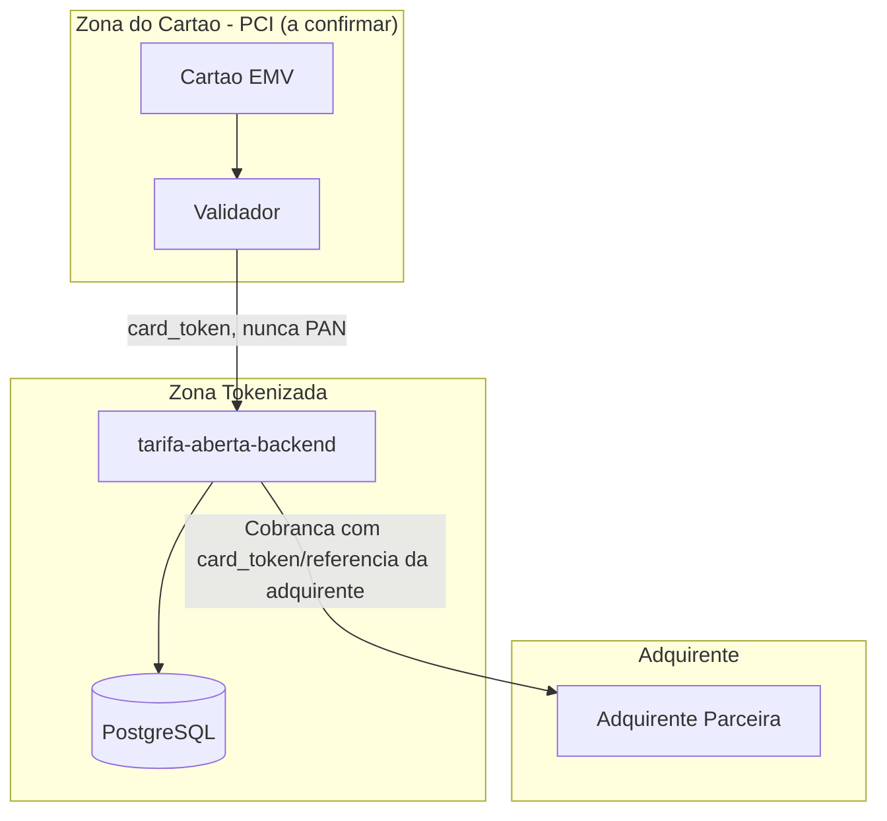

# TRD - Tarifa Aberta

**Produto:** Tarifa Aberta
**Versão:** v1.0
**Data:** 2026-09-26
**Status:** Rascunho
**Fontes Principais:** PRD (`docs/prd/prd.md`), FRD (`docs/frd/frd.md`), ADR-0001 (`docs/adr/0001-monolito-modular.md`). NFRD não existe no repositório — ver seção 22.

---

## Controle de Versão

| Versão | Data | Descrição |
|---|---|---|
| v1.0 | 2026-09-26 | Criação inicial do TRD a partir de PRD + FRD + ADR-0001, sem NFRD disponível |

---

## Sumário

1. Introdução
2. Objetivo do Documento
3. Referências
4. Consolidação Técnica dos Insumos
5. Visão Técnica da Solução
6. Estilo Arquitetural
7. Módulos e Deployables
8. Arquitetura de APIs
9. Arquitetura de Eventos e Mensageria
10. Arquitetura de Dados
11. Arquitetura de Integração
12. Segurança Técnica
13. Compliance e Privacidade
14. Observabilidade
15. Resiliência, Performance e Escalabilidade
16. Ambientes, Deploy e Configuração
17. CI/CD e Qualidade Técnica
18. Operação e Suporte
19. Diagramas Técnicos
20. Matriz de Rastreabilidade
21. Riscos Técnicos
22. Pontos a Validar
23. Anexos

---

## 1. Introdução

A Tarifa Aberta permite que o passageiro pague a tarifa de ônibus encostando um cartão de crédito ou débito contactless (EMV) no validador embarcado, sem cadastro prévio e sem cartão de transporte dedicado. A operadora recebe o valor via uma adquirente parceira e concilia diariamente. Este TRD traduz o PRD e o FRD aprovados, mais a decisão arquitetural já registrada em ADR-0001 (monólito modular com PostgreSQL), em uma especificação técnica implementável.

O repositório está em layout legado de documentação (`docs/prd/`, `docs/frd/`, `docs/adr/`, sem `docs/product/...`) e sem NFRD, sem padrão de API definido e sem DDD/Modules formalizados. Este documento segue adiante com o que existe, aplicando inferência técnica marcada e registrando lacunas como Ponto a Validar, conforme solicitado pelo time de plataforma para iniciar o desenho de infraestrutura.

---

## 2. Objetivo do Documento

Fornecer à engenharia, DevOps, segurança, QA e SRE uma base técnica implementável — arquitetura, módulos, contratos de API/evento, modelo de dados, segurança, compliance, observabilidade, deploy e operação — rastreável ao PRD e ao FRD e coerente com a decisão já aprovada em ADR-0001, permitindo que o time de plataforma comece o desenho de infraestrutura mesmo com o NFRD pendente.

---

## 3. Referências

| Documento | Caminho | Observação |
|---|---|---|
| PRD | `docs/prd/prd.md` | Layout legado (fallback de `docs/product/prd/prd.md`). Fonte de visão, objetivos e escopo. |
| FRD | `docs/frd/frd.md` | Layout legado (fallback de `docs/product/frd-nfrd/frd.md`). Fonte de requisitos funcionais. |
| NFRD | — | **Não existe no repositório.** Nenhum requisito não funcional formal disponível — ver VAL-TRD-01. |
| ADR-0001 | `docs/adr/0001-monolito-modular.md` | Layout legado (fallback de `docs/product/adr/`). Decisão de estilo arquitetural e persistência. |
| DDD | — | Não existe `docs/product/ddd/` nem `docs/specifications/ddd/` no repositório — ver VAL-TRD-02. |
| Modules | — | Não existe `docs/product/modules/` — ver VAL-TRD-03. |
| Data Model | — | Não existe `docs/product/data-model/data-model.md` — modelo de dados desta seção 10 é inferência técnica derivada do FRD/PRD. |
| Glossary | — | Não existe glossário formal — nomenclatura desta seção segue `.forge/rules/conventions/naming.md` e `language-policy.md` onde aplicável. |

> **Recomendação de migração:** consolidar `docs/prd/`, `docs/frd/` e `docs/adr/` para os paths canônicos `docs/product/prd/`, `docs/product/frd-nfrd/` e `docs/product/adr/`, e escrever o NFRD antes da próxima revisão deste TRD (ver seção 22).

---

## 4. Consolidação Técnica dos Insumos

### 4.1 Objetivos Técnicos Derivados

| Código | Objetivo Técnico | Origem | Impacto |
|---|---|---|---|
| TOBJ-01 | Autorizar a passagem do usuário no validador em tempo mínimo, inclusive offline | PRD OBJ-01, FRD-tap-01/02 | Define exigência de decisão local (deny list embarcada) sem round-trip síncrono à rede |
| TOBJ-02 | Eliminar fluxo de caixa manual no veículo | PRD OBJ-02 | Sem impacto técnico direto além de F-01 (não há hardware/fluxo de dinheiro a integrar) |
| TOBJ-03 | Expor histórico de viagens pagas ao passageiro | PRD OBJ-03, FRD-cons-01 | Exige API de consulta e read model de viagens por cartão/portador |
| TOBJ-04 | Cobrar o valor agregado do dia junto à adquirente com janela fixa (23h59) | PRD RN-03, FRD-aut-01 | Exige job agendado (batch) de fechamento diário e integração com adquirente |
| TOBJ-05 | Bloquear cartões com cobrança recusada até quitação | PRD F-04/RN-04, FRD-den-01 | Exige deny list distribuída (central + réplica local no validador) e sincronização periódica |
| TOBJ-06 | Fechar o dia financeiramente com a liquidação da adquirente | PRD F-05, FRD-conc-01 | Exige processo de conciliação diária com trilha de auditoria |

### 4.2 Fluxos Críticos

| Código | Fluxo | Criticidade | Requisitos Relacionados |
|---|---|---|---|
| FLOW-01 | Tap EMV → liberação de catraca (online ou offline) | Alta | FRD-tap-01, FRD-tap-02, RN-02 |
| FLOW-02 | Fechamento diário e envio da cobrança agregada à adquirente | Alta | FRD-aut-01, RN-03 |
| FLOW-03 | Atualização e distribuição da deny list para os validadores | Alta | FRD-den-01, RN-04 |
| FLOW-04 | Conciliação diária com a liquidação da adquirente | Alta | FRD-conc-01 |
| FLOW-05 | Consulta de viagens pagas pelo passageiro no app | Média | FRD-cons-01 |

### 4.3 Requisitos Funcionais com Impacto Técnico

| Código | Requisito FRD | Impacto Técnico |
|---|---|---|
| FRD-tap-01 | Capturar o tap EMV e registrar viagem com linha, veículo e horário | Necessário schema de evento/registro `trip` com `route_id`, `vehicle_id`, `occurred_at`, hash/token do cartão (nunca PAN cru) |
| FRD-tap-02 | Liberar catraca offline por até 30 minutos consultando deny list local | Validador precisa de persistência local (embarcada) da deny list + relógio local confiável para o timeout de 30 min; requer estratégia de sincronização e de expiração de cache |
| FRD-aut-01 | Agregar taps do dia por cartão em cobrança única até 23h59 | Job de fechamento diário (batch), idempotente, com janela de corte por timezone operacional (America/Sao_Paulo — Ponto a Validar) |
| FRD-cons-01 | Exibir viagens pagas ao passageiro | API de consulta pública/autenticada por identificador do cartão (tokenizado); exige mecanismo de "login" ou vínculo cartão↔app — Ponto a Validar (não coberto pelo PRD/FRD) |
| FRD-den-01 | Manter deny list de cartões com cobrança recusada | Fonte central da deny list + réplica local versionada nos validadores; TTL/estratégia de purge quando a dívida é quitada |
| FRD-conc-01 | Conciliar diariamente com a liquidação da adquirente | Processo batch de reconciliação, com trilha de auditoria e alerta em divergência |

### 4.4 Requisitos Não Funcionais com Impacto Técnico

| Código | Requisito NFRD | Impacto Técnico |
|---|---|---|
| NFRD-REF-01 | **NFRD inexistente** — nenhum requisito não funcional formalizado no repositório | Todos os alvos de performance, disponibilidade, capacidade e segurança abaixo são **Inferência Técnica** ou **Ponto a Validar**; ver VAL-TRD-01 |

> A única pista de NFR no material disponível é a observação do FRD: *"O validador tem que responder rápido para não formar fila na porta do ônibus."* Tratada como `Inferência Técnica` de meta de latência na seção 15.

### 4.5 Decisões Arquiteturais Existentes

| ADR | Decisão | Impacto no TRD |
|---|---|---|
| ADR-0001 | Backend inicia como monólito modular (um deployable, um módulo por bounded context), um único PostgreSQL com schema por módulo. Extração de serviços fica para quando houver necessidade medida | Define o estilo arquitetural (seção 6), a arquitetura de dados (schema-per-module, seção 10) e a comunicação interna (in-process entre módulos, sem gRPC/HTTP interno enquanto for monólito, seção 11) |

### 4.6 Bounded Contexts e Módulos

Nenhum DDD/Modules formal existe no repositório (VAL-TRD-02, VAL-TRD-03). Os bounded contexts abaixo são **Inferência Técnica**, derivados diretamente das funcionalidades do PRD/FRD, respeitando o monólito modular do ADR-0001:

| Bounded Context (inferido) | Módulo / Schema | Observação |
|---|---|---|
| Fare Collection | `fare_collection` | Tap EMV, registro de viagem, agregação diária (FLOW-01, FLOW-02) |
| Card Risk | `card_risk` | Deny list central, distribuição para validadores (FLOW-03) |
| Settlement | `settlement` | Envio de cobrança à adquirente e conciliação diária (FLOW-02, FLOW-04) |
| Passenger Experience | `passenger_experience` | Consulta de viagens pagas pelo app (FLOW-05) |

### 4.7 Integrações Externas

| Código | Sistema Externo | Tipo | Impacto Técnico |
|---|---|---|---|
| INT-01 | Adquirente parceira | API (Ponto a Validar — protocolo não definido) | Autorização agregada diária e liquidação; contrato externo desconhecido — ver VAL-TRD-04 |
| INT-02 | Validador embarcado (hardware EMV) | Protocolo físico/local (Ponto a Validar) | Canal de comunicação validador ↔ backend (conectividade intermitente, deny list local) não especificado — ver VAL-TRD-05 |

### 4.8 Dados Críticos

| Código | Dado | Categoria | Impacto Técnico |
|---|---|---|---|
| DATA-01 | Dado do cartão EMV (PAN/track data) | Financeiro / Cartão | Exige fronteira de tokenização no validador ou no gateway da adquirente; PAN não deve circular no domínio — ver seção 13 (CDE) |
| DATA-02 | Registro de viagem (linha, veículo, horário, cartão tokenizado) | Operacional | Base para agregação diária e para consulta do passageiro |
| DATA-03 | Deny list (identificador de cartão tokenizado, motivo, status de dívida) | Financeiro | Precisa de réplica local no validador com garantia de atualidade (janela de 30 min offline) |
| DATA-04 | Lote de cobrança diária por cartão | Financeiro | Base para envio à adquirente e para conciliação |

### 4.9 Pontos a Validar (consolidação)

Ver seção 22 para a lista completa e numerada.

---

## 5. Visão Técnica da Solução

### Estilo Arquitetural

Monólito modular (Modular Monolith), conforme ADR-0001: um único deployable de backend, organizado em módulos por bounded context, com um único banco PostgreSQL e um schema por módulo. Não há arquitetura orientada a eventos entre módulos internos definida — comunicação interna é in-process (chamadas de aplicação diretas ou mediator), preservando o isolamento por módulo via fronteiras de código, não de rede.

### Visão de Alto Nível

- **Validador embarcado** (hardware EMV, fora do escopo de código deste TRD, mas parte do sistema): captura o tap, decide localmente com a deny list replicada, libera a catraca, e envia o registro da viagem ao backend quando há conectividade.
- **Backend Tarifa Aberta** (monólito modular): recebe registros de viagem, mantém a deny list central, executa o fechamento diário (agregação por cartão), envia a cobrança à adquirente, concilia a liquidação e expõe consulta de viagens ao app do passageiro.
- **App do passageiro**: consome a API de consulta de viagens pagas (F-03/FRD-cons-01).
- **Adquirente parceira**: recebe a cobrança agregada diária e devolve a liquidação para conciliação.

### Decisões Técnicas Norteadoras

| Decisão | Origem | Justificativa |
|---|---|---|
| Monólito modular, um deployable, schema-per-module no PostgreSQL | ADR-0001 | Já aprovada; extração de serviços fica para quando houver necessidade medida |
| Comunicação síncrona interna entre módulos é in-process (sem gRPC) enquanto for monólito | ADR-0001 (implícito) | Regra padrão do projeto (`.forge/rules/architecture/internal-grpc-communication.md`) reserva gRPC para comunicação **entre serviços**; dentro de um único deployable não há fronteira de processo a proteger — Ponto a Validar quando houver extração de serviço |
| Valores monetários em inteiro de centavos (`amount_cents`, `BIGINT`) | `.forge/rules/domain/money-as-cents.md` | Regra de projeto para qualquer dado financeiro, aplicável à tarifa fixa (RN-01) e aos lotes de cobrança |
| Cálculo de tarifa/arredondamento segue NBR 5891 (banker's rounding) | `.forge/rules/domain/nbr-5891-rounding.md` | RN-01 define tarifa fixa (sem split), mas qualquer rateio futuro (ex.: integração tarifária, hoje fora de escopo) deve seguir esta regra |
| Tabelas de ledger/auditoria são append-only com trigger de imutabilidade | `.forge/rules/domain/audit-immutability.md` | Aplica-se ao lote de cobrança e à trilha de conciliação (DATA-04) |

---

## 6. Estilo Arquitetural

Monólito modular, conforme ADR-0001. Um único deployable de backend com módulos internos correspondentes aos bounded contexts inferidos na seção 4.6, cada um com seu schema PostgreSQL dedicado. Nenhuma decisão de mensageria assíncrona entre módulos foi registrada em ADR; o uso de eventos internos nesta versão (seção 9) é **Inferência Técnica** para desacoplar os fluxos de fechamento diário e deny list, mas pode ser substituído por chamada direta in-process sem violar ADR-0001 — ver VAL-TRD-06.

---

## 7. Módulos e Deployables

| Deployable | Tipo | Módulos Incluídos | Bounded Context | Responsabilidade | Criticidade |
|---|---|---|---|---|---|
| `tarifa-aberta-backend` | Monolito (deployable único) | `fare_collection`, `card_risk`, `settlement`, `passenger_experience` | Todos (ADR-0001) | Captura de viagens, deny list, fechamento diário, conciliação, consulta ao passageiro | Alta |

### Deployable - tarifa-aberta-backend

#### Objetivo

Concentrar toda a lógica de negócio da Tarifa Aberta em um único processo implantável, com módulos isolados por schema de banco, conforme ADR-0001.

#### Responsabilidades

- Receber e persistir registros de viagem enviados pelo validador (FLOW-01)
- Manter e distribuir a deny list (FLOW-03)
- Executar o fechamento diário e enviar a cobrança agregada à adquirente (FLOW-02)
- Conciliar a liquidação da adquirente (FLOW-04)
- Expor consulta de viagens pagas ao app do passageiro (FLOW-05)

#### Módulos Internos

| Módulo | Responsabilidade |
|---|---|
| `fare_collection` | Registro de viagens (tap), agregação diária por cartão |
| `card_risk` | Deny list central, versionamento e distribuição para validadores |
| `settlement` | Envio de cobrança à adquirente, conciliação diária |
| `passenger_experience` | Consulta de viagens pagas pelo app |

#### APIs Expostas

| API | Protocolo | Consumidores |
|---|---|---|
| `POST /api/v1/trips` (Inferência Técnica) | REST | Validador embarcado (quando conectado) |
| `GET /api/v1/deny-list` (Inferência Técnica) | REST | Validador embarcado (sincronização periódica) |
| `GET /api/v1/passengers/{cardToken}/trips` (Inferência Técnica) | REST | App do passageiro |

#### Eventos Publicados

| Evento | Consumidores |
|---|---|
| `trip.recorded.v1` (Inferência Técnica) | `fare_collection` → agregador diário interno |
| `card.denylist-updated.v1` (Inferência Técnica) | `card_risk` → distribuição para validadores |
| `charge-batch.closed.v1` (Inferência Técnica) | `settlement` → conciliação |

#### Eventos Consumidos

| Evento | Produtor |
|---|---|
| `card.charge-declined.v1` (Inferência Técnica — origem: retorno da adquirente) | Adquirente (via adapter de integração) |

#### Dados Próprios

| Entidade/Tabela/Collection | Persistência |
|---|---|
| `fare_collection.trips` | PostgreSQL (schema `fare_collection`) |
| `fare_collection.daily_charge_batches` | PostgreSQL (schema `fare_collection`) |
| `card_risk.deny_list_entries` | PostgreSQL (schema `card_risk`) |
| `settlement.acquirer_charges` | PostgreSQL (schema `settlement`) |
| `settlement.reconciliation_records` | PostgreSQL (schema `settlement`) |

#### Dependências

| Dependência | Tipo | Obrigatória? |
|---|---|---|
| PostgreSQL | Banco relacional | Sim |
| Adquirente parceira | API externa | Sim |
| Validador embarcado | Canal de dados (protocolo a definir — VAL-TRD-05) | Sim |

---

## 8. Arquitetura de APIs

### Princípios

- Versionamento: `/api/v1/`
- Autenticação: a definir (não há padrão de API nem definição de autenticação de validador/app no PRD/FRD — VAL-TRD-07)
- Idempotência: obrigatória em `POST /api/v1/trips` (evitar viagem duplicada por retry offline do validador)
- Paginação: obrigatória em `GET /api/v1/passengers/{cardToken}/trips`
- Filtros: por período em consulta de viagens
- Erros padronizados: conforme `.forge/rules/architecture/api-and-contracts.md`
- Rate limiting: a definir (VAL-TRD-07)
- Correlação: `correlationId` obrigatório (ver seção 14)

> **Ponto a Validar:** o projeto não tem padrão de API definido (nem no PRD/FRD, nem em `docs/product/...`). As APIs abaixo seguem `/api/v1/[resource]` em kebab-case por inferência técnica, conforme `.forge/rules/architecture/api-and-contracts.md` e `.forge/rules/conventions/naming.md` (seção 9.5 do agente TRD Generator).

### APIs

| API | Método/Operação | Protocolo | Produtor | Consumidor | Autenticação | Finalidade |
|---|---|---|---|---|---|---|
| `/api/v1/trips` | POST | REST | `fare_collection` | Validador embarcado | Inferência Técnica — mTLS ou API key de dispositivo (VAL-TRD-07) | Registrar viagem (tap) |
| `/api/v1/deny-list` | GET | REST | `card_risk` | Validador embarcado | Inferência Técnica — mTLS ou API key de dispositivo (VAL-TRD-07) | Sincronizar deny list local |
| `/api/v1/passengers/{cardToken}/trips` | GET | REST | `passenger_experience` | App do passageiro | Inferência Técnica — a definir vínculo cartão↔identidade do passageiro (VAL-TRD-08) | Consultar viagens pagas |

### Padrão de Erro

```json
{
  "error": "Descrição legível do erro",
  "code": "ERROR_CODE_SNAKE_UPPER",
  "correlationId": "uuid-v4"
}
```

Conforme `.forge/rules/architecture/api-and-contracts.md`.

### Padrão de Headers

| Header | Obrigatório | Finalidade |
|---|---|---|
| `X-Correlation-Id` | Sim | Correlação fim a fim |
| `Idempotency-Key` | Sim em `POST /api/v1/trips` | Evitar viagem duplicada em reenvio offline |

---

## 9. Arquitetura de Eventos e Mensageria

Nenhum broker de mensageria foi decidido em ADR. A tabela abaixo é **Inferência Técnica** — modela os fluxos internos como eventos de domínio para permitir que `card_risk` e `settlement` reajam sem acoplar `fare_collection` diretamente; em um monólito modular isso pode ser implementado como evento in-process (mediator/domain event dispatcher) sem exigir broker externo (Kafka/RabbitMQ/SNS), até que a extração de serviços do ADR-0001 se justifique.

### Event Catalog

| Evento | Produtor | Consumidores | Canal/Tópico/Fila | Retenção | Criticidade |
|---|---|---|---|---|---|
| `trip.recorded.v1` | `fare_collection` | `fare_collection` (agregador diário) | In-process (Ponto a Validar se migrar para broker) | N/A enquanto in-process | Alta |
| `card.denylist-updated.v1` | `card_risk` | Adapter de distribuição para validadores | In-process → fila de saída para validador (VAL-TRD-05) | N/A | Alta |
| `charge-batch.closed.v1` | `fare_collection` (fechamento diário) | `settlement` | In-process | N/A | Alta |
| `card.charge-declined.v1` | Adapter de integração com a adquirente | `card_risk` | In-process (originado por chamada de API externa) | N/A | Alta |

### Contrato de Evento

```json
{
  "event_id": "uuid",
  "event_type": "string",
  "event_version": "v1",
  "occurred_at": "datetime",
  "correlation_id": "string",
  "tenant_id": "uuid",
  "payload": {}
}
```

> `tenant_id` é Inferência Técnica: o PRD/FRD não menciona multi-tenancy (múltiplas operadoras). Mantido no contrato por convenção de projeto (`.forge/rules/conventions/database-naming.md`), a confirmar se a Tarifa Aberta atende uma ou múltiplas operadoras — VAL-TRD-09.

### Políticas de Consumer

| Política | Descrição |
|---|---|
| Idempotência | Consumers devem tratar duplicidade por `event_id`, especialmente `trip.recorded.v1` reenviado pelo validador após reconexão |
| DLQ | Aplicável apenas se/quando um broker externo for adotado (VAL-TRD-06) |
| Retry | Retry com backoff na chamada à adquirente (FLOW-02); política de tentativas não definida — VAL-TRD-10 |

---

## 10. Arquitetura de Dados

### Princípios

- Cada módulo (schema) tem ownership claro dos seus dados, conforme ADR-0001 (schema-per-module)
- Apenas o dono escreve nos seus dados; outros módulos consomem via chamada de aplicação (in-process) ou evento de domínio
- Dados sensíveis (PAN) seguem a fronteira de tokenização da seção 13

### Data Ownership Matrix

| Módulo / Contexto | Entidade/Tabela | Banco/Persistência | Dono da Escrita | Consumidores | Forma de Consumo |
|---|---|---|---|---|---|
| `fare_collection` | `trips` | PostgreSQL (schema `fare_collection`) | `fare_collection` | `passenger_experience` | Chamada de aplicação / read model |
| `fare_collection` | `daily_charge_batches` | PostgreSQL (schema `fare_collection`) | `fare_collection` | `settlement` | Evento `charge-batch.closed.v1` |
| `card_risk` | `deny_list_entries` | PostgreSQL (schema `card_risk`) | `card_risk` | Validador embarcado | API `GET /api/v1/deny-list` |
| `settlement` | `acquirer_charges` | PostgreSQL (schema `settlement`) | `settlement` | — | — |
| `settlement` | `reconciliation_records` | PostgreSQL (schema `settlement`) | `settlement` | — | — |

### Bancos e Persistências

| Persistência | Uso | Módulos | Observações |
|---|---|---|---|
| PostgreSQL (único, schema-per-module) | Persistência primária de todos os módulos | Todos | Conforme ADR-0001 |
| Cache local embarcado no validador (Ponto a Validar — tecnologia não definida) | Réplica da deny list para operação offline até 30 min | `card_risk` (consumido pelo validador) | VAL-TRD-05 |

### Modelo de Dados Inferido (principais entidades)

| Tabela | Colunas principais (Inferência Técnica) | Observação |
|---|---|---|
| `fare_collection.trips` | `trip_id UUID PK`, `card_token VARCHAR NOT NULL`, `route_id VARCHAR NOT NULL`, `vehicle_id VARCHAR NOT NULL`, `fare_amount_cents BIGINT NOT NULL`, `occurred_at TIMESTAMPTZ NOT NULL`, `created_at TIMESTAMPTZ NOT NULL` | `fare_amount_cents` fixo em 440 (RN-01); nunca PAN — apenas `card_token` |
| `fare_collection.daily_charge_batches` | `batch_id UUID PK`, `card_token VARCHAR NOT NULL`, `business_date DATE NOT NULL`, `total_amount_cents BIGINT NOT NULL`, `status VARCHAR NOT NULL`, `sent_to_acquirer_at TIMESTAMPTZ` | Um registro por cartão por dia (RN-03) |
| `card_risk.deny_list_entries` | `card_token VARCHAR PK`, `reason VARCHAR NOT NULL`, `added_at TIMESTAMPTZ NOT NULL`, `resolved_at TIMESTAMPTZ` | `resolved_at` nulo enquanto a dívida não é quitada (RN-04) |
| `settlement.acquirer_charges` | `charge_id UUID PK`, `batch_id UUID FK`, `status VARCHAR NOT NULL`, `acquirer_response_code VARCHAR`, `sent_at TIMESTAMPTZ NOT NULL` | Append-only por natureza financeira |
| `settlement.reconciliation_records` | `reconciliation_id UUID PK`, `business_date DATE NOT NULL`, `expected_amount_cents BIGINT NOT NULL`, `settled_amount_cents BIGINT NOT NULL`, `divergence_cents BIGINT NOT NULL`, `created_at TIMESTAMPTZ NOT NULL` | Base para FLOW-04 |

Todas as tabelas seguem `snake_case` (`.forge/rules/conventions/database-naming.md`) e sufixo `_cents` para valores monetários (`.forge/rules/domain/money-as-cents.md`).

`settlement.acquirer_charges` e `fare_collection.daily_charge_batches` são candidatas a regime append-only com trigger de imutabilidade (`.forge/rules/domain/audit-immutability.md`), dado seu caráter financeiro/auditável — Ponto a Validar a confirmação final com o time de dados (VAL-TRD-11).

### Read Models

| Read Model | Fonte | Consumidor | Atualização |
|---|---|---|---|
| Viagens pagas por cartão | `fare_collection.trips` | App do passageiro (via `passenger_experience`) | Consulta direta (sem projeção assíncrona nesta versão) |

### Retenção de Dados

| Dado | Retenção | Motivo | Expurgo |
|---|---|---|---|
| `trips` | Não definida no PRD/FRD | Sem requisito de retenção formal | VAL-TRD-12 |
| `deny_list_entries` | Até quitação da dívida (RN-04) | Regra de negócio explícita | Purge após `resolved_at`, política de tempo pós-quitação não definida — VAL-TRD-12 |
| `reconciliation_records` | Não definida | Auditoria/compliance provável (ver seção 13) | VAL-TRD-12 |

---

## 11. Arquitetura de Integração

### Integrações Externas

| Sistema | Finalidade | Protocolo | Autenticação | Direção | Criticidade |
|---|---|---|---|---|---|
| Adquirente parceira | Autorização agregada da cobrança diária, liquidação | Ponto a Validar (API/arquivo — VAL-TRD-04) | Ponto a Validar | Bidirecional (envio de cobrança / recebimento de status e liquidação) | Alta |
| Validador embarcado | Recebimento de registros de viagem, distribuição da deny list | Ponto a Validar (VAL-TRD-05) | Ponto a Validar | Bidirecional (intermitente — precisa tolerar offline) | Alta |

### Integrações Internas

| Origem | Destino | Protocolo | Contrato | Observações |
|---|---|---|---|---|
| `fare_collection` | `card_risk` | In-process (chamada de aplicação) | Interno ao monólito | Não usar gRPC/HTTP interno enquanto o ADR-0001 se mantiver (regra de gRPC aplica-se a comunicação **entre serviços**, não dentro de um deployable único) |
| `fare_collection` | `settlement` | In-process / evento de domínio `charge-batch.closed.v1` | Interno ao monólito | — |
| `settlement` | Adquirente parceira | Adapter externo (REST/SFTP/arquivo — VAL-TRD-04) | Contrato externo desconhecido | Aplicar Anti-Corruption Layer para isolar o formato da adquirente do domínio interno |

### Padrões de Integração

| Padrão | Quando usar |
|---|---|
| Anti-Corruption Layer | No adapter com a adquirente parceira, para isolar o formato/contrato externo do domínio `settlement` |
| Outbox Pattern | Se o envio da cobrança diária (`charge-batch.closed.v1` → chamada à adquirente) precisar de consistência transacional forte — recomendado dado o caráter financeiro (Inferência Técnica) |
| Retry | Para chamadas à adquirente (falhas transitórias) |
| Circuit Breaker | Para proteger o fechamento diário contra indisponibilidade prolongada da adquirente |

---

## 12. Segurança Técnica

### Princípios

Conforme `.forge/rules/architecture/security-and-secrets.md` e `.forge/rules/architecture/security-and-compliance.md`: menor privilégio, defesa em profundidade, segregação de funções, criptografia em trânsito e repouso, nenhum dado sensível em log.

### Autenticação

| Canal | Mecanismo |
|---|---|
| Usuário humano (app do passageiro) | Ponto a Validar — PRD/FRD não define autenticação do passageiro (VAL-TRD-08) |
| Validador embarcado → backend | Ponto a Validar — mTLS de dispositivo ou API key, a definir (VAL-TRD-07); `.forge/rules/architecture/mtls-internal-services.md` cobre mTLS **entre serviços internos do cluster**, não necessariamente dispositivo de campo — decisão a tomar |
| Serviço interno | N/A nesta versão — comunicação é in-process dentro do monólito (ADR-0001) |
| Sistema externo (adquirente) | Ponto a Validar — depende do contrato da adquirente (VAL-TRD-04) |

### Autorização

| Perfil/Papel | Permissões Técnicas |
|---|---|
| Validador (dispositivo) | Escrever `trips`, ler `deny-list` |
| Passageiro (app) | Ler apenas as próprias viagens (`GET /api/v1/passengers/{cardToken}/trips`), escopo restrito ao próprio `cardToken` — mecanismo de comprovação de posse do cartão não definido (VAL-TRD-08) |
| Operador/backoffice | Consultar lotes, conciliação e deny list — perfis administrativos não definidos no PRD/FRD (VAL-TRD-13) |

### Criptografia

| Dado/Canal | Em trânsito | Em repouso | Observação |
|---|---|---|---|
| Comunicação validador ↔ backend | TLS obrigatório (mínimo) | N/A | mTLS desejável, a confirmar (VAL-TRD-07) |
| Comunicação backend ↔ adquirente | TLS obrigatório | N/A | Depende do contrato da adquirente |
| `card_token` em `trips`/`deny_list_entries` | N/A | Já tokenizado antes de chegar ao backend (ver seção 13) — backend nunca armazena PAN | Fronteira de tokenização deve estar no validador ou no gateway da adquirente, nunca no domínio `fare_collection` |

### Gestão de Segredos

| Segredo | Armazenamento | Rotação |
|---|---|---|
| Credenciais de integração com a adquirente | Kubernetes Secrets via External Secrets Operator (stg/prd), `.env` local em dev | Conforme `.forge/rules/architecture/security-and-secrets.md` |
| Chave/certificado de autenticação do validador (se mTLS) | A definir junto com VAL-TRD-07 | A definir |

### Segurança de APIs

| Controle | Aplicação |
|---|---|
| Rate limit | A definir (VAL-TRD-07) |
| Input validation | Obrigatória em `POST /api/v1/trips` (schema, tipos, `fare_amount_cents` sempre igual à tarifa vigente) |
| Idempotency key | Obrigatória em `POST /api/v1/trips` |
| WAF/API Gateway | Não definido — Ponto a Validar junto ao time de plataforma (VAL-TRD-13) |

---

## 13. Compliance e Privacidade

### Compliance Aplicável

| Compliance / Norma / Lei | Aplicável? | Motivo | Impacto Técnico |
|---|---|---|---|
| PCI DSS | Ponto a Validar (provavelmente Sim) | O produto captura dado de cartão EMV (PAN) no validador; mesmo que o backend nunca armazene PAN, o **validador** e a integração com a adquirente entram potencialmente no CDE | Definir com a adquirente/PCI se o validador é um dispositivo P2PE/PCI-approved (reduz escopo de SAQ) — VAL-TRD-14 |
| LGPD | Sim | Consulta de viagens pagas associa histórico de deslocamento a um portador de cartão | Minimização de dados, retenção definida (VAL-TRD-12), mascaramento de `card_token` em log |

### Dados Sensíveis

| Dado | Categoria | Módulo Dono | Proteção |
|---|---|---|---|
| PAN do cartão EMV | Cartão | Fora do backend (validador/gateway da adquirente) | Nunca armazenado nem processado pelo backend; tokenizado na borda (validador/adquirente) |
| `card_token` | Financeiro (derivado de cartão) | `fare_collection`, `card_risk` | Mascaramento em log (`.forge/rules/architecture/pii-pci-classification.md`); nunca exibido em texto claro em log/trace |
| Histórico de viagens (linha, horário) associado ao cartão | Pessoal (LGPD) | `fare_collection` | Acesso restrito ao próprio portador (VAL-TRD-08); retenção a definir |

### Controles Técnicos

| Controle | Aplicação | Evidência Esperada |
|---|---|---|
| Mascaramento | `card_token` mascarado em log/trace | Log estruturado sem valor bruto do token |
| Tokenização | PAN nunca cruza a fronteira do backend | Nenhuma coluna de PAN no schema; apenas `card_token` |
| Auditoria | Trilha append-only de `acquirer_charges` e `reconciliation_records` | Tabelas com `REVOKE UPDATE/DELETE` + trigger, conforme `.forge/rules/domain/audit-immutability.md` |
| Retenção | A definir (VAL-TRD-12) | Política de retenção documentada |

### CDE - Cardholder Data Environment

| Componente | Dentro do CDE? | Justificativa |
|---|---|---|
| Validador embarcado | Ponto a Validar | Componente que efetivamente lê o EMV; depende de ser dispositivo PCI-approved (P2PE) ou não — VAL-TRD-14 |
| Backend `tarifa-aberta-backend` | Não, se `card_token` nunca for reversível para PAN no domínio | A confirmar que o token recebido do validador/adquirente é opaco e não reversível pelo backend |
| Canal validador ↔ backend | Ponto a Validar | Depende do que trafega nesse canal (token já tokenizado vs. dado de cartão) — VAL-TRD-05/VAL-TRD-14 |
| Canal backend ↔ adquirente | Sim (potencialmente) | Envio de lote de cobrança referenciando cartões, mesmo que tokenizados |

### Fluxo de PII

| Dado Pessoal | Coleta | Processamento | Armazenamento | Retenção | Descarte |
|---|---|---|---|---|---|
| Histórico de viagens vinculado a `card_token` | No tap EMV (validador) | Agregação diária, consulta pelo app | `fare_collection.trips` | Não definida (VAL-TRD-12) | Não definido (VAL-TRD-12) |

---

## 14. Observabilidade

### Princípios

Conforme `.forge/rules/architecture/observability.md`: os três pilares (métricas, logs, traces) são obrigatórios; `correlationId` propagado fim a fim; nenhum dado sensível em log.

### Logging

| Campo | Obrigatório | Descrição |
|---|---|---|
| `timestamp` | Sim | — |
| `level` | Sim | — |
| `service_name` | Sim | `tarifa-aberta-backend` |
| `correlation_id` | Sim | Propagado desde o validador (quando aplicável) até a chamada à adquirente |
| `card_token` | Quando aplicável | **Sempre mascarado** (ex.: últimos 4 caracteres do token) — nunca em texto claro |

### Métricas

| Métrica | Módulo | Tipo | Objetivo |
|---|---|---|---|
| `trip_recorded_total` | `fare_collection` | Counter | Volume de taps processados |
| `deny_list_sync_duration_seconds` | `card_risk` | Histogram | Latência de distribuição da deny list |
| `daily_charge_batch_amount_cents` | `settlement` | Gauge | Valor agregado enviado à adquirente por fechamento |
| `acquirer_call_duration_seconds` | `settlement` | Histogram | Latência da chamada à adquirente |
| `reconciliation_divergence_cents` | `settlement` | Gauge | Divergência entre esperado e liquidado |

### Tracing

| Fluxo | Trace Obrigatório? | Observação |
|---|---|---|
| FLOW-01 (tap → catraca) | Sim, no trecho online; trace local do validador é Ponto a Validar (VAL-TRD-05) | — |
| FLOW-02 (fechamento diário → adquirente) | Sim | Span dedicado por chamada à adquirente |
| FLOW-04 (conciliação) | Sim | — |

### Health Checks

| Módulo | Liveness | Readiness | Dependências |
|---|---|---|---|
| `tarifa-aberta-backend` | `GET /health/live` (Inferência Técnica) | `GET /health/ready` (Inferência Técnica) | PostgreSQL, conectividade com adquirente (para readiness de `settlement`) |

### Alertas

| Alerta | Condição | Severidade | Ação Esperada |
|---|---|---|---|
| Fechamento diário não enviado até 23h59 | `daily_charge_batch` sem `sent_to_acquirer_at` após o corte | Crítica | Acionar operação financeira |
| Divergência de conciliação acima de limiar | `reconciliation_divergence_cents` > limiar (a definir — VAL-TRD-15) | Crítica | Investigação financeira |
| Falha de sincronização da deny list | `deny_list_sync_duration_seconds` acima do limiar ou erro de distribuição | Alta | Risco de validador liberar embarque de cartão bloqueado além do previsto |

---

## 15. Resiliência, Performance e Escalabilidade

### Performance

| Fluxo / Módulo | Métrica | Meta | Observação |
|---|---|---|---|
| Tap EMV → liberação de catraca (online) | Latência p95 | **Inferência Técnica: alvo sugerido < 500ms** | Baseado na observação do FRD ("responder rápido para não formar fila"); nenhum NFRD define o número — VAL-TRD-01 |
| Tap EMV → liberação de catraca (offline) | Decisão local | Deve ser imediata (sem round-trip de rede) | Decorre diretamente de RN-02 (até 30 min offline) |
| Fechamento diário | Janela de execução | Deve concluir antes das 23h59 (RN-03) | Corte de agregação é às 23h59; execução do job pode ocorrer logo após |

### Escalabilidade

| Módulo | Estratégia | Métrica de Escala |
|---|---|---|
| `tarifa-aberta-backend` | Horizontal (múltiplas réplicas do monólito atrás de load balancer) | Volume de taps/segundo em horário de pico |
| PostgreSQL | Vertical inicialmente; leitura replicada se `passenger_experience` gerar carga relevante | Conexões simultâneas, IOPS |

### Resiliência

| Cenário de Falha | Tratamento Esperado | Módulos Impactados |
|---|---|---|
| Validador sem conectividade | Decisão local via deny list replicada, por até 30 min (RN-02); reenvio de `trips` ao reconectar | `fare_collection`, `card_risk` |
| Adquirente indisponível no fechamento diário | Retry com backoff + circuit breaker; fila/lote não enviado deve ficar em estado explícito para reprocesso | `settlement` |
| PostgreSQL indisponível | Falha explícita no tap online; validador deve cair no modo offline (deny list local) | Todos |

### Idempotência

| Operação | Chave de Idempotência | Retenção |
|---|---|---|
| `POST /api/v1/trips` | `Idempotency-Key` (Ponto a Validar — gerado pelo validador, ex.: hash de cartão+timestamp+veículo) | A definir (VAL-TRD-15) |
| Envio de lote à adquirente | `batch_id` | Vida do lote |

### Timeouts, Retries e Circuit Breakers

| Integração | Timeout | Retry | Circuit Breaker |
|---|---|---|---|
| Backend → Adquirente | A definir (VAL-TRD-04) | Backoff exponencial, tentativas a definir | Sim — proteger fechamento diário de indisponibilidade prolongada |
| Validador → Backend | A definir (VAL-TRD-05) | Reenvio ao reconectar | N/A (cliente intermitente, não serviço) |

---

## 16. Ambientes, Deploy e Configuração

### Ambientes

| Ambiente | Finalidade | Observações |
|---|---|---|
| Local | Desenvolvimento | `.env` permitido apenas aqui (`.forge/rules/architecture/security-and-secrets.md`) |
| Development | Integração inicial | — |
| Staging | Homologação, inclusive com validador de bancada | — |
| Production | Produção | Multi-arch obrigatório (ver abaixo) |

### Estratégia de Deploy

| Módulo | Estratégia | Observação |
|---|---|---|
| `tarifa-aberta-backend` | Rolling (Inferência Técnica) | Monólito único; blue-green é alternativa se o time de plataforma preferir menor risco no fechamento diário — VAL-TRD-16 |

### Configuração

| Configuração | Módulo | Fonte | Sensível? |
|---|---|---|---|
| String de conexão PostgreSQL | Todos | Secret Manager / K8s Secret (stg/prd), `.env` (local) | Sim |
| Credenciais/endpoint da adquirente | `settlement` | Secret Manager / K8s Secret | Sim |
| Tarifa vigente (`fare_amount_cents`) | `fare_collection` | ConfigMap (Inferência Técnica — RN-01 é fixa hoje, mas mutável no futuro) | Não |
| Janela de corte do fechamento diário (23h59) | `fare_collection`/`settlement` | ConfigMap | Não |

### Feature Flags

| Feature Flag | Finalidade | Módulo |
|---|---|---|
| Nenhuma definida no PRD/FRD | — | — |

> **Observação de projeto:** imagens de container multi-arch (`linux/amd64` + `linux/arm64`) são obrigatórias conforme `.forge/rules/architecture/docker-multi-arch.md`; sem tag `latest` em qualquer ambiente.

---

## 17. CI/CD e Qualidade Técnica

### Pipeline Esperado

| Etapa | Objetivo |
|---|---|
| Build | Compilar/empacotar `tarifa-aberta-backend` |
| Unit Tests | Validar regras locais (ex.: cálculo de `fare_amount_cents`, agregação diária) |
| Integration Tests | Validar persistência em PostgreSQL real, repositórios por schema |
| Contract Tests | Validar contrato REST com o validador e com o app do passageiro; contrato com a adquirente quando definido |
| Security Scan | SAST/Dependency scan/Secret scan |
| Container Scan | Trivy por digest (amd64 e arm64), conforme `.forge/rules/architecture/docker-image-security.md` |
| Deploy | Implantar no ambiente alvo |

### Gates de Qualidade

| Gate | Critério |
|---|---|
| Testes unitários | Obrigatórios para toda lógica de negócio (cálculo de tarifa, agregação, deny list) |
| Cobertura mínima | Domain ≥ 95%/90%, Application ≥ 85%/80%, Infrastructure ≥ 70% (`.forge/rules/testing/quality-gates.md`) |
| Vulnerabilidades críticas | Zero tolerância a CVE com fix disponível (`.forge/rules/architecture/docker-image-security.md`) |
| Lint/format | Conforme convenções do stack adotado (stack de implementação não definido no PRD/FRD/ADR — VAL-TRD-17) |
| Contratos | Pact obrigatório para integração validador↔backend e app↔backend |

> **TDD obrigatório** em domínio/aplicação (`.forge/rules/testing/tdd.md`), incluindo o cálculo de `fare_amount_cents` e a lógica de agregação diária.

---

## 18. Operação e Suporte

### Runbooks Iniciais

| Cenário | Ação Operacional | Responsável |
|---|---|---|
| Falha no envio do fechamento diário à adquirente | Verificar circuit breaker/retry, reenviar lote manualmente se necessário | Operação financeira / plantão técnico |
| Deny list desatualizada em validador (risco de liberar cartão bloqueado) | Forçar ressincronização, verificar job de distribuição | Plantão técnico |
| Divergência de conciliação | Investigar `reconciliation_records`, contatar a adquirente | Operação financeira |
| Alta latência no tap online | Verificar saúde do PostgreSQL e da API; validador deve continuar liberando via modo offline | SRE |

### Suporte

| Nível | Responsabilidade |
|---|---|
| N1 | Triagem operacional (deny list, status de lote) — estrutura de suporte não definida no PRD/FRD (VAL-TRD-18) |
| N2 | Plantão técnico (backend, integrações) |
| N3 | Engenharia de plataforma / arquitetura |

### Auditoria Operacional

| Evidência | Origem | Retenção |
|---|---|---|
| Lotes de cobrança enviados | `settlement.acquirer_charges` (append-only) | A definir (VAL-TRD-12) |
| Registros de conciliação | `settlement.reconciliation_records` (append-only) | A definir (VAL-TRD-12) |

---

## 19. Diagramas Técnicos

### Architecture Overview



### Fluxo de Fechamento Diário (Event Flow)



### Fluxo Offline de Deny List



### Security Boundary (fronteira de tokenização — Ponto a Validar)



---

## 20. Matriz de Rastreabilidade

| Origem | Item | TRD Seção | Status |
|---|---|---|---|
| PRD | OBJ-01, OBJ-02, OBJ-03 | 4.1, 5 | Coberto |
| PRD | F-01 a F-05 | 4.1, 7, 8, 9 | Coberto |
| PRD | RN-01 (tarifa fixa) | 10 (modelo de dados) | Coberto |
| PRD | RN-02 (offline 30 min) | 4.3, 10, 15 | Coberto |
| PRD | RN-03 (agregação diária até 23h59) | 4.1, 9, 15, 18 | Coberto |
| PRD | RN-04 (deny list) | 4.3, 10, 12, 18 | Coberto |
| FRD | FRD-tap-01, FRD-tap-02 | 7, 8, 10, 19 | Coberto |
| FRD | FRD-aut-01 | 9, 15, 18 | Coberto |
| FRD | FRD-cons-01 | 7, 8, 10, 12 | Parcial — autenticação do passageiro não definida (VAL-TRD-08) |
| FRD | FRD-den-01 | 7, 9, 10, 18 | Coberto |
| FRD | FRD-conc-01 | 7, 9, 18 | Coberto |
| NFRD | — | 4.4, 15, 22 | **Não Coberto** — documento inexistente |
| ADR-0001 | Monólito modular + PostgreSQL schema-per-module | 5, 6, 7, 10, 11 | Coberto |
| DDD | — | 4.6 | **Não Coberto** — bounded contexts inferidos, não formalizados |

---

## 21. Riscos Técnicos

| Código | Risco | Impacto | Probabilidade | Mitigação |
|---|---|---|---|---|
| RISK-TRD-01 | Ausência de NFRD leva a metas de performance/disponibilidade divergentes entre plataforma e produto | Alta | Alta | Escrever o NFRD antes da implementação; validar os alvos inferidos na seção 15 com o time de produto |
| RISK-TRD-02 | Protocolo de comunicação validador ↔ backend não definido (VAL-TRD-05) pode bloquear o desenho de infraestrutura pedido pelo time de plataforma | Alta | Média | Priorizar decisão técnica/ADR sobre o canal de comunicação com o hardware embarcado |
| RISK-TRD-03 | Escopo PCI DSS indefinido (validador pode ou não ser P2PE) | Alta | Média | Validar com a adquirente e com compliance se o validador é dispositivo PCI-approved antes de desenhar a infraestrutura de rede do CDE |
| RISK-TRD-04 | Falta de definição de autenticação do passageiro no app (VAL-TRD-08) pode expor histórico de viagens de outro portador | Alta | Média | Definir mecanismo de vínculo cartão↔identidade antes de implementar `passenger_experience` |
| RISK-TRD-05 | Contrato com a adquirente desconhecido (VAL-TRD-04) impede dimensionar corretamente o Anti-Corruption Layer e os timeouts do fechamento diário | Média | Alta | Obter especificação técnica da adquirente o quanto antes |

---

## 22. Pontos a Validar

| Código | Ponto | Origem | Impacto | Recomendação |
|---|---|---|---|---|
| VAL-TRD-01 | NFRD não existe no repositório — nenhum requisito não funcional formal (latência, disponibilidade, capacidade, RTO/RPO) | Ausência de `docs/product/frd-nfrd/nfrd.md` / `docs/nfrd/` | Todas as metas da seção 15 são inferência sem lastro formal | Escrever o NFRD com o time de produto/plataforma antes de fechar o desenho de infraestrutura |
| VAL-TRD-02 | Não há modelagem DDD (bounded contexts, context map) formalizada | Ausência de `docs/product/ddd/` | Módulos da seção 4.6/7 são inferidos diretamente do PRD/FRD | Formalizar DDD quando houver tempo de arquitetura dedicado; módulos inferidos podem servir de ponto de partida |
| VAL-TRD-03 | Não há `docs/product/modules/` com deployables/dependências formais | Ausência do diretório | Estrutura de módulos desta seção 7 é proposta, não confirmada | Validar com arquitetura antes de criar os schemas físicos |
| VAL-TRD-04 | Protocolo/contrato de integração com a adquirente parceira não definido (API? SFTP? arquivo?) | PRD/FRD não especificam | Bloqueia o desenho do adapter, do Anti-Corruption Layer e dos timeouts/retries do fechamento diário | Obter especificação técnica da adquirente |
| VAL-TRD-05 | Canal de comunicação entre validador embarcado e backend não definido (REST sobre celular embarcado? MQTT? outro?) | PRD/FRD não especificam a tecnologia do validador | Bloqueia decisão de protocolo, autenticação de dispositivo e estratégia de sincronização da deny list — item explicitamente aguardado pelo time de plataforma | Levantar especificação do hardware do validador com o fornecedor |
| VAL-TRD-06 | Uso de eventos internos (seção 9) modelados como in-process vs. necessidade real de broker externo | Inferência técnica desta seção | Impacta complexidade operacional | Confirmar se o monólito atual comporta tudo in-process ou se algum fluxo já exige fila externa |
| VAL-TRD-07 | Mecanismo de autenticação do validador e do app junto ao backend não definido | PRD/FRD não especificam | Bloqueia seção 12 (segurança) e a política de rate limit | Definir com segurança: mTLS de dispositivo, API key ou outro |
| VAL-TRD-08 | Como o app do passageiro comprova ser o portador de um `cardToken` para consultar viagens (F-03) | FRD-cons-01 não detalha autenticação | Risco de exposição de histórico de viagens de terceiros | Definir fluxo de vínculo cartão↔identidade (ex.: confirmação por SMS/e-mail, login bancário, etc.) |
| VAL-TRD-09 | Multi-tenancy (uma ou múltiplas operadoras de transporte usando a mesma plataforma) | PRD não menciona | Afeta modelo de dados (`tenant_id`) e isolamento | Confirmar com produto se há mais de uma operadora prevista |
| VAL-TRD-10 | Política de retry/circuit breaker na chamada à adquirente (quantidade de tentativas, backoff) | Não definida | Afeta resiliência do fechamento diário | Definir com base no SLA real da adquirente, quando conhecido |
| VAL-TRD-11 | Confirmar quais tabelas exigem o regime append-only de `audit-immutability.md` | Regra de projeto é geral; PRD/FRD não classificam explicitamente | Afeta migrations e triggers de banco | Validar com o time de dados/compliance quais tabelas entram no regime |
| VAL-TRD-12 | Política de retenção de dados (viagens, deny list, conciliação) | Não definida no PRD/FRD | Afeta LGPD e custo de armazenamento | Definir com jurídico/compliance |
| VAL-TRD-13 | Perfis administrativos/backoffice e uso de WAF/API Gateway | Não definidos | Afeta seção 12 | Levantar com o time de plataforma |
| VAL-TRD-14 | Classificação PCI do validador embarcado (P2PE/PCI-approved ou não) | Não definida | Determina o escopo real do CDE (seção 13) | Validar com a adquirente/QSA antes de desenhar a rede do validador |
| VAL-TRD-15 | Limiares de alerta de divergência de conciliação e retenção da `Idempotency-Key` | Não definidos | Afeta operação (seção 18) e resiliência (seção 15) | Definir com operação financeira |
| VAL-TRD-16 | Estratégia de deploy definitiva (rolling vs. blue-green) para o fechamento diário crítico | Inferência técnica | Afeta risco de janela de deploy coincidir com o fechamento das 23h59 | Confirmar com plataforma, considerando o horário de menor risco |
| VAL-TRD-17 | Stack de implementação (linguagem/framework) não definida no PRD/FRD/ADR | ADR-0001 fala em "monólito modular" mas não define stack | Referências desta seção 17/16 a `.NET`/multi-arch são as convenções gerais do projeto, podem não se aplicar se a stack for outra | Confirmar stack com arquitetura antes de aplicar as regras específicas de `.NET`/EF Core |
| VAL-TRD-18 | Estrutura de suporte N1/N2/N3 não definida | Não coberto pelo PRD/FRD | Afeta seção 18 | Definir com operações |
| **Recomendação de migração de layout** | Consolidar `docs/prd/`, `docs/frd/`, `docs/adr/` para `docs/product/prd/`, `docs/product/frd-nfrd/`, `docs/product/adr/` | Compatibilidade legada (seção 3) | Reduz risco de drift entre paths canônicos e legados em revisões futuras | Migrar documentos antes da próxima revisão deste TRD |

---

## 23. Anexos

Nenhum anexo adicional nesta versão. Os diagramas complementares (fluxos internos por módulo, diagrama de deployment em Kubernetes) devem ser adicionados quando VAL-TRD-05 (protocolo do validador), VAL-TRD-17 (stack) e VAL-TRD-04 (contrato da adquirente) forem resolvidos.
