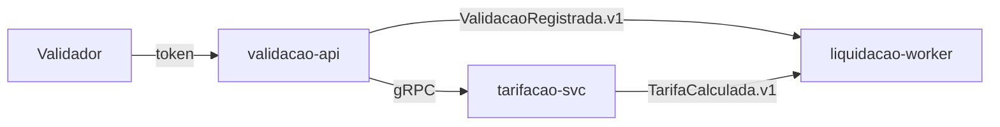

# TRD - Axis Validação

## Controle de Versão

| Versão | Data | Descrição |
|---|---|---|
| v0.1 | 2026-09-02 | Primeira versão para revisão |
| v0.2 | 2026-09-26 | Revisão crítica contra PRD/FRD/NFRD/ADRs/DDD/Modules/Data Model: evento `ValidacaoRegistrada.v1` adicionado à arquitetura de eventos e ao diagrama, seção 14 (Observabilidade) criada, retenção de `lotes_compensacao` e da DLQ explicitada, matriz de rastreabilidade completada (FRD-EXT-01, NFRD-PERF-01, NFRD-OBS-01/02, NFRD-RET-01) |

## 1. Introdução

Documento técnico da plataforma de validação de embarque e compensação entre operadoras.

## 2. Objetivo do Documento

Orientar engenharia, segurança, SRE e QA na implementação dos módulos validacao, tarifacao e liquidacao.

## 3. Referências

PRD v1.2, FRD, NFRD, ADR-0001 a ADR-0004, DDD Segmentation, Modules, Data Model.

## 4. Consolidação Técnica dos Insumos

Três bounded contexts (Validação, Tarifação, Liquidação), um deployable por módulo.

## 5. Visão Técnica da Solução

O validador embarcado tokeniza o cartão no gateway do adquirente e envia o token à `validacao-api`, que consulta a tarifa na `tarifacao-svc` via gRPC síncrono, libera a catraca e registra o fato publicando `ValidacaoRegistrada.v1`, consumido por `tarifacao-svc` e `liquidacao-worker`.

## 6. Estilo Arquitetural

Microsserviços por bounded context, banco por contexto (ADR-0001), eventos de domínio assíncronos (ADR-0004).

## 7. Módulos e Deployables

| Módulo | Deployable | Banco |
|---|---|---|
| validacao | `validacao-api` | `validacao_db` |
| tarifacao | `tarifacao-svc` | `tarifacao_db` |
| liquidacao | `liquidacao-worker` | `liquidacao_db` |

## 8. Arquitetura de APIs

| API | Produtor | Consumidor | Protocolo | Autenticação |
|---|---|---|---|---|
| `TarifaService.Calcular` v1 | tarifacao-svc | validacao-api | gRPC | mTLS interno |
| `GET /v1/extrato` | validacao-api | App do passageiro | REST | OAuth2 (token do app) |

## 9. Arquitetura de Eventos e Mensageria

| Evento | Produtor | Consumidores | Canal | Retry/DLQ |
|---|---|---|---|---|
| `ValidacaoRegistrada.v1` | validacao-api | tarifacao-svc, liquidacao-worker | `dominio.eventos` (RabbitMQ) | 3 tentativas, DLQ `liquidacao.dlq` |
| `TarifaCalculada.v1` | tarifacao-svc | liquidacao-worker | `dominio.eventos` (RabbitMQ) | 3 tentativas, DLQ `liquidacao.dlq` |

A DLQ retém as mensagens por 7 dias (ADR-0004) e todo consumidor é idempotente por `event_id`, para permitir reprocessamento sem duplicar tarifação ou compensação.

## 10. Arquitetura de Dados

Cada módulo escreve apenas no próprio banco (ADR-0001). `validacoes` e `tarifas_aplicadas` são retidas por 5 anos; `lotes_compensacao` é retida por 10 anos, por exigência de auditoria das operadoras. Nenhuma tabela armazena PAN.

## 11. Arquitetura de Integração

Gateway do adquirente (tokenização) acessado apenas pelo validador embarcado. Arquivo de compensação entregue às operadoras via SFTP em D+1.

## 12. Segurança Técnica

mTLS entre serviços internos; segredos no gerenciador de segredos do provedor de nuvem; somente `card_token` trafega nos serviços Axis (ADR-0003).

## 13. Compliance e Privacidade

Ambiente Axis fora do CDE por tokenização no gateway (ADR-0003). O token do cartão é tratado como dado pessoal (LGPD) e mascarado em logs.

## 14. Observabilidade

Todos os deployables (`validacao-api`, `tarifacao-svc`, `liquidacao-worker`) emitem logs estruturados em JSON com `correlation_id` propagado entre chamadas gRPC e eventos RabbitMQ, métricas RED (rate, errors, duration) por endpoint/consumidor e alerta quando a latência p99 ultrapassar 300 ms por 5 minutos seguidos (NFRD-OBS-01). Cada deployable expõe health checks de liveness e readiness (NFRD-OBS-02).

## 15. Resiliência, Performance e Escalabilidade

`validacao-api` com timeout de 150 ms na chamada a `tarifacao-svc` — parte do orçamento de latência de 300 ms p99 do fluxo completo de embarque (NFRD-PERF-01) — e escala horizontal por CPU.

## 16. Ambientes, Deploy e Configuração

Ambientes dev, stg e prd em Kubernetes; configuração por variáveis de ambiente.

## 17. CI/CD e Qualidade Técnica

Pipeline com build, testes unitários e de contrato gRPC, varredura de dependências.

## 18. Operação e Suporte

Plantão da equipe de plataforma em horário comercial.

## 19. Diagramas Técnicos

## 20. Matriz de Rastreabilidade

| Requisito | Seção TRD |
|---|---|
| FRD-VAL-01 | 5, 7, 9 |
| FRD-TAR-01 | 8 |
| FRD-LIQ-01 | 9, 11 |
| FRD-EXT-01 | 8 |
| NFRD-PERF-01 | 15 |
| NFRD-OBS-01 | 14 |
| NFRD-OBS-02 | 14 |
| NFRD-SEC-01 | 12, 13 |
| NFRD-RET-01 | 10 |

## 21. Riscos Técnicos

| Risco | Mitigação |
|---|---|
| Indisponibilidade do gateway do adquirente | Validação offline com lista de tokens autorizados no validador |

## 23. Anexos

Nenhum.
