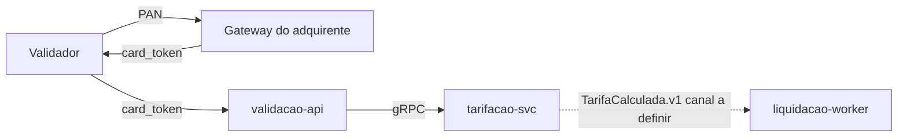

# TRD - Axis Validação

## Controle de Versão

| Versão | Data | Descrição |
|---|---|---|
| v0.1 | 2026-09-02 | Primeira versão para revisão |
| v0.2 | 2026-09-26 | Ajustes aplicados pelo TRD Validator: seções 5, 10, 12, 13 e 19 realinhadas ao ADR-0003 (Axis não recebe nem persiste o PAN) e ao Data Model (chave é `card_token`); rastreabilidade completada (seções 20); pontos a validar registrados para o broker de eventos e para a meta de p99 discutida informalmente (seção 22). Solicitações de alterar o NFRD e de marcar o ADR-0003 como substituído foram recusadas por estarem fora do escopo deste agente — ver `trd-validation-report.md`. |

## 1. Introdução

Documento técnico da plataforma de validação de embarque e compensação entre operadoras.

## 2. Objetivo do Documento

Orientar engenharia, segurança, SRE e QA na implementação dos módulos validacao, tarifacao e liquidacao.

## 3. Referências

PRD v1.2, FRD, NFRD, ADR-0001 a ADR-0003, DDD Segmentation, Modules, Data Model.

## 4. Consolidação Técnica dos Insumos

Três bounded contexts (Validação, Tarifação, Liquidação), um deployable por módulo.

## 5. Visão Técnica da Solução

O validador embarcado tokeniza o PAN diretamente no gateway do adquirente e envia à `validacao-api` apenas o `card_token` retornado (ADR-0003); a Axis não recebe nem persiste o PAN. A `validacao-api` grava a validação com o `card_token`, consulta a tarifa na `tarifacao-svc` e libera a catraca.

## 6. Estilo Arquitetural

Microsserviços por bounded context, banco por contexto (ADR-0001), eventos de domínio assíncronos (broker ainda sem decisão registrada).

## 7. Módulos e Deployables

| Módulo | Deployable | Banco |
|---|---|---|
| validacao | `validacao-api` | `validacao_db` |
| tarifacao | `tarifacao-svc` | `tarifacao_db` |
| liquidacao | `liquidacao-worker` | `liquidacao_db` |

## 8. Arquitetura de APIs

| API | Produtor | Consumidor | Protocolo | Autenticação |
|---|---|---|---|---|
| `TarifaService.Calcular` v1 | tarifacao-svc | validacao-api | gRPC | mTLS interno |
| `GET /v1/extrato` | validacao-api | App do passageiro | REST | OAuth2 (token do app) |

## 9. Arquitetura de Eventos e Mensageria

| Evento | Produtor | Consumidores | Canal | Retry/DLQ |
|---|---|---|---|---|
| `ValidacaoRegistrada.v1` | validacao-api | tarifacao-svc, liquidacao-worker | a definir | a definir |
| `TarifaCalculada.v1` | tarifacao-svc | liquidacao-worker | a definir | a definir |

## 10. Arquitetura de Dados

Cada módulo escreve apenas no próprio banco (ADR-0001). `validacoes` retida por 5 anos. A tabela `validacoes` guarda o `card_token` emitido pelo gateway do adquirente (Data Model); nenhuma entidade Axis armazena PAN, cifrado ou não (ADR-0003; PRD — Restrições).

## 11. Arquitetura de Integração

Gateway do adquirente (tokenização) acessado apenas pelo validador embarcado. Arquivo de compensação entregue às operadoras via SFTP em D+1.

## 12. Segurança Técnica

mTLS entre serviços internos; segredos no gerenciador de segredos do provedor de nuvem; a Axis nunca recebe o PAN — apenas o `card_token` emitido pelo gateway do adquirente (ADR-0003) —, que é mascarado nos logs.

## 13. Compliance e Privacidade

A tokenização no gateway do adquirente mantém o ambiente Axis fora do CDE (ADR-0003), reduzindo o escopo de aplicação do PCI DSS aos controles de proteção do `card_token`. O `card_token` é tratado como dado pessoal (LGPD) e mascarado em logs.

## 14. Observabilidade

Logs estruturados em JSON com `correlation_id`; métricas RED por endpoint; alerta de p99 > 300 ms por 5 minutos; liveness e readiness em todos os deployables.

## 15. Resiliência, Performance e Escalabilidade

`validacao-api` com timeout de 150 ms na chamada a `tarifacao-svc` e escala horizontal por CPU.

## 16. Ambientes, Deploy e Configuração

Ambientes dev, stg e prd em Kubernetes; configuração por variáveis de ambiente.

## 17. CI/CD e Qualidade Técnica

Pipeline com build, testes unitários e de contrato gRPC, varredura de dependências.

## 18. Operação e Suporte

Plantão da equipe de plataforma em horário comercial.

## 19. Diagramas Técnicos

## 20. Matriz de Rastreabilidade

| Requisito | Seção TRD |
|---|---|
| FRD-VAL-01 | 5, 7 |
| FRD-TAR-01 | 8 |
| FRD-LIQ-01 | 9, 11 |
| FRD-EXT-01 | 8 |
| NFRD-PERF-01 | 14, 15 |
| NFRD-OBS-01 | 14 |
| NFRD-OBS-02 | 14 |
| NFRD-SEC-01 | 5, 10, 12, 13 |
| NFRD-RET-01 | 10 |

## 21. Riscos Técnicos

| Risco | Mitigação |
|---|---|
| Indisponibilidade do gateway do adquirente | Validação offline com lista de tokens autorizados no validador |

## 22. Pontos a Validar

| Código | Ponto | Origem | Impacto | Recomendação |
|---|---|---|---|---|
| VAL-TRD-01 | Canal/broker dos eventos `ValidacaoRegistrada.v1` e `TarifaCalculada.v1` (seção 9) segue sem decisão registrada. | TRD v0.1 (mantido) | Sem retry/DLQ e canal definidos, `liquidacao-worker` e `tarifacao-svc` não têm garantia de entrega; bloqueia implementação assíncrona. | Registrar ADR de mensageria antes do início da implementação dos módulos tarifacao e liquidacao. |
| VAL-TRD-02 | Meta de p99 de 500 ms mencionada como acordo de daily diverge do `NFRD-PERF-01` (300 ms), que é o requisito documentado e usado pela seção 14 (alerta) e 15 (timeout). | Solicitação verbal, sem registro em NFRD | TRD mantém 300 ms; se a meta realmente mudou, o TRD ficará desalinhado até o NFRD ser atualizado por quem o mantém. | Formalizar a mudança no NFRD (fora do escopo deste agente) e só então propagar para o TRD. |
| VAL-TRD-03 | A v0.1 deste TRD descrevia `validacao-api` recebendo e persistindo o PAN cifrado, contrariando ADR-0003, Data Model e a restrição de PCI DSS do PRD; corrigido nesta revisão (seções 5, 10, 12, 13, 19). | ARCH-CONFLICT-001 (ver relatório de validação) | Se algum componente já implementado seguiu a v0.1, há PAN em trânsito/persistido fora do escopo aprovado. | Auditar `validacao-api` e o validador embarcado para confirmar que nenhum fluxo ainda transmite ou grava o PAN; se houver, tratar como incidente de escopo PCI DSS. |

## 23. Anexos

Nenhum.
