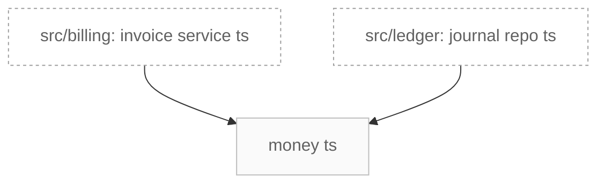

# C3 — Componentes: src/shared (cor = camada)

> Gerado por `/forge:c4` a partir do code graph. Renderiza como diagrama em qualquer
> previewer de Markdown com suporte a Mermaid (VS Code, GitHub).

