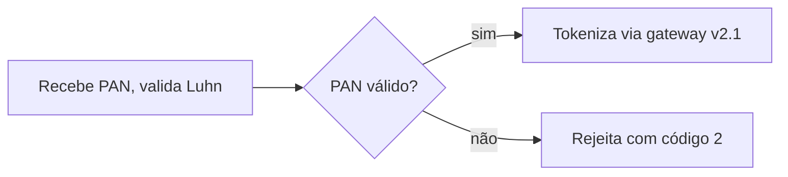

# Fluxo de tokenização

O PAN é validado localmente por Luhn antes de sair para o gateway de tokenização. PAN inválido encerra o fluxo com código 2, sem chamada externa.

```mermaid
flowchart LR
  A[Recebe PAN, valida Luhn] --> B{PAN válido?}
  B -- sim --> C[Tokeniza via gateway v2.1]
  B -- não --> D[Rejeita com código 2]
```
