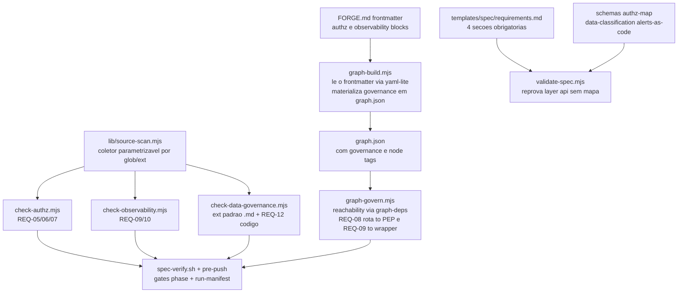

# Design — security-observability-gates

> Design técnico do change `security-observability-gates`. Decisões duráveis e transversais merecem ADR (`/forge:new-adr`) — referencie aqui em vez de duplicar.

## 1. Contexto e restrições

O harness já tem um padrão provado de gate determinista para uma preocupação transversal: `template/.forge/scripts/lib/check-data-governance.mjs` varre artefatos contra uma matriz normativa `ANTI` de anti-padrões (cada item `{ re, why, allow }`, linhas 34-40), reporta `CONFLICT (<file:line: why>)` e sai com `exit 1` (linhas 53-56), envolto por `check-data-governance.sh` que aceita `<change-id>` ou `--path <dir|file>` (linhas 9-13). Este change replica esse padrão para autorização e observabilidade e estende a própria data-governance — mas colide com uma limitação estrutural: o coletor `collect()` (linhas 20-30) só acumula `.md` (`e.name.endsWith('.md')`), enquanto os requisitos exigem varrer código-fonte real (`.rego/.go/.kt/.ts`), por convenção explícita do requirements.md ("código real" = arquivo-fonte na linguagem alvo).

O code-graph é o segundo substrato. `template/.forge/scripts/lib/graph-build.mjs` caminha o repo (`walk`, linhas 43-58), classifica `layer` por path (`layerOf`, linhas 80-104 — `api|application|domain|infrastructure|contracts|test|config|unknown`), extrai edges de import por linguagem (JS/CS/Go/Python/Java/Kotlin, linhas 213-252) e materializa `graph.json` conforme `template/.forge/schemas/graph.schema.json` (schema `graph/v0`, `additionalProperties: false` no topo). Crucialmente, `graph-build.mjs` **não lê o `FORGE.md`** hoje — só o repo. `template/.forge/scripts/lib/graph-deps.mjs` já faz alcançabilidade e agregação módulo→módulo sobre `graph.json` (adjacência linhas 42-51, DFS de ciclos linhas 54-80), então o gate de grafo (REQ-08/09) reusa essa maquinaria de reachability, não a reinventa.

Quatro restrições de integração amarram o desenho. Primeira: o `FORGE.md` (frontmatter YAML acima de `# FORGE.md`) tem um bloco `runtime:` com chaves fixas (`primary_stack/package_manager/run/test/typecheck/lint`); dois leitores independentes o parseiam por awk — `spec-verify.sh` (`get_runtime`, linhas 44-51, com `for check in test typecheck lint` na linha 65) e `hooks/git/pre-push` (`fm_field`, linhas 25-31, que hoje faz apenas duas chamadas explícitas `run_check "typecheck"` e `run_check "test"` — sem loop e sem checar `lint`). Qualquer bloco novo (`authz:`/`observability:`) e qualquer chave nova dentro de `runtime:` (`gates:`) têm que conviver com esses parsers sem quebrá-los. Segunda: `validate-spec.mjs` já parseia YAML via `parseYamlSubset` de `./yaml-lite.mjs` (linha 18) — o mesmo parser serve para `graph-build.mjs` ler o frontmatter do `FORGE.md`, evitando um segundo dialeto YAML; porém `graph-build.mjs` é **distribuído ao consumidor** (`template/.forge/scripts/`), que não tem o `node_modules` do harness, então é obrigatoriamente zero-dep (NFR-01) e não pode usar o pacote `yaml` que `tools/validate-forge.mjs` usa (esse é um utilitário só do harness-repo). Terceira: `yaml-lite.mjs` aceita `- scalar` (block sequences) e `key: []`, mas **não** aceita arrays inline `[a, b]` nem faz strip de comentário final de linha (`parseScalar` devolve a string crua) — e o `FORGE.md` real tem comentários finais em vários campos existentes (ex.: linhas 12-14 e 31 do `template/.forge/FORGE.md`); qualquer parse do frontmatter inteiro tem que tolerá-los. Quarta: a suíte `tests/run-all.sh` auto-descobre gates por `ls tests/*-gate.sh` (linhas ~40-44) e exige 100% verde (NFR-04); os gates `tests/gw3-data-governance-gate.sh` (retrocompat do coletor, passos [1]-[8]) e `tests/w20-spec-gate.sh` (valida `FORGE.md` contra `forge.schema.json` via `tools/validate-forge.mjs`) **não podem regredir**.

NFRs que restringem: zero-dependência (NFR-01 — só Node puro, sem `opa`/`npm i`), determinismo (NFR-02), proporcionalidade (NFR-03 — change trivial não sofre exigência nova) e sem regressão (NFR-04). A constitution (`template/.forge/constitution.md`, 31 linhas) tem um item 7 "Security by default" enxuto ("No secrets in code, repos or images; least privilege; auditability") que REQ-01 emenda, não substitui.

## 2. Decisão técnica

A arquitetura são **cinco camadas de imposição** empilhadas sobre um único coletor compartilhado, atravessando os quatro pontos de extensão do harness (constitution → rules → gates → template/validate-spec → schemas), integradas ao `spec-verify`/`pre-push`/CI e materializadas por um bloco declarativo no `FORGE.md` lido pelo code-graph.



### 2.1 Engine compartilhado — `lib/source-scan.mjs` (REQ-12/Notas, NFR-01/04)

Extraio o coletor e o motor de matriz de `check-data-governance.mjs` para um módulo novo `template/.forge/scripts/lib/source-scan.mjs`, zero-dep, com duas funções:

```js
// collect(paths, opts) → string[] de arquivos. opts.exts: Set de extensões
// (default { '.md' } — retrocompat); opts.skipDirs: dirs ignorados (default o
// mesmo conjunto de graph-build: node_modules,.git,dist,build,.forge,vendor…).
export function collect(paths, { exts = new Set(['.md']), skipDirs = DEFAULT_SKIP } = {})
// scan(files, matrix, { rel }) → findings[] "rel:line: why", aplicando cada
// { re, why, allow } por linha, pulando quando allow casa (a semântica exata
// das linhas 46-50 do check-data-governance atual).
export function scan(files, matrix, opts = {})
```

`check-data-governance.mjs` passa a importar `collect`/`scan` de `source-scan.mjs` preservando `exts = { '.md' }` como default — nenhum comportamento observável muda para os checks atuais, e `gw3-data-governance-gate.sh` [1]-[8] continua verde (é assim que NFR-04 é provado). A extensão PII/PCI (REQ-12) chama `collect(paths, { exts: {'.go','.kt','.ts','.rego','.py'} })` para varrer código além do `.md`. Cada gate declara sua própria constante `ANTI`/matriz local no seu `lib/*.mjs`, no molde `{ re, why, allow }` já existente — o engine é o coletor+scanner, não a matriz. **Decisão: um engine compartilhado, três matrizes** (§3 registra o trade-off vs três engines separados).

### 2.2 Os três gates

**`check-authz` — `check-authz.sh` + `lib/check-authz.mjs`** (REQ-05/06/07). Três sub-checks:
- REQ-05 (deny-by-default, **sempre enforce**): sobre arquivos `.rego`, reprova todo package que não contenha `default allow := false` ou que contenha `allow` incondicional / `default allow := true`. Parsing por regex sobre o texto Rego (não invoca `opa` — NFR-01); a fragilidade do regex é risco §6 mitigado por fixtures e limitação documentada.
- REQ-06 (nenhuma decisão imperativa fora do PEP): matriz `ANTI` por stack (`hasRole(`, `user.role ==`, `claims["permissions"]`, decorators de role) aplicada por `scan()` a arquivos **fora** do diretório PEP declarado no bloco `authz:`. Dentro do PEP → PASS.
- REQ-07 (cobertura de política): quando `authz.policy_coverage_threshold` está declarado, lê o **valor reportado** de um relatório de cobertura (ex.: `opa test --coverage` gerado pelo projeto — a geração é do consumidor, REQ-07/Notas) e reprova se `< threshold`. Ausência de threshold ⇒ no-op (não falso-positivo).

**`check-observability` — `check-observability.sh` + `lib/check-observability.mjs`** (REQ-09/10):
- REQ-09(a): node `layer:api` sem caminho ao wrapper de instrumentação — delegado ao gate de grafo `graph-govern.mjs` (§2.3), pois é alcançabilidade, não varredura de texto. REQ-09(b): logger cru (`fmt.Println`, `console.log`, `print(` em contexto de serviço) fora do wrapper — matriz `ANTI` via `scan()`.
- REQ-10 (alerts-as-code por serviço): para cada boundary declarado, exige ≥1 artefato `alerts-as-code` válido (schema REQ-14) associado ao serviço; ausência → FAIL nomeando o serviço.

**Extensão `check-data-governance`** (REQ-12): adiciona à matriz existente (a) taint de PAN/PII em chamada de log (regex de PAN 13-19 dígitos, CPF, e-mail dentro de `log.*(...)`/`logger.*`), **sempre enforce** no ramo PAN/PII em log (REQ-16 — violação PCI direta) e (b) campo marcado sensível sem classificação no artefato `data-classification`. A varredura agora inclui código via `exts` ampliado (§2.1).

**Contrato comum dos gates.** Cada `.sh` espelha `check-data-governance.sh`: `set -euo pipefail`, `ROOT="${FORGE_ROOT:-…}"`, exige `node`, aceita `<change-id>` ou `--path`. Saída `OK <gate> (…)` (exit 0) ou `CONFLICT (…)`/`FAIL (…)` (exit≠0). O **modo warn|enforce** (REQ-16) é lido do bloco `authz:`/`observability:` e aplicado apenas aos cinco gates de adoção (REQ-06/07/08/09/10): em `warn` o achado imprime `WARN (…)` e sai 0; em `enforce`, `CONFLICT (…)` e sai 1. Os ramos **inegociáveis** — REQ-05 (deny-by-default) e REQ-12(a) (PAN/PII em log) — ignoram o `mode` e sempre saem 1 no achado (coerente com REQ-01(b)/(d)). Implemento isso como um flag interno `enforceable=false` por finding: o modo só rebaixa findings marcados rebaixáveis.

### 2.3 Blocos declarativos `authz:`/`observability:` + extensão do code-graph (REQ-11, habilita 06/07/08/09/10)

Adiciono ao frontmatter do `FORGE.md` dois blocos irmãos do `runtime:`, escritos em **block sequence** (não arrays inline) e **sem comentário final de linha** — o dialeto que `yaml-lite` parseia com segurança:

```yaml
authz:
  pep_paths:
    - services/*/internal/authz
    - packages/pep
  policy_dir: policy
  allowlist:
    - services/health
    - services/metrics
  mode: warn
  policy_coverage_threshold: 0.8
observability:
  wrapper_paths:
    - packages/otel
    - services/*/observability
  allowlist:
    - services/health
  mode: warn
```

`graph-build.mjs` ganha um passo novo: ao iniciar, lê o frontmatter do `FORGE.md` (fatia entre os dois primeiros `---`) via `parseYamlSubset` de `yaml-lite.mjs` (mesmo parser de `validate-spec.mjs` — sem segundo dialeto, e zero-dep como NFR-01 exige para um script distribuído). **Resolução da tensão parser×dialeto (§1, terceira restrição):** como o frontmatter real contém comentários finais em outros blocos, `yaml-lite.mjs` é estendido com **strip de comentário final de linha** (` #…` fora de aspas) no `parseScalar` — mudança retrocompatível (nenhum emissor do harness produz comentário final, então nenhum valor atual muda) e testada por fixture própria; beneficia todos os consumidores de `yaml-lite` (`validate-spec`, `validate-archive`, `delta-apply`). Os blocos novos usam block sequences, que `yaml-lite` já suporta — sem necessidade de inline arrays. Isso **não toca** o awk de `spec-verify.sh`/`pre-push`, que continuam lendo só `runtime:` (o awk de `pre-push` para no primeiro `^[a-z_]+:` após `runtime:`, então blocos posteriores nunca são varridos por engano). Com os blocos em mãos, `graph-build.mjs`: (1) taggeia cada node cujo `id` casa um glob de `pep_paths`/`wrapper_paths` com um campo novo `roles: ["pep"]` / `["otel-wrapper"]`; (2) emite um bloco `governance` no `graph.json` com `{ authz: {...}, observability: {...} }`. Ambos exigem **estender `graph.schema.json`**: adicionar `roles` (array opcional) às properties de `nodes` e um objeto `governance` opcional no topo — mudança aditiva, não quebra `graph/v0`. Ausência dos blocos ⇒ `governance` ausente ⇒ gates dependentes em no-op (REQ-11 AC).

**Schema do `FORGE.md` (REQ-11 AC — MISS corrigido):** os blocos `authz:`/`observability:` e a chave `gates:` (§2.6) são novos campos do frontmatter, validado por `template/.forge/schemas/forge.schema.json` (`$defs/forgeFrontmatter`, hoje `additionalProperties: false`) via `tools/validate-forge.mjs` no gate `tests/w20-spec-gate.sh`. Sem admiti-los no schema, todo `FORGE.md` que os declare — inclusive as fixtures deste change — reprova o W1.0 e quebra NFR-04. Portanto o change **estende `forge.schema.json`**: adiciona `authz` e `observability` como objetos opcionais no `$defs/forgeFrontmatter`, e `gates` como chave opcional (lista) dentro do objeto `runtime`. Extensão aditiva, sem tornar os blocos obrigatórios (proporcionalidade).

O **gate de grafo** `lib/graph-govern.mjs` (REQ-08/09) opera sobre `graph.json` reusando a alcançabilidade de `graph-deps.mjs`: para cada node `layer:api` que não esteja na `allowlist`, computa se alcança (edge direto ou transitivo, seguindo só `resolved:true`) algum node com `roles: ["pep"]` (REQ-08) e algum com `roles: ["otel-wrapper"]` (REQ-09a). Node `api` sem caminho → finding nomeando o arquivo. Respeita `mode` do bloco correspondente. `graph-govern.mjs` é **motor interno** (biblioteca), não um gate público: o resultado de REQ-08 é reportado sob o gate `check-authz` e o de REQ-09(a) sob `check-observability` no `run-manifest` (REQ-15); um teste de unidade próprio (`tests/*-graph-govern-gate.sh`) exercita o motor isoladamente, mas ele não é declarado na chave `gates:` do `FORGE.md`. Este gate prova **importação, não aplicação** — a prova comportamental (401/403) é declarativa no `authz-map` (REQ-14) e executada no CI do consumidor (fora de escopo).

### 2.4 Schemas declarativos (REQ-14)

Três schemas em `template/.forge/schemas/`, draft 2020-12, `$id: https://forge.dev/schemas/<nome>.schema.json`, `additionalProperties: false`, no estilo de `verification.schema.json`:
- `authz-map.schema.json` — lista de endpoints `{ method, path, action, resource, policy }`, cada um exigindo `negative_contract_test` (objeto `{ unauthenticated_401, forbidden_403 }` com referência ao teste). O campo é `required` — `authz-map` reprova endpoint sem o teste de contrato negativo declarado (REQ-14 AC + tríade anti-falso-negativo §4 da proposal).
- `data-classification.schema.json` — mapa `field → { classification: pii|pan|sensitive|public, masking, tokenization_boundary }`.
- `alerts-as-code.schema.json` — `service` + lista de `alerts { name, expr, severity, for }` (golden signals), consumido por REQ-10.

Cada schema vem com um fixture válido e um inválido (REQ-14 AC), validados pelo mesmo runner de schemas que a suíte já usa (`w30-schemas-gate.sh`).

### 2.5 Template + validate-spec (REQ-13, NFR-03)

`template/.forge/templates/spec/requirements.md` ganha quatro seções obrigatórias, preenchidas só quando o change toca `layer:api`/dados: (1) mapa endpoint→ação→recurso→policy; (2) tabela dado→classificação; (3) checklist de sinais OTel por boundary; (4) mapa de eventos auditáveis (mutação→audit event append-only — a superfície declarativa da família *audit trail*, REQ-01 decisão de escopo).

`validate-spec.mjs` ganha uma regra condicional nova, no molde das `headingRules` (linhas 149-159): quando o change **toca `layer:api`**, reprova ausência do mapa endpoint→policy e do mapa de eventos auditáveis. O gatilho de proporcionalidade (NFR-03) é um campo declarativo opcional no `manifest.yaml` — `affects_surfaces: [api, data]` — em vez de heurística frágil sobre o texto. Ausente ⇒ change trivial ⇒ nenhuma seção exigida (NFR-03 AC). **Decisão (ratificada):** `affects_surfaces` no `manifest.yaml` (aditivo em `spec-manifest.schema.json` e nos campos permitidos do `validate-spec.mjs`), preferido à derivação pós-código via `/forge:impact` sobre o grafo — o campo declarativo é explícito, testável e existe antes do código; a derivação por grafo só existe após implementar. É consistente com o padrão de campos declarativos já validados no manifest.

### 2.6 Integração verify/pre-push/CI + run-manifest (REQ-15)

Adiciono ao bloco `runtime:` do `FORGE.md` uma chave `gates:` cujo valor é uma **lista CSV escalar numa única linha** (ex.: `gates: check-authz,check-observability,check-data-governance`) — deliberadamente escalar, e **não** block-sequence, porque os leitores do `runtime:` são os parsers **awk** `get_runtime` (`spec-verify.sh`) e `fm_field` (`pre-push`), que extraem o valor escalar de uma linha `key: value` e não leem sequências YAML multilinha. `spec-verify.sh` ganha, **após** o `for check in test typecheck lint` (linha 65), um loop que lê `gates:` via `get_runtime`, faz split por vírgula (`IFS=','`) e roda `check-<gate>.sh <id>` via o mesmo `run_check` (linhas 54-63) — resultado em `verification.yaml` (`CHECKS_YAML`) e, por consequência, no `run-manifest.sh write` (linhas 106-120). O `pre-push` **hoje não tem loop** — faz duas chamadas explícitas `run_check "typecheck"`/`"test"` (§1); o change acrescenta ali o mesmo split de `gates:` via `fm_field` e roda cada gate, que respeita seu `mode: warn|enforce` (os `warn` reportam sem bloquear o push; os inegociáveis sempre bloqueiam). No CI é a mesma chamada. `gates:` fica **dentro** de `runtime:` (chave escalar a mais que ambos os parsers já alcançam) e é admitida no `runtime` do `forge.schema.json` (§2.3) como string. **Correção do analyze (AN-01):** a assimetria é intencional — os blocos `authz:`/`observability:` continuam block-sequence porque quem os lê é o `graph-build.mjs` via `yaml-lite` (que parseia sequências); só a chave `gates:`, lida por awk, precisa ser escalar CSV.

### 2.7 Constitution, rules, ADR, plugin (REQ-01/02/03/04/17)

Constitution: emendo o item 7 "Security by default" com as cinco cláusulas invariantes (PDP; deny-by-default/fail-closed; auditabilidade append-only; zero PII/PAN em log; boundary instrumentado) e a nota da **tríade** (gate estático + teste de contrato negativo + evidência de decision-log — o gate prova importação, não aplicação). Rules novas em `architecture/`: `authz-pdp-pep.md` (REQ-02, `based_on: [ADR-00NN]`) e `pii-pci-classification.md` (REQ-03, mapa controle→PCI Req 3/4/7/8/10, referência a `domain/audit-immutability.md`); extensão de `observability.md` (REQ-04 — alerts-as-code + stack OSS OTel Collector→Tempo/Loki/Prometheus/Grafana) e de `jwt-permissions.md` (REQ-02 AC — claims são insumo do PEP, nunca o mecanismo de decisão). Todas indexadas em `rules/README.md` e verdes em `validate-rules.sh`. Um **ADR de substrato** no baseline (`/forge:adr`) registra OPA/Rego como escolha (OpenFGA runner-up para ReBAC; stack OSS OTel greenfield). As rules do template referenciam esse ADR **em prosa** e usam `based_on: []` — guardrail G3 (`rules/README.md`): o template não traz ADRs (são decisões do projeto), então a ancoragem formal via `based_on` é opt-in do projeto adotante. (Correção de implementação: `based_on: [ADR-0002]` numa rule shipada quebraria o `gw2` no consumidor, que não tem o ADR do harness-repo.) `plugin/forge/**` regenerado por `npm run build:plugin` (REQ-17), `CHANGELOG.md` atualizado.

### 2.8 Fixtures e testes (NFR-04)

Fixtures em `tests/fixtures/{authz,observability,data-governance}/{pass,fail}/` com arquivos-fonte reais por stack: `.rego` (deny-by-default pass/fail), `.go`/`.kt`/`.ts` (decisão imperativa fora do PEP; logger cru; PAN em log) e `graph.json` sintéticos para o gate de grafo (rota com/sem caminho ao PEP, rota na allowlist). Um gate novo por preocupação — `tests/wXX-authz-gate.sh`, `tests/wXX-observability-gate.sh`, `tests/wXX-graph-govern-gate.sh` — cada um no molde de `gw3-data-governance-gate.sh` (copia `template/.forge` para tmp, roda o checker, afirma PASS/FAIL + nome do arquivo + warn/enforce + inegociabilidade de REQ-05/12). São auto-descobertos por `ls tests/*-gate.sh` em `run-all.sh` e a suíte permanece 100% verde (NFR-04). Além dos gates novos, duas extensões ganham cobertura própria: um caso no gate de grafo/schema exercita `FORGE.md` fixtures com os blocos `authz:`/`observability:` validando contra o `forge.schema.json` estendido (garante `w20-spec-gate.sh` verde), e uma fixture de `yaml-lite` prova o strip de comentário final sem alterar o parse dos artefatos atuais (garante `validate-spec`/`delta-apply` sem regressão).

## 3. Alternativas consideradas

| Alternativa | Prós | Contras | Por que não |
|---|---|---|---|
| Três engines de coleta separados (um por gate) | Isolamento total; nenhum acoplamento | Triplica a lógica de `collect`/`scan`/skip-dirs; três pontos de regressão do `.md`; drift entre eles | Escolhido o engine compartilhado `source-scan.mjs`: um só coletor parametrizável por `exts`, matrizes locais por gate — menos superfície de bug e retrocompat provada num só lugar |
| Invocar o binário `opa`/`opa test` para parsear Rego e cobertura | Parsing correto de Rego; cobertura real | Quebra NFR-01 (zero-dep); exige `opa` instalado no runner e no pre-push; não-determinístico entre versões | Regex sobre texto Rego para deny-by-default; o **valor reportado** de cobertura é lido de um relatório que o consumidor gera (REQ-07/Notas). Fragilidade documentada como limitação, coberta por fixtures |
| Gate de grafo por análise de fluxo/taint (provar que o handler *chama* o PEP) | Fecha o falso-negativo import≠aplicação | Requer AST/CFG por linguagem; zero-dep inviável; alto falso-positivo | Gate de grafo prova só **importação** (reachability via `graph-deps.mjs`); a aplicação é provada pela tríade — teste de contrato negativo declarado no `authz-map` + evidência de decision-log no CI do consumidor |
| Sidecar `.forge/graph/governance.json` em vez de bloco no `graph.json` | Mantém `graph/v0` intacto | Mais um arquivo/estado para sincronizar; gate teria que casar dois arquivos | Extensão **aditiva** de `graph.schema.json` (`roles` no node + `governance` no topo) mantém uma fonte só; nenhum consumidor atual lê os campos novos, então não há quebra |
| Blocos `authz:`/`observability:` como arquivos YAML avulsos (`authz.yaml`) | Não mexe no `FORGE.md` | Fragmenta a governança do projeto; segundo lugar para procurar; parser próprio | O `FORGE.md` já é a "canonical rich source"; `graph-build` passa a lê-lo com o `yaml-lite` que o harness já tem — coerência de fonte única |
| Proporcionalidade por heurística de texto (detectar tabela de rotas no requirements) | Zero campo novo no manifesto | Frágil, falso-positivo/negativo alto; acopla a regra ao formato do texto | Campo declarativo `affects_surfaces` no `manifest.yaml` — explícito, testável, no molde dos campos já validados |
| Gates nascendo em `mode: enforce` (default) | Segurança máxima imediata | Trava todo repo brownfield sem PEP/wrapper — repete a fricção das issues #20/#21 | Gates de adoção nascem `warn` + allowlist (REQ-16); só REQ-05 e REQ-12(a) nascem enforce (invariantes PCI) |

## 4. Contratos e integrações afetados

- **`FORGE.md` frontmatter** — dois blocos novos (`authz:`, `observability:`) + chave `gates:` no `runtime:`. Compatibilidade: aditivo; os parsers awk de `spec-verify.sh`/`pre-push` continuam lendo só `runtime:`; blocos novos são lidos apenas por `graph-build.mjs` via `yaml-lite`. Os blocos são config **operacional** do `FORGE.md` (fonte canônica) e **não** são projetados no `AGENTS.md` gerado por `sync-adapters` (que projeta convenções para o code agent, não configuração de gates) — decisão de escopo para evitar duplicação de fonte.
- **`forge.schema.json`** (`$defs/forgeFrontmatter`, `additionalProperties: false`) — aditivo: `authz`/`observability` como objetos opcionais no frontmatter e `gates` como chave opcional dentro de `runtime`. Validado por `tools/validate-forge.mjs` (gate `w20-spec-gate.sh`); sem isso o `FORGE.md` com os blocos novos reprova o W1.0 (REQ-11 AC / NFR-04).
- **`yaml-lite.mjs`** — extensão aditiva: strip de comentário final de linha (` #…` fora de aspas) no `parseScalar`. Retrocompatível (nenhum emissor atual produz comentário final); consumidores `validate-spec`/`validate-archive`/`delta-apply` inalterados no comportamento, cobertos por fixture nova.
- **`graph.schema.json` / `graph.json`** (`graph/v0`) — aditivo: `roles` (array opcional) por node + objeto `governance` opcional no topo. Sem bump de versão (nenhum consumidor atual referencia os campos). Materializado por `graph-build.mjs`; consumido por `graph-govern.mjs`.
- **Schemas novos** — `authz-map`, `data-classification`, `alerts-as-code` (REQ-14). Contratos de artefato dos projetos consumidores; o `authz-map` exige `negative_contract_test` por endpoint.
- **`templates/spec/requirements.md` + `validate-spec.mjs`** — quatro seções obrigatórias; nova regra condicional que reprova `layer:api` sem mapa endpoint→policy nem mapa de eventos auditáveis, disparada por `affects_surfaces` (aditivo em `spec-manifest.schema.json`).
- **`verification.yaml` / `run-manifest.json`** — passam a carregar os resultados dos novos gates como checks adicionais (via `CHECKS_YAML` do `spec-verify.sh`); `verification.schema.json` já aceita `checks[*]` arbitrários (nome/comando/status) — sem mudança de schema.
- **Constitution, rules, plugin, CHANGELOG** — emenda ao item 7; rules novas/estendidas indexadas; `plugin/forge/**` regenerado; ADR de substrato no baseline referenciado por `based_on:`.

## 5. Plano de migração / rollout

Expand-contract, sem flip automático. (1) **Expand silencioso**: entra o engine `source-scan.mjs` com `check-data-governance` refatorado (default `.md`, retrocompat provada por `gw3`), os schemas, as rules e a constitution — nada bloqueia código de consumidor ainda. (2) **Blocos declarativos opcionais**: `graph-build` passa a ler `authz:`/`observability:` se existirem; ausentes ⇒ gates em no-op. Um repo sem os blocos não sente diferença. (3) **Adoção em `warn`**: ao declarar os blocos, os cinco gates de adoção (REQ-06/07/08/09/10) nascem `mode: warn` + allowlist versionada — reportam sem quebrar o build, exatamente a lição das issues #20/#21. Os inegociáveis REQ-05/REQ-12(a) já valem enforce desde o primeiro dia em que houver `.rego`/log varrido. (4) **Promoção `warn`→`enforce`**: decisão **operacional e humana** por repo, registrada no ledger (`/forge:defer`/roadmap) — REQ-16/Notas deixa explícito que o flip temporal não é deste change. O harness em si (este repo) valida tudo pelas fixtures; nenhum consumidor real é tocado aqui (piloto axis-go-cloud é follow-up cross-repo, fora de escopo).

## 6. Riscos e mitigação

| Risco | Probabilidade | Impacto | Mitigação / detecção |
|---|---|---|---|
| Falso-negativo estrutural: import do PEP ≠ aplicação do PEP (REQ-08) | Alta | Alto (falsa sensação de segurança) | Nunca vender o gate de grafo sozinho: tríade gate estático + `negative_contract_test` obrigatório no `authz-map` (REQ-14) + evidência de decision-log no CI do consumidor; a constitution (REQ-01) documenta a tríade como invariante. Detecção: schema reprova `authz-map` sem o campo |
| Fricção de brownfield (repos sem PEP/wrapper travados) | Alta | Alto (repete #20/#21) | Gates de adoção nascem `mode: warn` + allowlist; default seguro quando o bloco está ausente (no-op). Detecção: fixtures de repo sem bloco → gate PASS/no-op |
| Regressão do `check-data-governance` ao extrair o coletor | Média | Alto (quebra gate em produção) | `source-scan.collect` mantém `exts = {'.md'}` como default; `gw3-data-governance-gate.sh` [1]-[8] roda em `run-all` e prova o comportamento idêntico. Detecção: suíte vermelha bloqueia o merge |
| Regex de Rego frágil (deny-by-default mal detectado) | Média | Médio | Fixtures pass/fail canônicas; limitação documentada na rule `authz-pdp-pep.md`; o gate cobre o anti-padrão literal, não semântica completa de Rego. Detecção: fixture `.rego` de borda |
| `graph-build` lendo `FORGE.md` quebra o parsing de `runtime:` | Baixa | Alto (grafo/verify param) | O frontmatter é lido por `yaml-lite` num passo isolado; o awk de `spec-verify`/`pre-push` fica intocado. Detecção: `w41-graph-gate.sh` + gate novo de grafo verdes |
| Dialeto do `FORGE.md` (comentários finais, arrays) incompatível com `yaml-lite` corrompe silenciosamente os campos dos blocos novos | Média | Alto (gate de grafo lê paths errados) | Blocos escritos em block sequence sem comentário final; `yaml-lite` estendido com strip de comentário final (fixture própria); regressão de `validate-spec`/`delta-apply` barrada por `run-all`. Detecção: fixture de frontmatter com comentários → blocos parseados corretos |
| `forge.schema.json` não admite os blocos novos → `w20-spec-gate` reprova | Média | Alto (quebra NFR-04 no próprio harness) | Extensão aditiva do `$defs/forgeFrontmatter` + `runtime.gates`; fixtures de `FORGE.md` com blocos validam no W1.0. Detecção: `w20-spec-gate.sh` verde |
| PII/PAN no input de decisão logado (decision-log do OPA) | Média | Alto (violação PCI direta) | O decision-log entra no regime anti-PII do `check-data-governance` estendido (REQ-12(a), sempre enforce); mascaramento no PEP antes do log é exigência da rule `pii-pci-classification.md` |
| `mode: warn` vira desculpa permanente (nunca promove a enforce) | Média | Médio | Promoção rastreada no ledger; a rule documenta o regime; REQ-05/REQ-12(a) já são enforce e não rebaixáveis, garantindo um piso mínimo mesmo em warn |

## 7. Rastreabilidade

| REQ | Seção do design que o atende |
|---|---|
| REQ-01 | §2.7 (emenda ao item 7 da constitution + nota da tríade) |
| REQ-02 | §2.7 (rule `authz-pdp-pep.md` + atualização de `jwt-permissions.md`, `based_on:` ao ADR) |
| REQ-03 | §2.7 (rule `pii-pci-classification.md`, mapa controle→PCI, ref a `audit-immutability.md`) |
| REQ-04 | §2.7 (extensão de `observability.md` — alerts-as-code + stack OSS OTel) |
| REQ-05 | §2.2 (check-authz deny-by-default, sempre enforce) |
| REQ-06 | §2.1 + §2.2 (matriz `ANTI` por stack via `scan()`, respeita PEP dir e mode) |
| REQ-07 | §2.2 (cobertura de política vs threshold; ausência ⇒ no-op) |
| REQ-08 | §2.3 (`graph-govern.mjs` — reachability rota `layer:api` → node `roles:pep`) |
| REQ-09 | §2.2 + §2.3 (boundary→wrapper via grafo; logger cru via `scan()`) |
| REQ-10 | §2.2 + §2.4 (alerts-as-code por serviço + schema) |
| REQ-11 | §2.3 (blocos `authz:`/`observability:` no `FORGE.md`; extensão de `graph-build.mjs` + `graph.schema.json` + `forge.schema.json` + strip de comentário no `yaml-lite.mjs`) |
| REQ-12 | §2.1 + §2.2 (generalização do coletor + PAN/PII em log e classificação obrigatória) |
| REQ-13 | §2.5 (4 seções obrigatórias + regra condicional em `validate-spec.mjs`) |
| REQ-14 | §2.4 (schemas `authz-map`/`data-classification`/`alerts-as-code` + teste de contrato negativo) |
| REQ-15 | §2.6 (chave `gates:` no `runtime:`, loop em `spec-verify.sh`/`pre-push`, run-manifest) |
| REQ-16 | §2.2 + §2.3 (modo warn|enforce por bloco; REQ-05/REQ-12(a) inegociáveis) |
| REQ-17 | §2.7 (plugin regenerado + ADR de substrato + CHANGELOG) |
| NFR-01 | §2.1, §3 (zero-dep: regex, sem `opa`) |
| NFR-02 | §2.2, §2.8 (determinismo; fixtures repetíveis) |
| NFR-03 | §2.5 (proporcionalidade via `affects_surfaces`) |
| NFR-04 | §2.1, §2.8 (retrocompat do `.md`; `gw3` e `run-all` verdes) |
